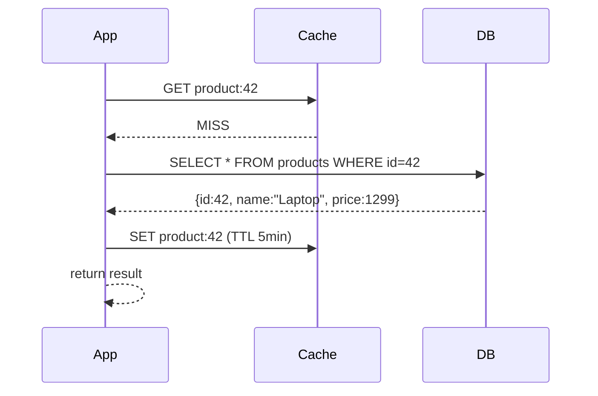
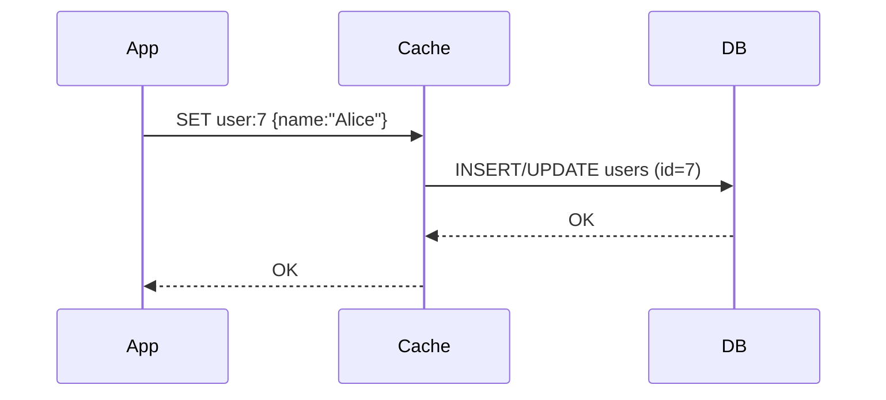
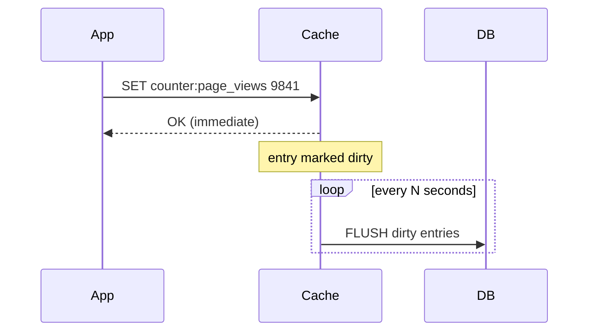
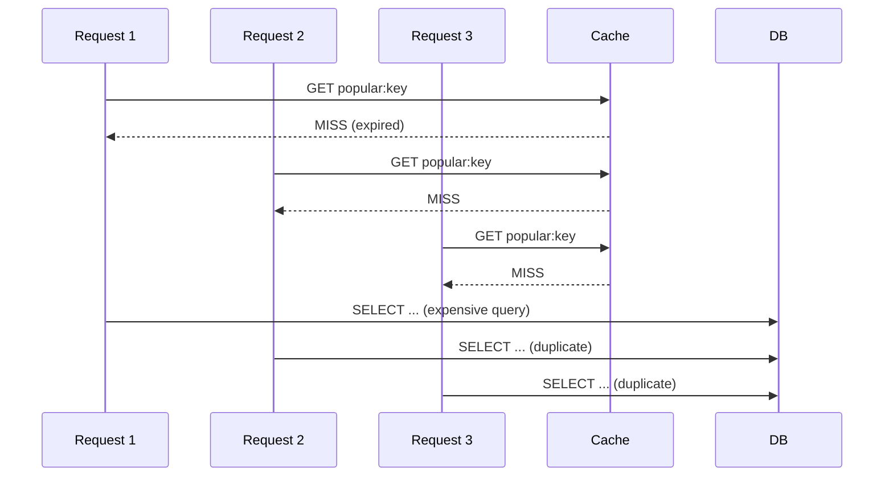

# Caching Patterns

Every application eventually hits the same wall: some operations are too expensive to repeat on every request. A database query joining three tables, an API call to a third-party service, or a complex computation that takes 200ms -- these are fast the first time but painful at scale. Caching is the solution: store the result of an expensive operation so subsequent requests get it instantly.

But caching is deceptively simple. The data model is trivial (a dictionary). The hard part is correctness: when does the cached value become stale, how do you populate the cache, and what happens when the cache fills up?

> **Data Structure:** Caches are almost always backed by a hash table for O(1) lookup. See [Hash Tables](../02-data-structures/01-hash-tables.md) for how hash functions and bucket indexing work.

> **Storage:** Caches live at the top of the storage hierarchy -- RAM or CPU cache -- which is why they're fast. See [I/O and Storage Fundamentals](../01-complexity-and-performance/02-io-and-storage-fundamentals.md) for the latency gap between memory and disk.

---

## The Three Cache Patterns

### Cache-Aside (Lazy Population)

The application manages the cache directly. On a cache miss, the application fetches the data from the source and populates the cache itself.

```
Read:
  1. Check cache for key
  2. HIT  → return cached value
  3. MISS → fetch from source, store in cache, return value

Write:
  1. Write to source (database)
  2. Invalidate or update cache entry
```



**When to use:** Read-heavy workloads where the full dataset doesn't need to be cached. The cache is populated on demand. If the cache fails, the system degrades gracefully (reads fall through to the database).

**Tradeoff:** Cache misses are expensive (two round trips: cache + database). On a cold cache, the first N requests all miss simultaneously -- see the thundering herd problem below.

---

### Write-Through

Every write goes to both the cache and the source simultaneously. The cache is always consistent with the source.

```
Write:
  1. Write to cache
  2. Write to source (synchronously)
  3. Return success when both succeed

Read:
  1. Check cache for key
  2. HIT  → return (always fresh)
  3. MISS → fetch from source, store in cache
```



**When to use:** Workloads where stale reads are unacceptable, and write latency is acceptable (both cache and source must confirm). Good for user profile data, configuration settings, and any data where reads outnumber writes significantly.

**Tradeoff:** Every write is slower (two synchronous writes). Cache can fill with data that is never read (you cache on write, even if nobody reads it).

---

### Write-Behind (Write-Back)

Writes go to the cache immediately and are asynchronously flushed to the source later. The cache absorbs write bursts.

```
Write:
  1. Write to cache (fast)
  2. Mark entry as "dirty"
  3. Return success immediately
  4. (Background) Flush dirty entries to source

Read:
  1. Always read from cache (always fresh)
```



**When to use:** Write-heavy workloads where the source cannot absorb the write rate directly. Common for counters, analytics aggregations, and shopping cart updates.

**Tradeoff:** Data loss on cache failure before flush. Complexity of managing the dirty-entry queue. Requires the cache to be durable enough to survive the flush window.

---

## Cache Invalidation

Caching the right data is easy. Knowing when to **remove** it is hard.

> "There are only two hard things in Computer Science: cache invalidation and naming things." -- Phil Karlton

### TTL (Time-to-Live)

The simplest strategy: every cached entry expires after a fixed duration. The application re-fetches fresh data on the next request after expiry.

- **Predictable** -- easy to reason about, no invalidation logic needed
- **Eventually consistent** -- data is stale for at most TTL duration
- **Right for:** session tokens, product listings, leaderboards, anything where "a few minutes stale" is acceptable

Choosing TTL is a business tradeoff: shorter TTL = fresher data but more cache misses. Longer TTL = more hits but more staleness.

### Event-Driven Invalidation

When data changes in the source, explicitly invalidate or update the cached entry. Often implemented with database triggers, change data capture (CDC), or an event bus.

- **Precise** -- cache is invalidated exactly when data changes
- **Complex** -- requires coordination between the write path and the cache layer
- **Right for:** pricing data, inventory counts, anything where stale reads cause business problems

### Versioned Keys

Embed a version number or hash in the cache key. On a data change, increment the version. Old entries are orphaned (not invalidated, just never read again -- they expire via TTL).

```
cache key: product:42:v7          # current version
new write → cache key: product:42:v8   # old key is never deleted, just abandoned
```

- **Simpler** than event-driven invalidation -- no need to delete old keys
- **Wastes memory** -- orphaned keys persist until TTL
- **Right for:** immutable-ish data (e.g. a compiled artifact, a rendered page snapshot)

---

## Eviction Policies

When the cache reaches its memory limit, something must be removed to make room for new entries. The eviction policy determines what gets removed.

| Policy | Algorithm | Use case |
|--------|-----------|----------|
| **LRU** (Least Recently Used) | Remove the entry that has not been accessed for the longest time | General-purpose; works well when recent access predicts future access |
| **LFU** (Least Frequently Used) | Remove the entry accessed the fewest times | Skewed access patterns; keeps hot keys even if accessed long ago |
| **Random** | Remove a random entry | Simpler to implement; acceptable when access patterns are unpredictable |
| **TTL-based** | Remove entries closest to expiry | Keeps recently written data; useful when freshness matters more than hotness |
| **No eviction** | Reject new writes when full | Used when the cache holds critical data that cannot be lost |

**LRU vs LFU:** LRU can evict a frequently-accessed key just because there was a recent scan of cold data (a "cache pollution" problem). LFU is more accurate for hotspot data but requires tracking access counts, which is more expensive.

---

## The Thundering Herd Problem

When a popular cached entry expires (or a cold cache starts up), many concurrent requests can all miss simultaneously and all try to fetch the same data from the source at once. This is the thundering herd -- the cache was protecting the database from N concurrent queries, and now they all arrive at once.



**Solutions:**

1. **Locking / mutex:** The first request to miss acquires a lock and fetches the data. Other requests wait. Only one database query fires.
2. **Probabilistic early expiry:** Before a key expires, randomly re-fetch it early (with some probability proportional to how close it is to expiry). Staggers the re-population.
3. **Background refresh:** A background job refreshes popular keys before they expire. Requests always hit a valid cache entry.

---

## Cold Start

A freshly started or cleared cache has zero entries. Every request misses until the cache is populated. In high-traffic systems, this can spike database load to dangerous levels.

**Strategies:**
- **Cache warming:** Pre-populate the cache at startup by reading the most-accessed keys from the database before serving traffic
- **Gradual rollout:** Shift traffic slowly to the new cache instance while the old cache is still warm
- **Persistent cache:** Use a cache that survives restarts (e.g. Redis with AOF persistence) to avoid cold starts entirely

---

## When Caching Breaks Down

Caching is not a free performance boost. There are situations where it makes things worse:

- **Write-heavy workloads:** If data changes as fast as it's read, the cache hit rate is low and you pay the overhead of cache management for little benefit
- **Unique-per-request data:** If every request fetches different data (e.g. paginated user-specific feeds), cache hit rates are near zero
- **Strong consistency requirements:** If the application cannot tolerate stale reads at all, caching is only viable with write-through or event-driven invalidation -- both of which add complexity
- **Memory pressure:** On machines with limited RAM, a large cache competes with application memory; eviction becomes constant and hit rates drop

---

**Next:** [Pub/Sub and Messaging Patterns →](02-pubsub-and-messaging.md)

---

[← Back: Polyglot Persistence](../06-architecture-patterns/03-polyglot-persistence.md) | [Core Concepts Home](../README.md)
