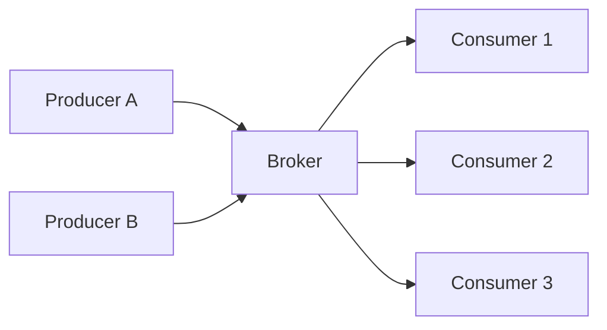
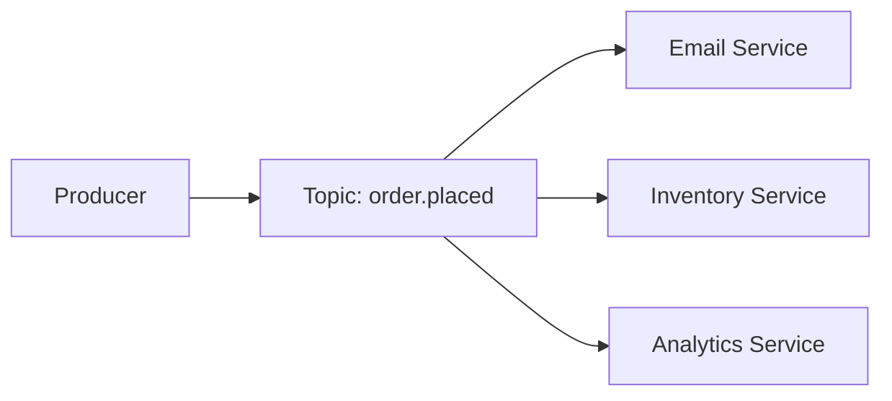
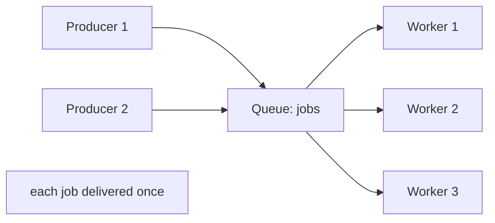
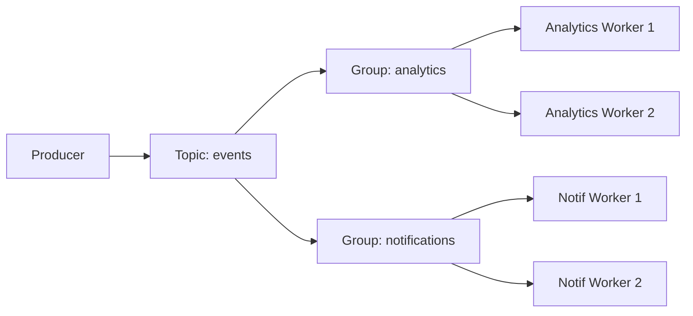
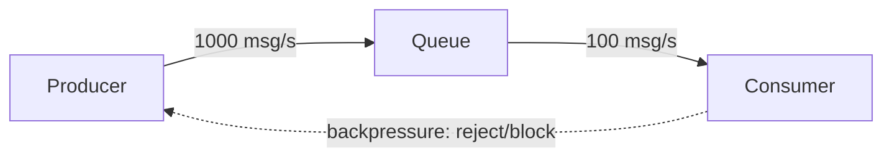

# Pub/Sub and Messaging Patterns

Services need to communicate. The naive approach -- Service A calls Service B directly -- works for simple systems but creates tight coupling: A must know B's address, A must wait for B to respond, and if B is down, A fails too.

Publish/Subscribe (pub/sub) messaging inverts this. A **producer** publishes a message to a **channel** or **topic** without knowing who will receive it. **Consumers** subscribe to channels and receive messages. The two sides are fully decoupled -- they don't know about each other, don't need to be running at the same time, and can scale independently.

This pattern shows up in almost every distributed system: notification services, event pipelines, job queues, real-time feeds, and microservice coordination.

---

## Core Components



- **Producer (Publisher):** Sends messages without caring who reads them
- **Broker:** The intermediary that receives, routes, and (optionally) stores messages
- **Consumer (Subscriber):** Receives messages from topics it has subscribed to
- **Topic / Channel:** The named "pipe" through which messages flow

The broker is the key component. Its capabilities -- whether it stores messages, how long it retains them, how it handles slow consumers -- define the entire system's behavior.

---

## Messaging Topologies

### Fan-Out (One-to-Many)

A single message is delivered to all subscribers. Every consumer receives every message.



**Use cases:** Broadcast notifications, event propagation across services (an "order placed" event that triggers email, inventory update, and analytics simultaneously).

**Tradeoff:** All consumers receive all messages -- there's no way to divide load across consumers of the same subscription.

---

### Point-to-Point (Queue)

Each message is delivered to exactly one consumer. A pool of consumers competes for messages. This is a **work queue** or **task queue** pattern.



**Use cases:** Background job processing, image resizing, email sending queues -- any task that can be distributed across workers and should only be processed once.

**Tradeoff:** Only one consumer gets each message -- not suitable for broadcasting.

---

### Consumer Groups (Fan-Out + Queue)

A compromise: multiple consumer groups each receive all messages (fan-out between groups), but within each group, messages are divided across members (queue behavior).



**Use cases:** Kafka, Redis Streams -- multiple downstream systems each process all events, but each system can scale horizontally with multiple workers.

---

## Delivery Guarantees

The guarantee a messaging system provides for whether a message reaches its consumers is one of the most important design decisions.

### At-Most-Once

Messages are delivered zero or one times. If the broker fails after sending but before the consumer acknowledges, the message is lost.

- **Implementation:** Fire and forget -- no acknowledgement, no retry
- **Tradeoff:** Fastest, simplest, but messages can disappear
- **Use cases:** Metrics, real-time analytics where occasional loss is acceptable (a dropped gauge reading doesn't matter)

### At-Least-Once

Messages are delivered one or more times. If delivery fails or times out, the broker retries. Consumers may receive duplicates.

- **Implementation:** Consumer acknowledges receipt; broker retries unacknowledged messages
- **Tradeoff:** No message loss, but consumers must be idempotent (handling the same message twice must be safe)
- **Use cases:** Email notifications, order processing -- losing a message is worse than processing it twice

### Exactly-Once

Each message is delivered exactly once. No loss, no duplicates.

- **Implementation:** Requires coordination between producer, broker, and consumer (two-phase commit or transactional messaging)
- **Tradeoff:** Most complex, significant performance overhead
- **Use cases:** Financial transactions, inventory updates where duplicate processing causes real damage

> In practice, most systems are built on at-least-once delivery with idempotent consumers. True exactly-once semantics across distributed components is extremely difficult to achieve correctly.

---

## Persistence and Replay

A fundamental distinction between pub/sub implementations is whether messages are **stored** after delivery.

### Fire-and-Forget (No Persistence)

Messages exist only in memory. If no consumer is subscribed at the time of publication, the message is lost. If the broker restarts, all in-flight messages are lost.

```
Publisher ──→ Broker ──→ (connected subscribers only)
                 │
            no storage
```

**Use cases:** Real-time notifications, live dashboards, chat -- situations where a message is only useful if received immediately. Old messages have no value.

**Limitation:** Consumers must be online to receive messages. No ability to replay history or catch up after a restart.

### Durable Messaging (With Persistence)

Messages are written to disk before delivery. Consumers can replay from any point in history. Slow or offline consumers can catch up without missing messages.

```
Publisher ──→ Broker ──→ Log (persistent)
                              │
                     Consumers read from offset
```

**Use cases:** Event sourcing, audit logs, microservice coordination where services may be temporarily offline. Kafka, Redis Streams, and AWS SQS all offer durable messaging.

---

## Backpressure

When producers send messages faster than consumers can process them, the queue grows. Without a mechanism to slow producers, queues can grow unboundedly until memory is exhausted.

**Backpressure** is signaling from consumer to producer: "slow down, I can't keep up."



**Strategies:**
- **Bounded queues:** Reject new messages when the queue is full (producer gets an error and must retry or drop)
- **Producer blocking:** Block the producer until space is available
- **Dropping:** Drop the oldest or newest messages when full (appropriate for real-time data where staleness matters more than completeness)

---

## When Pub/Sub Breaks Down

Messaging adds complexity. It's not always the right tool:

- **Simple request-response:** If Service A needs an immediate answer from Service B, async messaging adds latency and complexity with no benefit
- **Small, low-traffic systems:** Message brokers introduce operational overhead (another service to deploy, monitor, and scale)
- **Fire-and-forget without persistence:** If consumers go offline, messages are silently dropped -- dangerous for anything that must be processed
- **Ordering guarantees:** Most pub/sub systems don't guarantee ordered delivery across partitions; if strict ordering is required, the system must be designed carefully (single partition per ordered stream, or application-level sequencing)

---

[← Back: Caching Patterns](01-caching-patterns.md) | [Core Concepts Home](../README.md)
