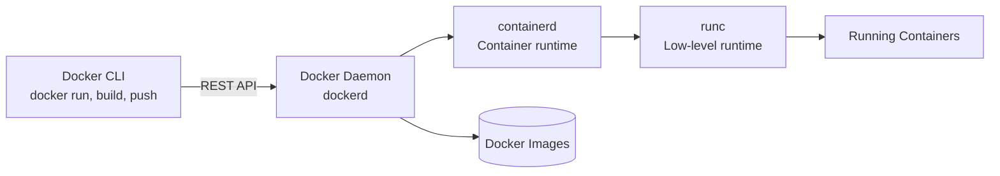
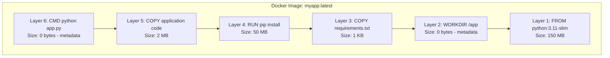
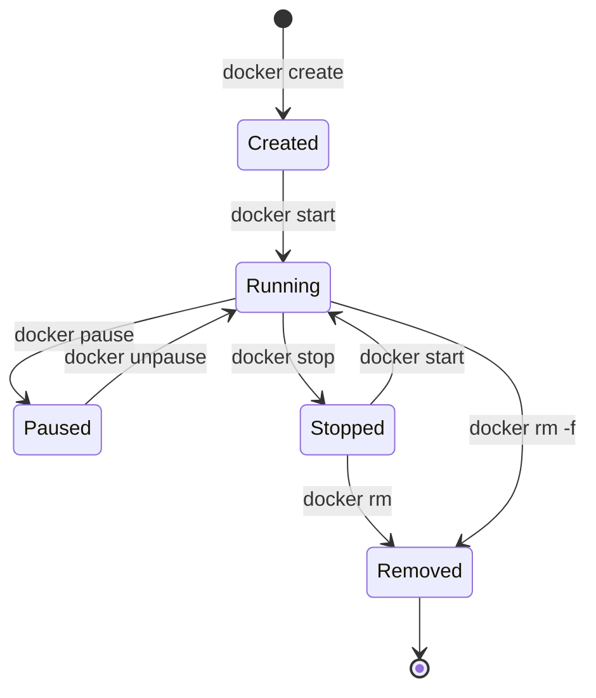

# How Docker Works

## Overview

Understanding Docker's architecture helps you work effectively with containers. In this section, we'll explore the key components—the Docker daemon, images, containers, and layers—and build a mental model of how they interact.

You don't need to understand every low-level detail, but grasping the core concepts will make troubleshooting easier and help you write better Dockerfiles.

## Docker Architecture: Client-Server Model

Docker uses a client-server architecture:



**Components:**

1. **Docker CLI (Client):** The `docker` command you run in your terminal. It sends requests to the daemon via a REST API.

2. **Docker Daemon (`dockerd`):** The background service that manages containers, images, networks, and volumes. It listens for API requests from the CLI or other tools.

3. **containerd:** A lower-level container runtime that manages the container lifecycle (start, stop, pause, delete). Docker delegates to containerd.

4. **runc:** The lowest-level component that actually spawns and runs containers using Linux kernel features (namespaces, cgroups). It's the OCI (Open Container Initiative) reference implementation.

**How it works:**
```bash
docker run nginx
```

1. CLI sends a request to the daemon: "Run a container from the `nginx` image"
2. Daemon checks if the `nginx` image exists locally; if not, it pulls it from Docker Hub
3. Daemon asks containerd to create a container from the image
4. containerd uses runc to start the container process
5. Container runs, isolated from other processes on the host

**Advanced Note:** You rarely interact with containerd or runc directly—Docker abstracts them away. However, Kubernetes uses containerd directly (bypassing Docker), which is why Kubernetes can run containers without Docker installed.

## Core Concepts: Images, Containers, and Layers

### Images: The Blueprint

An **image** is a read-only template for creating containers. Think of it as a class in object-oriented programming—it defines what the container will contain but isn't running itself.

An image includes:
- A base operating system (often a minimal Linux distribution like Alpine or Ubuntu)
- Application code (your Python script, Java JAR, etc.)
- Dependencies (libraries, packages)
- Configuration (environment variables, exposed ports)
- A command to run when the container starts

**Example:** The official `python:3.11` image contains:
- A minimal Debian Linux distribution
- Python 3.11 installed
- pip and setuptools
- No application code yet (you add that in your Dockerfile)

Images are stored in **registries** like Docker Hub. You pull images with `docker pull` and build your own with `docker build`.

### Containers: The Running Instance

A **container** is a running instance of an image—like an object instantiated from a class. When you run `docker run`, Docker:
1. Takes the image (the blueprint)
2. Creates a writable layer on top of it
3. Starts the container process

**Key properties of containers:**
- **Isolated:** Containers have their own filesystem, network, and process space
- **Ephemeral:** By default, changes made inside a container (new files, modified data) disappear when the container is removed
- **Stateless:** Containers should be designed to be replaced at any time (we'll cover volumes for persistent data later)

**Analogy:**
- **Image:** A cookie cutter (defines the shape)
- **Container:** The cookie itself (an instance you can eat, modify, or throw away)

You can create many containers from the same image:
```bash
docker run -d --name web1 nginx
docker run -d --name web2 nginx
docker run -d --name web3 nginx
# Three nginx containers running independently
```

### Layers: How Images Are Built

Docker images are built from **layers**, stacked on top of each other. Each instruction in a Dockerfile creates a new layer.

**Example Dockerfile:**
```dockerfile
FROM python:3.11-slim       # Layer 1: Base image (Python runtime)
WORKDIR /app                # Layer 2: Set working directory (metadata, no files)
COPY requirements.txt .     # Layer 3: Copy requirements file
RUN pip install -r requirements.txt  # Layer 4: Install dependencies
COPY . .                    # Layer 5: Copy application code
CMD ["python", "app.py"]    # Layer 6: Define startup command (metadata)
```

**Each layer is cached.** If you rebuild the image and a layer hasn't changed, Docker reuses the cached layer. This makes builds fast.

**Diagram of image layers:**



**Why layers matter:**

1. **Caching speeds up builds:** If you only change `app.py`, Docker reuses layers 1-4 and only rebuilds layer 5.

2. **Layers are shared across images:** If two images both use `python:3.11-slim`, they share the base layer on disk (saves space).

3. **Layer order affects efficiency:** Put instructions that change frequently (like copying application code) at the end of the Dockerfile. Put stable instructions (like installing system packages) at the beginning.

**Best Practice:** Order Dockerfile instructions from least frequently changed to most frequently changed.

```dockerfile
# Good: Stable layers first, changing layers last
FROM python:3.11-slim
RUN apt-get update && apt-get install -y curl  # Rarely changes
COPY requirements.txt .
RUN pip install -r requirements.txt            # Changes when dependencies change
COPY . .                                       # Changes frequently (every code change)

# Bad: Changing layers first invalidate cache for everything below
FROM python:3.11-slim
COPY . .                                       # Changes frequently, invalidates all layers below
COPY requirements.txt .
RUN pip install -r requirements.txt
```

### The Container Writable Layer

When you create a container, Docker adds a **writable layer** on top of the read-only image layers. All changes (new files, modified files) happen in this writable layer using a **copy-on-write** strategy.

```
Container: web1
├── Writable Layer (new/modified files)
└── Image Layers (read-only)
    ├── Layer 6: CMD
    ├── Layer 5: App code
    ├── Layer 4: Dependencies
    ├── Layer 3: requirements.txt
    ├── Layer 2: WORKDIR
    └── Layer 1: Base image
```

**When you remove the container, the writable layer is deleted.** This is why containers are ephemeral by default—data doesn't persist unless you use volumes (covered later).

**Advanced Note:** Docker uses storage drivers (like `overlay2` on modern Linux systems) to implement layers efficiently. The copy-on-write mechanism means that if a container modifies a file from an image layer, Docker copies the file to the writable layer and modifies the copy, leaving the original layer unchanged.

## Container Lifecycle

Containers go through several states:



**Common commands:**

```bash
# Create a container (but don't start it)
docker create --name myapp nginx

# Start a stopped container
docker start myapp

# Stop a running container (sends SIGTERM, waits, then SIGKILL)
docker stop myapp

# Pause a container (freezes all processes)
docker pause myapp
docker unpause myapp

# Remove a stopped container
docker rm myapp

# Force remove a running container
docker rm -f myapp
```

**Best Practice:** Use `docker stop` rather than `docker kill` to allow graceful shutdown. Most applications handle SIGTERM by closing connections, flushing buffers, and cleaning up.

## How Images Are Stored and Named

Images are identified by **repository name** and **tag**:

```
docker.io/library/python:3.11-slim
└──────┘ └─────┘ └────┘ └────────┘
registry namespace name    tag
```

- **Registry:** Where the image is hosted (default: `docker.io`, Docker Hub)
- **Namespace:** Organization or user (default: `library` for official images)
- **Name:** The image name (e.g., `python`, `nginx`, `postgres`)
- **Tag:** Version or variant (e.g., `3.11-slim`, `latest`)

**Common tags:**
- `latest`: The most recent version (but not automatically updated in your local cache—you must `docker pull` again)
- `3.11`: A specific version
- `3.11-slim`: A minimal variant (smaller image, fewer tools)
- `3.11-alpine`: Based on Alpine Linux (even smaller, ~5MB base)

**Best Practice:** Avoid using `latest` in production. Pin specific versions (e.g., `python:3.11.5`) for reproducibility.

```bash
# Pull specific version
docker pull python:3.11.5-slim

# Pull latest (default if no tag specified)
docker pull python
```

## How Docker Isolates Containers

Docker uses Linux kernel features to isolate containers:

1. **Namespaces:** Give each container its own view of system resources
   - **PID namespace:** Container processes can't see host processes
   - **Network namespace:** Container has its own network stack (IP address, ports)
   - **Mount namespace:** Container has its own filesystem
   - **UTS namespace:** Container has its own hostname

2. **Cgroups (Control Groups):** Limit resource usage
   - Set CPU limits (e.g., 50% of one CPU core)
   - Set memory limits (e.g., 512MB max)
   - Set I/O limits (disk read/write throttling)

**Example:** Running a container with resource limits:

```bash
docker run -d --name limited --memory="512m" --cpus="0.5" nginx

# This container can use at most 512MB RAM and 50% of one CPU core
```

**At Scale:** In production, always set resource limits. Without limits, a misbehaving container can consume all CPU or memory, affecting other containers on the same host.

## Where Images and Containers Live

**On your local machine:**
- **Images:** Stored in `/var/lib/docker/` (Linux) or Docker Desktop's VM storage (macOS/Windows)
- **Containers:** Also stored in `/var/lib/docker/`

**View them with:**
```bash
# List images
docker images

# List running containers
docker ps

# List all containers (including stopped)
docker ps -a

# View disk usage
docker system df
```

**Cleanup commands:**
```bash
# Remove stopped containers
docker container prune

# Remove unused images
docker image prune

# Remove everything unused (containers, images, networks, volumes)
docker system prune -a
```

**Advanced Note:** Docker uses a local storage driver (like `overlay2`) to manage layers efficiently. When you `docker pull` an image, Docker downloads only the layers you don't already have, which is why pulling related images (like `python:3.11` and `python:3.12`) is faster the second time.

## Summary

Docker's architecture separates the client (CLI) from the server (daemon), which manages images and containers via lower-level runtimes (containerd, runc). Images are built from layers stacked together, and layers are cached for fast rebuilds. Containers are running instances of images, with a writable layer on top for changes. Docker achieves isolation using Linux kernel namespaces and cgroups, making containers lightweight compared to VMs.

**Key Takeaways:**
- **Images** are read-only blueprints; **containers** are running instances
- **Layers** are cached and shared across images for efficiency
- **Layer order** in Dockerfiles affects build speed
- **Containers are ephemeral** by default—data disappears when removed (unless using volumes)
- Docker uses **namespaces** for isolation and **cgroups** for resource limits

---

**Previous:** [What is Docker?](01-what-is-docker.md) | **Next:** [Docker Across Platforms](03-docker-across-platforms.md)
