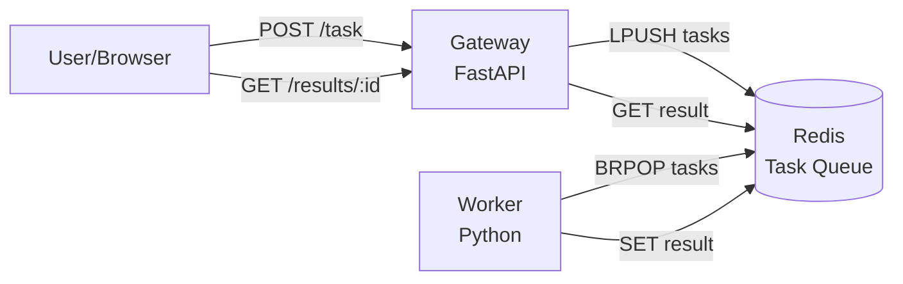

---
kernelspec:
  name: python3
  language: python
  display_name: Python 3
---

# Distributed System Demo

## Overview

In this section, we'll build a **distributed task processing system** using Docker Compose. This demo showcases how multiple services communicate via a message broker (Redis), demonstrating real-world microservices architecture patterns.

**The system:**
- **Gateway** (FastAPI): Accepts HTTP requests, pushes tasks to Redis
- **Worker** (Python): Polls Redis for tasks, processes them, stores results
- **Redis**: Message broker and shared state

This architecture is common in data engineering for job queues, ETL pipelines, and event-driven systems.

## System Architecture



**Flow:**
1. User sends POST request to Gateway with a task (e.g., "process data")
2. Gateway pushes task to Redis list (`tasks`)
3. Worker polls Redis, retrieves task, processes it (simulated work)
4. Worker stores result in Redis
5. User queries Gateway for result by task ID

**Key concepts demonstrated:**
- **Service discovery:** Gateway and Worker find Redis by service name
- **Asynchronous processing:** Gateway returns immediately; Worker processes in background
- **Shared state:** Redis acts as communication layer
- **Scalability:** Multiple workers can process tasks in parallel

## Project Structure

```
distributed-system/
├── docker-compose.yml
├── gateway/
│   ├── Dockerfile
│   ├── main.py
│   └── requirements.txt
└── worker/
    ├── Dockerfile
    ├── main.py
    └── requirements.txt
```

## Gateway Service

The Gateway is a FastAPI application that accepts HTTP requests and manages tasks.

**gateway/main.py:**
```{code-cell} python
from fastapi import FastAPI, HTTPException
from pydantic import BaseModel
import redis
import uuid
import json

app = FastAPI()

# Connect to Redis (by service name)
r = redis.Redis(host='redis', port=6379, decode_responses=True)

class Task(BaseModel):
    data: str

@app.get("/")
def read_root():
    return {
        "service": "Gateway",
        "status": "running",
        "endpoints": {
            "POST /task": "Submit a task",
            "GET /result/{task_id}": "Get task result",
            "GET /stats": "Get system stats"
        }
    }

@app.post("/task")
def create_task(task: Task):
    """Submit a task for processing"""
    task_id = str(uuid.uuid4())
    task_payload = {
        "id": task_id,
        "data": task.data,
        "status": "pending"
    }
    
    # Push task to Redis list
    r.lpush("tasks", json.dumps(task_payload))
    
    # Store initial status
    r.set(f"result:{task_id}", json.dumps({"status": "pending"}))
    
    return {
        "task_id": task_id,
        "status": "submitted",
        "message": "Task queued for processing"
    }

@app.get("/result/{task_id}")
def get_result(task_id: str):
    """Get result of a processed task"""
    result = r.get(f"result:{task_id}")
    
    if not result:
        raise HTTPException(status_code=404, detail="Task not found")
    
    return json.loads(result)

@app.get("/stats")
def get_stats():
    """Get system statistics"""
    pending_tasks = r.llen("tasks")
    return {
        "pending_tasks": pending_tasks,
        "message": "System statistics"
    }
```

**gateway/requirements.txt:**
```
fastapi==0.104.1
uvicorn[standard]==0.24.0
redis==5.0.1
pydantic==2.5.0
```

**gateway/Dockerfile:**
```dockerfile
FROM python:3.11-slim

WORKDIR /app

COPY requirements.txt .
RUN pip install --no-cache-dir -r requirements.txt

COPY main.py .

EXPOSE 8000

CMD ["uvicorn", "main:app", "--host", "0.0.0.0", "--port", "8000"]
```

## Worker Service

The Worker polls Redis for tasks, processes them (with simulated work), and stores results.

**worker/main.py:**
```{code-cell} python
import redis
import json
import time
import logging

logging.basicConfig(
    level=logging.INFO,
    format='%(asctime)s - %(levelname)s - %(message)s'
)
logger = logging.getLogger(__name__)

# Connect to Redis
r = redis.Redis(host='redis', port=6379, decode_responses=True)

def process_task(task_data):
    """Simulate task processing"""
    logger.info(f"Processing task: {task_data['id']}")
    
    # Simulate work (e.g., data transformation, API call, computation)
    time.sleep(2)
    
    # Generate result
    result = {
        "status": "completed",
        "task_id": task_data['id'],
        "original_data": task_data['data'],
        "processed_data": task_data['data'].upper(),  # Simple transformation
        "processed_at": time.time()
    }
    
    return result

def main():
    logger.info("Worker starting... waiting for tasks")
    
    while True:
        try:
            # Block until a task is available (BRPOP with 1 second timeout)
            task = r.brpop("tasks", timeout=1)
            
            if task:
                # task is a tuple: (key, value)
                task_json = task[1]
                task_data = json.loads(task_json)
                
                logger.info(f"Received task: {task_data['id']}")
                
                # Process the task
                result = process_task(task_data)
                
                # Store result in Redis
                r.set(f"result:{task_data['id']}", json.dumps(result))
                
                logger.info(f"Task {task_data['id']} completed")
            
        except Exception as e:
            logger.error(f"Error processing task: {e}")
            time.sleep(1)

if __name__ == "__main__":
    main()
```

**worker/requirements.txt:**
```
redis==5.0.1
```

**worker/Dockerfile:**
```dockerfile
FROM python:3.11-slim

WORKDIR /app

COPY requirements.txt .
RUN pip install --no-cache-dir -r requirements.txt

COPY main.py .

CMD ["python", "main.py"]
```

## Docker Compose Configuration

**docker-compose.yml:**
```yaml
services:
  gateway:
    build: ./gateway
    ports:
      - "8000:8000"
    environment:
      - REDIS_HOST=redis
      - REDIS_PORT=6379
    depends_on:
      - redis
    restart: unless-stopped

  worker:
    build: ./worker
    environment:
      - REDIS_HOST=redis
      - REDIS_PORT=6379
    depends_on:
      - redis
    restart: unless-stopped
    # Scale workers easily: docker compose up --scale worker=3

  redis:
    image: redis:7-alpine
    ports:
      - "6379:6379"
    restart: unless-stopped
```

## Running the System

**1. Start all services:**
```bash
cd distributed-system
docker compose up --build
```

**Output:**
```
[+] Building gateway, worker
[+] Running 3/3
 ✔ Container redis     Started
 ✔ Container gateway   Started
 ✔ Container worker    Started

gateway  | INFO:     Started server process
worker   | 2025-02-09 10:00:00 - INFO - Worker starting... waiting for tasks
```

**2. Submit tasks:**
```bash
# Submit a task
curl -X POST http://localhost:8000/task -H "Content-Type: application/json" -d '{"data": "process this data"}'

# Output:
# {
#   "task_id": "a3f2c1b9-e8d7-4a5b-9c2d-1e3f4a5b6c7d",
#   "status": "submitted",
#   "message": "Task queued for processing"
# }
```

**3. Check worker logs:**
```bash
docker compose logs -f worker

# Output:
# 2025-02-09 10:00:05 - INFO - Received task: a3f2c1b9-e8d7-4a5b-9c2d-1e3f4a5b6c7d
# 2025-02-09 10:00:05 - INFO - Processing task: a3f2c1b9-e8d7-4a5b-9c2d-1e3f4a5b6c7d
# 2025-02-09 10:00:07 - INFO - Task a3f2c1b9-e8d7-4a5b-9c2d-1e3f4a5b6c7d completed
```

**4. Get result:**
```bash
curl http://localhost:8000/result/a3f2c1b9-e8d7-4a5b-9c2d-1e3f4a5b6c7d

# Output:
# {
#   "status": "completed",
#   "task_id": "a3f2c1b9-e8d7-4a5b-9c2d-1e3f4a5b6c7d",
#   "original_data": "process this data",
#   "processed_data": "PROCESS THIS DATA",
#   "processed_at": 1707476407.123
# }
```

**5. Check system stats:**
```bash
curl http://localhost:8000/stats

# Output:
# {
#   "pending_tasks": 0,
#   "message": "System statistics"
# }
```

**6. Stop the system:**
```bash
docker compose down
```

## Service Discovery in Action

Notice how services communicate:

**Gateway connects to Redis:**
```{code-cell} python
r = redis.Redis(host='redis', port=6379, decode_responses=True)
#                     ↑
#                 service name (not IP!)
```

**Worker connects to Redis:**
```{code-cell} python
r = redis.Redis(host='redis', port=6379, decode_responses=True)
#                     ↑
#                 same service name
```

Docker Compose's automatic DNS resolves `redis` to the Redis container's IP. This works because all services are on the same default network.

**Advanced Note:** In production (Kubernetes, Docker Swarm), service discovery is more sophisticated, often using service meshes (Istio, Linkerd) or cloud-native load balancers.

## Scaling Workers

Run multiple workers to process tasks in parallel:

```bash
docker compose up -d --scale worker=3
```

This starts **3 worker containers**. Each polls Redis independently, so tasks are distributed among them.

**Verify:**
```bash
docker compose ps

# Output:
# NAME                 SERVICE   STATUS    PORTS
# gateway              gateway   running   0.0.0.0:8000->8000/tcp
# redis                redis     running   0.0.0.0:6379->6379/tcp
# worker-1             worker    running
# worker-2             worker    running
# worker-3             worker    running
```

**Submit multiple tasks:**
```bash
for i in {1..10}; do curl -X POST http://localhost:8000/task -H "Content-Type: application/json" -d "{\"data\": \"task $i\"}"; done
```

**Watch logs:**
```bash
docker compose logs -f worker

# Output shows tasks distributed across workers:
# worker-1 | Processing task: abc123...
# worker-2 | Processing task: def456...
# worker-3 | Processing task: ghi789...
```

**At Scale:** In production, use Kubernetes Horizontal Pod Autoscaler (HPA) to automatically scale workers based on queue length.

## Real-World Use Cases

This architecture pattern is used in:

**1. ETL Pipelines:**
- Gateway receives data ingestion requests
- Workers process and transform data
- Results stored in databases or data lakes

**2. Image/Video Processing:**
- Gateway accepts media uploads
- Workers transcode, resize, or apply filters
- Results stored in object storage (S3, GCS)

**3. Machine Learning Inference:**
- Gateway accepts inference requests
- Workers load models and generate predictions
- Results returned to users or stored

**4. Data Engineering Job Queues:**
- Gateway schedules data pipeline jobs
- Workers execute Spark jobs, SQL queries, or API calls
- Results tracked in metadata stores

## Extending the System

**Add a database for persistent results:**
```yaml
services:
  gateway:
    build: ./gateway
    environment:
      DATABASE_URL: postgresql://postgres:secret@db/tasks
    depends_on:
      - redis
      - db

  db:
    image: postgres:16
    environment:
      POSTGRES_PASSWORD: secret
      POSTGRES_DB: tasks
    volumes:
      - pgdata:/var/lib/postgresql/data

volumes:
  pgdata:
```

**Add monitoring (Prometheus + Grafana):**
```yaml
services:
  prometheus:
    image: prom/prometheus
    volumes:
      - ./prometheus.yml:/etc/prometheus/prometheus.yml
    ports:
      - "9090:9090"

  grafana:
    image: grafana/grafana
    ports:
      - "3000:3000"
```

**Add API authentication:**
- Use environment variables for API keys
- Add middleware to Gateway for token validation

## Debugging Tips

**1. Check if services can reach Redis:**
```bash
docker compose exec gateway sh
# Inside gateway container:
redis-cli -h redis ping
# Output: PONG
```

**2. Inspect Redis state:**
```bash
docker compose exec redis redis-cli

# Inside redis-cli:
LLEN tasks        # Check task queue length
KEYS result:*     # List all result keys
GET result:abc123 # Get specific result
```

**3. View all logs:**
```bash
docker compose logs -f
```

**4. Restart a specific service:**
```bash
docker compose restart worker
```

## At Scale: Production Considerations

When deploying this system in production:

**1. Persistence:**
- Use Redis persistence (RDB or AOF) or a separate message queue (RabbitMQ, Kafka)
- Store results in a database (PostgreSQL, MongoDB) instead of Redis

**2. Observability:**
- Add structured logging (JSON logs)
- Integrate with log aggregation (ELK stack, CloudWatch)
- Add metrics (Prometheus) and tracing (Jaeger)

**3. Security:**
- Use secrets management (AWS Secrets Manager, Vault)
- Enable TLS for Redis connections
- Implement authentication for Gateway API

**4. Scalability:**
- Use Kubernetes for automatic scaling based on queue depth
- Implement rate limiting in Gateway
- Use Redis Cluster for high availability

**5. Error Handling:**
- Implement retry logic with exponential backoff
- Add dead-letter queues for failed tasks
- Monitor and alert on error rates

## Summary

This distributed system demo shows how Docker Compose orchestrates multiple services communicating via Redis. The Gateway handles HTTP requests, Workers process tasks asynchronously, and Redis acts as the message broker. This architecture is common in data engineering for job queues, ETL pipelines, and event-driven systems. Services discover each other by name, and scaling is as simple as `--scale worker=N`.

**Key Takeaways:**
- **Microservices architecture:** Each service has a single responsibility
- **Asynchronous processing:** Gateway responds immediately, Workers process in background
- **Service discovery:** Services communicate by name (`redis`, not IP)
- **Horizontal scalability:** Add more workers to increase throughput
- **Shared state:** Redis provides communication and coordination
- **Real-world pattern:** Used in ETL, media processing, ML inference, and job queues

---

**Previous:** [Compose Fundamentals](01-compose-fundamentals.md) | **Next:** [Registries and Repositories](../04-docker-in-practice/01-registries-and-repositories.md)
