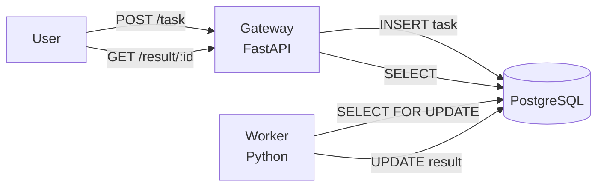

---
kernelspec:
  name: python3
  language: python
  display_name: Python 3
---

# Exercise: Build a Distributed System

## Overview

In this exercise, you'll build a multi-service distributed system using Docker Compose. You'll create a task processing system with a Gateway service (FastAPI), Worker service (Python), and PostgreSQL as a database and task queue.

This exercise reinforces Docker Compose concepts, service networking, and microservices architecture.

**Duration:** 40-50 minutes

**Skills practiced:**
- Writing `docker-compose.yml`
- Building multi-service architectures
- Container-to-container communication
- Debugging distributed systems
- Scaling services
- Using PostgreSQL for task queuing

## System Architecture

You'll build a distributed task processing system:



**Services:**
1. **Gateway (FastAPI):** Accepts HTTP requests, stores tasks in PostgreSQL
2. **Worker (Python):** Polls PostgreSQL for tasks, processes them, stores results
3. **PostgreSQL:** Database for task queue and results storage

## Part 1: Scaffold the Project

Create the following structure:

```
distributed-system/
├── docker-compose.yml
├── init.sql
├── gateway/
│   ├── Dockerfile
│   ├── main.py
│   └── requirements.txt
└── worker/
    ├── Dockerfile
    ├── main.py
    └── requirements.txt
```

### Task 1.1: Create the Database Schema

Create `init.sql` at the project root:

```sql
-- Create tasks table
CREATE TABLE IF NOT EXISTS tasks (
    id VARCHAR(36) PRIMARY KEY,
    task_data TEXT NOT NULL,
    status VARCHAR(20) NOT NULL DEFAULT 'pending',
    result TEXT,
    created_at TIMESTAMP NOT NULL DEFAULT NOW(),
    processed_at TIMESTAMP
);

-- Create index for efficient queue queries
CREATE INDEX IF NOT EXISTS idx_status_created ON tasks (status, created_at);
```

**Note:** The index on `(status, created_at)` allows efficient queries to find pending tasks in order.

## Part 2: Build the Gateway Service

### Gateway Requirements

The Gateway should:
- Accept `POST /task` with JSON payload `{"task": "some task"}`
- Generate a unique task ID
- Insert task into PostgreSQL `tasks` table
- Return `{"task_id": "...", "status": "submitted"}`
- Accept `GET /result/{task_id}` to retrieve task result from PostgreSQL

### Task 2.1: Write `gateway/main.py`

**Hints:**
- Use `psycopg2.connect()` to connect to PostgreSQL
- Use environment variables for database credentials
- Use `INSERT` to create new tasks
- Use `SELECT` to retrieve task results
- Generate task IDs with `uuid.uuid4()`

<details>
<summary>Solution (click to reveal)</summary>

**gateway/main.py:**
```{code-cell} python
from fastapi import FastAPI, HTTPException
from pydantic import BaseModel
import psycopg2
from psycopg2.extras import RealDictCursor
import uuid
import os

app = FastAPI()

def get_db():
    """Get database connection"""
    return psycopg2.connect(
        host=os.getenv('DB_HOST', 'postgres'),
        port=os.getenv('DB_PORT', '5432'),
        database=os.getenv('DB_NAME', 'tasks_db'),
        user=os.getenv('DB_USER', 'postgres'),
        password=os.getenv('DB_PASSWORD', 'postgres')
    )

class TaskRequest(BaseModel):
    task: str

@app.get("/")
def read_root():
    return {"service": "Gateway", "status": "running"}

@app.post("/task")
def create_task(req: TaskRequest):
    task_id = str(uuid.uuid4())
    
    conn = get_db()
    cur = conn.cursor()
    
    try:
        # Insert task into queue
        cur.execute("""
            INSERT INTO tasks (id, task_data, status, created_at)
            VALUES (%s, %s, %s, NOW())
        """, (task_id, req.task, 'pending'))
        
        conn.commit()
        
        return {"task_id": task_id, "status": "submitted"}
    
    except Exception as e:
        conn.rollback()
        raise HTTPException(status_code=500, detail=str(e))
    finally:
        cur.close()
        conn.close()

@app.get("/result/{task_id}")
def get_result(task_id: str):
    conn = get_db()
    cur = conn.cursor(cursor_factory=RealDictCursor)
    
    try:
        cur.execute("""
            SELECT id, task_data, status, result, processed_at
            FROM tasks
            WHERE id = %s
        """, (task_id,))
        
        task = cur.fetchone()
        
        if not task:
            raise HTTPException(status_code=404, detail="Task not found")
        
        return {
            "status": task['status'],
            "task_id": task['id'],
            "task": task['task_data'],
            "result": task['result'],
            "processed_at": task['processed_at'].timestamp() if task['processed_at'] else None
        }
    
    finally:
        cur.close()
        conn.close()
```

</details>

### Task 2.2: Write `gateway/requirements.txt`

```
fastapi==0.104.1
uvicorn[standard]==0.24.0
psycopg2-binary==2.9.9
```

### Task 2.3: Write `gateway/Dockerfile`

**Hints:**
- Use `python:3.11-slim` as base
- Set `WORKDIR /app`
- Copy and install dependencies first
- Copy source code
- Expose port 8000
- Run with `uvicorn main:app --host 0.0.0.0 --port 8000`

<details>
<summary>Solution (click to reveal)</summary>

**gateway/Dockerfile:**
```dockerfile
FROM python:3.11-slim

WORKDIR /app

COPY requirements.txt .
RUN pip install --no-cache-dir -r requirements.txt

COPY main.py .

EXPOSE 8000

CMD ["uvicorn", "main:app", "--host", "0.0.0.0", "--port", "8000"]
```

</details>

## Part 3: Build the Worker Service

### Worker Requirements

The Worker should:
- Connect to PostgreSQL
- Poll for pending tasks using `SELECT ... FOR UPDATE SKIP LOCKED`
- Process the task (simulate work with `time.sleep(3)`)
- Store result in the `tasks` table

### Task 3.1: Write `worker/main.py`

**Hints:**
- Use `SELECT ... FOR UPDATE SKIP LOCKED` to safely claim tasks in a multi-worker environment
- This prevents multiple workers from processing the same task
- Update task status to 'processing' when claimed, then 'completed' when done
- Simulate work with `time.sleep(3)`

<details>
<summary>Solution (click to reveal)</summary>

**worker/main.py:**
```{code-cell} python
import psycopg2
from psycopg2.extras import RealDictCursor
import time
import logging
import os

logging.basicConfig(level=logging.INFO, format='%(asctime)s - %(message)s')
logger = logging.getLogger(__name__)

def get_db():
    """Get database connection"""
    return psycopg2.connect(
        host=os.getenv('DB_HOST', 'postgres'),
        port=os.getenv('DB_PORT', '5432'),
        database=os.getenv('DB_NAME', 'tasks_db'),
        user=os.getenv('DB_USER', 'postgres'),
        password=os.getenv('DB_PASSWORD', 'postgres')
    )

def process_task(task_data):
    """Simulate task processing"""
    logger.info(f"Processing task {task_data['id']}: {task_data['task_data']}")
    
    # Simulate work
    time.sleep(3)
    
    result = task_data['task_data'].upper()  # Simple transformation
    
    return result

def main():
    logger.info("Worker started, waiting for tasks...")
    
    # Wait for database to be ready
    max_retries = 30
    retry_count = 0
    while retry_count < max_retries:
        try:
            conn = get_db()
            conn.close()
            logger.info("Database connection successful")
            break
        except Exception as e:
            retry_count += 1
            logger.warning(f"Database not ready, retrying ({retry_count}/{max_retries})...")
            time.sleep(1)
    
    while True:
        conn = None
        cur = None
        try:
            conn = get_db()
            cur = conn.cursor(cursor_factory=RealDictCursor)
            
            # Use SELECT FOR UPDATE SKIP LOCKED to safely claim a task
            cur.execute("""
                SELECT id, task_data, status
                FROM tasks
                WHERE status = 'pending'
                ORDER BY created_at
                LIMIT 1
                FOR UPDATE SKIP LOCKED
            """)
            
            task = cur.fetchone()
            
            if task:
                logger.info(f"Received task: {task['id']}")
                
                # Mark as processing
                cur.execute("""
                    UPDATE tasks
                    SET status = 'processing'
                    WHERE id = %s
                """, (task['id'],))
                conn.commit()
                
                # Process the task
                result = process_task(task)
                
                # Store result
                cur.execute("""
                    UPDATE tasks
                    SET status = 'completed',
                        result = %s,
                        processed_at = NOW()
                    WHERE id = %s
                """, (result, task['id']))
                conn.commit()
                
                logger.info(f"Task {task['id']} completed")
            else:
                # No tasks available, wait a bit
                time.sleep(1)
                
        except Exception as e:
            logger.error(f"Error: {e}")
            if conn:
                conn.rollback()
            time.sleep(1)
        finally:
            if cur:
                cur.close()
            if conn:
                conn.close()

if __name__ == "__main__":
    main()
```

</details>

**Advanced Note:** The `SELECT ... FOR UPDATE SKIP LOCKED` pattern is crucial for building reliable task queues with PostgreSQL:
- `FOR UPDATE` locks the selected row
- `SKIP LOCKED` tells PostgreSQL to skip rows already locked by other workers
- This ensures each task is processed by exactly one worker, even with multiple workers running

### Task 3.2: Write `worker/requirements.txt`

```
psycopg2-binary==2.9.9
```

### Task 3.3: Write `worker/Dockerfile`

<details>
<summary>Solution (click to reveal)</summary>

**worker/Dockerfile:**
```dockerfile
FROM python:3.11-slim

WORKDIR /app

COPY requirements.txt .
RUN pip install --no-cache-dir -r requirements.txt

COPY main.py .

CMD ["python", "main.py"]
```

</details>

## Part 4: Write `docker-compose.yml`

### Task 4.1: Define Services

Create a `docker-compose.yml` that defines three services:
- **gateway**: Build from `./gateway`, expose port 8000
- **worker**: Build from `./worker`
- **postgres**: Use `postgres:16-alpine` image with initialization script

**Hints:**
- Use `build: ./gateway` for the gateway service
- Use `depends_on` with `condition: service_healthy` to wait for PostgreSQL to be ready
- Mount `init.sql` to initialize the database schema
- Add a health check to PostgreSQL
- Map gateway port `8000:8000`
- Pass database credentials via environment variables

<details>
<summary>Solution (click to reveal)</summary>

**docker-compose.yml:**
```yaml
services:
  gateway:
    build: ./gateway
    ports:
      - "8000:8000"
    depends_on:
      postgres:
        condition: service_healthy
    environment:
      - DB_HOST=postgres
      - DB_PORT=5432
      - DB_NAME=tasks_db
      - DB_USER=postgres
      - DB_PASSWORD=postgres
    restart: unless-stopped

  worker:
    build: ./worker
    depends_on:
      postgres:
        condition: service_healthy
    environment:
      - DB_HOST=postgres
      - DB_PORT=5432
      - DB_NAME=tasks_db
      - DB_USER=postgres
      - DB_PASSWORD=postgres
    restart: unless-stopped

  postgres:
    image: postgres:16-alpine
    environment:
      - POSTGRES_DB=tasks_db
      - POSTGRES_USER=postgres
      - POSTGRES_PASSWORD=postgres
    volumes:
      - ./init.sql:/docker-entrypoint-initdb.d/init.sql
    healthcheck:
      test: ["CMD-SHELL", "pg_isready -U postgres"]
      interval: 5s
      timeout: 5s
      retries: 5
    restart: unless-stopped
```

</details>

**Note:** The health check ensures that gateway and worker only start after PostgreSQL is ready to accept connections.

## Part 5: Run and Test the System

### Task 5.1: Start the System

```bash
cd distributed-system
docker compose up --build
```

**Expected output:**
```
[+] Building gateway, worker
[+] Running 3/3
 ✔ Container postgres  Started (healthy)
 ✔ Container gateway   Started
 ✔ Container worker    Started

postgres | CREATE TABLE
postgres | CREATE INDEX
gateway  | INFO:     Started server process [1]
worker   | 2026-02-09 10:00:00 - Worker started, waiting for tasks...
worker   | 2026-02-09 10:00:00 - Database connection successful
```

### Task 5.2: Submit a Task

In another terminal:

```bash
curl -X POST http://localhost:8000/task -H "Content-Type: application/json" -d '{"task": "process my data"}'
```

**Expected output:**
```json
{
  "task_id": "a1b2c3d4-e5f6-7890-abcd-ef1234567890",
  "status": "submitted"
}
```

### Task 5.3: Watch Worker Logs

```bash
docker compose logs -f worker
```

**Expected output:**
```
worker | 2026-02-09 10:00:05 - Received task: a1b2c3d4-...
worker | 2026-02-09 10:00:05 - Processing task a1b2c3d4-...: process my data
worker | 2026-02-09 10:00:08 - Task a1b2c3d4-... completed
```

### Task 5.4: Get the Result

```bash
curl http://localhost:8000/result/a1b2c3d4-e5f6-7890-abcd-ef1234567890
```

**Expected output:**
```json
{
  "status": "completed",
  "task_id": "a1b2c3d4-e5f6-7890-abcd-ef1234567890",
  "task": "process my data",
  "result": "PROCESS MY DATA",
  "processed_at": 1770644497.065749
}
```

## Part 6: Scale Workers

### Task 6.1: Run Multiple Workers

Stop the system and restart with 3 workers:

```bash
docker compose down
docker compose up -d --scale worker=3
```

**Verify:**
```bash
docker compose ps
```

**Expected output:**
```
NAME                SERVICE   STATUS    PORTS
gateway             gateway   running   0.0.0.0:8000->8000/tcp
redis               redis     running
worker-1            worker    running
worker-2            worker    running
worker-3            worker    running
```

### Task 6.2: Submit Multiple Tasks

```bash
for i in {1..10}; do curl -X POST http://localhost:8000/task -H "Content-Type: application/json" -d "{\"task\": \"task $i\"}"; done
```

### Task 6.3: Watch All Workers Process Tasks

```bash
docker compose logs -f worker
```

**Expected output:**
You'll see tasks distributed across the three workers:
```
worker-1 | Processing task abc123: task 1
worker-2 | Processing task def456: task 2
worker-3 | Processing task ghi789: task 3
worker-1 | Processing task jkl012: task 4
...
```

## Bonus Challenges

### Bonus 1: Add Persistent Volume for PostgreSQL

Add a named volume to persist PostgreSQL data across restarts.

**Hints:**
- Add a volume to the `postgres` service
- Define a named volume at the bottom of `docker-compose.yml`

**Solution:**
```yaml
postgres:
  image: postgres:16-alpine
  environment:
    - POSTGRES_DB=tasks_db
    - POSTGRES_USER=postgres
    - POSTGRES_PASSWORD=postgres
  volumes:
    - ./init.sql:/docker-entrypoint-initdb.d/init.sql
    - postgres-data:/var/lib/postgresql/data
  healthcheck:
    test: ["CMD-SHELL", "pg_isready -U postgres"]
    interval: 5s
    timeout: 5s
    retries: 5
  restart: unless-stopped

volumes:
  postgres-data:
```

### Bonus 2: Add a Notifier Service

Create a fourth service that watches for completed tasks and "sends notifications" (logs to console).

**Hints:**
- Query PostgreSQL for tasks with status 'completed' that haven't been notified yet
- Add a `notified` boolean column to the tasks table
- Mark tasks as notified after logging

### Bonus 3: Add Health Checks to Gateway and Worker

Add health checks to `docker-compose.yml` for gateway and worker services.

**Example for gateway:**
```yaml
gateway:
  build: ./gateway
  ports:
    - "8000:8000"
  depends_on:
    postgres:
      condition: service_healthy
  environment:
    - DB_HOST=postgres
    - DB_PORT=5432
    - DB_NAME=tasks_db
    - DB_USER=postgres
    - DB_PASSWORD=postgres
  healthcheck:
    test: ["CMD", "curl", "-f", "http://localhost:8000/"]
    interval: 10s
    timeout: 5s
    retries: 3
  restart: unless-stopped
```

### Bonus 4: Add Task Priority

Add a priority system to the task queue.

**Hints:**
- Add a `priority` INTEGER column to the tasks table (default 0)
- Modify the worker's SELECT query to order by priority DESC, then created_at
- Update the gateway to accept an optional priority in the request

## Debugging Tips

**Issue: Gateway can't connect to PostgreSQL**
```
psycopg2.OperationalError: could not connect to server
```

**Solution:** 
- Ensure PostgreSQL is healthy: `docker compose ps`
- Check that services depend on `postgres` with `condition: service_healthy`
- Verify environment variables match database credentials

**Issue: Worker exits immediately**
```
docker compose ps
# worker shows "Exited (1)"
```

**Solution:** Check logs:
```bash
docker compose logs worker
```

Likely causes:
- Python syntax error
- Missing `psycopg2-binary` package
- Database connection error

**Issue: Table doesn't exist**
```
psycopg2.errors.UndefinedTable: relation "tasks" does not exist
```

**Solution:** 
- Ensure `init.sql` is mounted correctly in docker-compose.yml
- Check PostgreSQL logs: `docker compose logs postgres`
- Restart with fresh database: `docker compose down -v && docker compose up`

**Issue: Task stuck in "pending" status**
```
curl http://localhost:8000/result/abc123
# {"status": "pending"}
```

**Solution:** Worker isn't processing tasks. Check:
1. Worker is running: `docker compose ps`
2. Worker logs: `docker compose logs worker`
3. Database connection: Worker logs should show "Database connection successful"
4. Tasks in database:
```bash
docker compose exec postgres psql -U postgres -d tasks_db -c "SELECT COUNT(*) FROM tasks WHERE status='pending';"
```

**Issue: Multiple workers processing the same task**

**Solution:** This shouldn't happen if using `SELECT ... FOR UPDATE SKIP LOCKED` correctly. Verify:
- Your SELECT query includes `FOR UPDATE SKIP LOCKED`
- Each worker commits or rolls back transactions properly
- Check worker logs for any exceptions during task claiming

## Summary

You've built a complete distributed system with Docker Compose! You created a Gateway (FastAPI), Worker (Python), and PostgreSQL database, all communicating via a shared network. You learned to scale workers, debug multi-service systems, and understand how containers communicate by service name.

**Key Skills Demonstrated:**
- Writing `docker-compose.yml` for multi-service systems
- Building custom Docker images for each service
- Container-to-container communication via service names
- Using PostgreSQL as a task queue with `SELECT ... FOR UPDATE SKIP LOCKED`
- Implementing database health checks
- Scaling services with `--scale`
- Debugging distributed systems with logs
- Understanding asynchronous processing patterns
- Managing database initialization with Docker volumes

**At Scale:** In production systems, PostgreSQL-based task queues work well for moderate workloads (hundreds to thousands of tasks per second). For higher throughput, consider:
- Dedicated message brokers (RabbitMQ, Apache Kafka)
- Partitioning tasks across multiple database instances
- Using connection pooling (PgBouncer) to reduce connection overhead
- Redis or other in-memory solutions for very high-throughput scenarios

---

**Previous:** [Containerize a FastAPI App](01-containerize-fastapi-app.md) | **Next:** [Back to README](../README.md)
