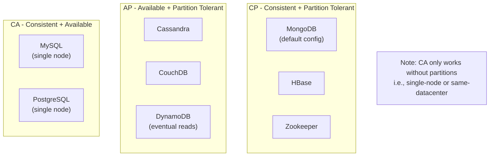

# CAP Theorem and Trade-offs

## The Distributed Systems Problem

When you run a database on a single machine, life is simple: the machine either works or it doesn't. But NoSQL databases are designed to run across many machines. When you have multiple nodes, a new class of problems emerges -- what happens when the network connecting them fails?

This is the question the **CAP theorem** answers.

## CAP Theorem

> **Core Concept:** For the full theory, proof intuition, and CP vs AP spectrum analysis, see [CAP Theorem](../../core-concepts/04-distributed-systems/01-cap-theorem.md).

Proposed by Eric Brewer in 2000, the CAP theorem states that a distributed system can guarantee at most two of: **Consistency** (every read sees the latest write), **Availability** (every request gets a response), and **Partition Tolerance** (system works despite network failures). Since partitions are unavoidable in distributed systems, the real choice is CP vs AP.

**Why this matters for NoSQL specifically:** In the SQL course, you worked with single-node databases where network partitions don't apply (CA systems). The moment you distribute data across nodes -- which every NoSQL database does -- you must choose where you sit on the CP vs AP spectrum. This choice drives every architectural decision that follows.

The major NoSQL databases fall into one of two camps:

- **CP** (sacrifice availability during a partition): MongoDB, HBase, Zookeeper
- **AP** (sacrifice consistency, serve potentially stale data): Cassandra, CouchDB, DynamoDB

## ACID vs BASE

You know ACID from the [SQL transactions module](../../sql/08-data-manipulation/04-transactions.md). NoSQL databases often use a different model called **BASE**.

> **Core Concept:** For the full theory of ACID vs BASE, pessimistic vs optimistic concurrency, and when each model fits, see [ACID vs BASE](../../core-concepts/04-distributed-systems/02-acid-vs-base.md).

**ACID** is pessimistic: assume conflicts will happen, lock things down, guarantee correctness at all times. **BASE** is optimistic: assume conflicts are rare, proceed without locks, reconcile conflicts when they're detected. Most NoSQL databases default to BASE semantics and expose tunable knobs to increase guarantees when needed.

## Consistency Models: A Spectrum

> **Core Concept:** For the full spectrum from linearizable to eventual consistency, isolation levels, and the PACELC extension, see [Consistency Models](../../core-concepts/04-distributed-systems/03-consistency-models.md).

CAP makes it sound binary, but consistency is actually a spectrum. From strongest to weakest: **Linearizable** (acts like a single node) → **Sequential** → **Causal** (causally related operations always appear in order) → **Eventual** (all nodes converge eventually, no timing guarantee). Stronger consistency requires more coordination, meaning higher latency.

## Where NoSQL Databases Sit

**Important nuance**: Most modern databases let you *tune* where they sit on this spectrum. MongoDB can be configured to behave more like AP. Cassandra lets you choose quorum levels per query. The CAP theorem describes the limits, not a fixed position.

## Tunable Consistency: The Real World

> **Core Concept:** For the full R + W > N quorum math, ALL/QUORUM/ONE levels, read repair, and per-operation tuning, see [Quorum and Tunable Consistency](../../core-concepts/04-distributed-systems/04-quorum-and-tunable-consistency.md).

Most NoSQL databases expose consistency as a parameter per operation rather than a fixed guarantee. Cassandra uses `ONE`, `QUORUM`, and `ALL` consistency levels. MongoDB exposes the same trade-off via **write concern** and **read concern** (covered in the [replication module](../04-mongodb-replication/01-replica-set-architecture.md)).

## Real-World Consistency Trade-off Examples

| Scenario                           | Acceptable?          | Consistency Level         |
| ---------------------------------- | -------------------- | ------------------------- |
| Bank transfer                      | No stale reads ever  | Linearizable              |
| E-commerce inventory: "5 in stock" | Slightly stale ok    | Strong or causal          |
| Shopping cart contents             | Briefly stale ok     | Causal (read-your-writes) |
| Product ratings average            | Stale for minutes ok | Eventual                  |
| Social media likes count           | Stale for seconds ok | Eventual                  |
| DNS record propagation             | Stale for hours ok   | Eventual                  |

## Advanced Note: The PACELC Extension

The CAP theorem only describes behavior during a partition. In 2012, Daniel Abadi proposed **PACELC** to also describe the latency vs consistency trade-off that exists even during normal operation (when there's no partition):

> **If Partition (P): trade off Availability (A) vs Consistency (C). Else: trade off Latency (L) vs Consistency (C).**

Even without network partitions, making a write durable across multiple nodes requires waiting for those nodes to acknowledge. This is why MongoDB's `w: majority` write concern adds latency even on healthy clusters -- it's paying the coordination cost to get consistency. Cassandra's default `ONE` consistency avoids this cost, getting lower latency at the price of weaker guarantees.

| System             | Partition behavior | Normal behavior  |
| ------------------ | ------------------ | ---------------- |
| DynamoDB           | PA (available)     | EL (low latency) |
| MongoDB            | PC (consistent)    | EC (consistent)  |
| Cassandra          | PA (available)     | EL (low latency) |
| CRDT-based systems | PA                 | EL               |

## Key Takeaways

- **CAP theorem**: A distributed system can provide at most two of Consistency, Availability, Partition Tolerance -- and since Partition Tolerance is mandatory in distributed systems, the real choice is C vs A during a partition
- **ACID** (relational): Pessimistic, synchronous, always consistent -- great for transactional systems
- **BASE** (many NoSQL): Optimistic, asynchronous, eventually consistent -- great for high-scale systems where perfect consistency is not required
- **Consistency is a spectrum**: from linearizable (every read sees the latest write) to eventual (reads may be stale for a period)
- **Tunable consistency**: Modern databases let you choose consistency level per operation -- the right choice depends on your use case
- **No free lunch**: Stronger consistency = higher latency. Higher availability = possible stale reads.

---

**Next:** [02 - NoSQL Types →](../02-nosql-types/01-document-stores.md)

---

[← Back: Why NoSQL](01-why-nosql.md) | [Course Home](../README.md)