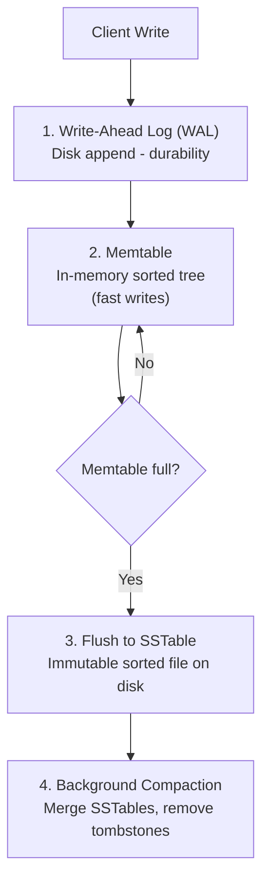

# Column-Family Stores

## What Is a Column-Family Store?

Column-family stores (also called wide-column stores) organize data in rows with dynamic columns. Despite the name, they are quite different from relational column-oriented databases like Redshift or BigQuery.

The key mental model: a column-family store is like a distributed, sorted, persistent hash map where:
- The **row key** determines which machine stores the data
- Each row can have **thousands of columns**, and different rows can have completely different columns
- Columns within a row are stored **sorted** by column name

```
                    Column-Family: "user_activity"
                    
Row Key          Timestamp:20240101  Timestamp:20240102  Timestamp:20240103
──────────────────────────────────────────────────────────────────────────
user_001         {views: 45}         {views: 67}         {views: 23, clicks: 5}
user_002         {views: 12}                             {views: 88, purchases: 2}
user_003                             {views: 5}          {views: 9}
```

Note: rows can have sparse columns -- `user_002` has no activity on 20240102. In a relational table this would be a NULL. In column-family stores, the column simply doesn't exist, saving storage.

## How It Differs from Relational Columns

This naming causes a lot of confusion. Here is the key distinction:

| Concept | Relational Column | Column-Family Column |
|---------|------------------|---------------------|
| **Schema** | Predefined, same for all rows | Dynamic per row |
| **Storage** | Row-oriented (all columns of a row together) | Column-family groups stored together |
| **Sparsity** | NULL stored | Missing columns not stored at all |
| **Count** | Dozens/hundreds per table | Millions per row possible |

## Internals: The LSM-Tree Write Path

Column-family stores are optimized for **write-heavy workloads**. The secret is the **Log-Structured Merge-tree (LSM-tree)** -- a data structure designed to convert random writes into sequential disk writes.

> **Core Concept:** See [LSM-Trees and SSTables](../../core-concepts/02-data-structures/03-lsm-trees-and-sstables.md) for the full write path, SSTable structure, compaction strategies, and the read amplification trade-off.

**Why Cassandra chose LSM-trees:** Remember how SQL databases use B-trees for indexes? B-trees are read-optimized -- great for the OLTP queries we wrote in SQL (point lookups, range scans, ORDER BY). Cassandra faces the opposite problem: write-heavy workloads ingesting millions of IoT sensor readings, event logs, or activity streams per second.

B-trees require random I/O for every write (finding the right page on disk and updating it in place). At millions of writes per second, disk seek time becomes the bottleneck. LSM-trees convert those random writes into sequential appends -- the fastest possible disk operation, 10-100x faster than random writes on the same hardware. Same fundamental trade-off, opposite optimization direction.

### Write Path



**Step 1 - WAL (Write-Ahead Log)**: Every write is appended to a sequential log file for durability. If the node crashes, the WAL is replayed on restart. See [Write-Ahead Logs](../../core-concepts/05-replication-and-availability/03-write-ahead-logs.md) for the general principle.

**Step 2 - Memtable**: Writes land in an in-memory sorted tree (usually a red-black tree). This is extremely fast -- pure RAM operations. Reads check the memtable first.

**Step 3 - SSTable flush**: When the memtable exceeds a size threshold, it is flushed to disk as an **SSTable (Sorted String Table)** -- an immutable, sorted file. The memtable is cleared.

**Step 4 - Compaction**: Background process merges multiple SSTables to remove deleted entries (tombstones), deduplicate, and maintain read performance.

### Read Path

Reads are more expensive -- they must check:
1. The memtable (most recent writes)
2. SSTables from newest to oldest (until found)
3. Bloom filters (probabilistic data structure to skip irrelevant SSTables -- see [Probabilistic Structures](../../core-concepts/02-data-structures/04-probabilistic-structures.md))

This is why column-family stores excel at writes but are more careful about read patterns.

## Data Modeling: Query-First Design

In a relational database, you normalize data around entities (users, orders, products) and let the query planner figure out how to join them. **In column-family stores, you design tables around your queries.**

This is the single most important concept. The partition key determines which node holds the data. If your query doesn't include the partition key, the database must scan all nodes -- catastrophic for performance.

**Example: A messaging system**

Bad design (entity-first):
```cql
-- Can only query: "give me all messages for conversation X"
-- Cannot query: "give me all messages by user Y" without a full scan
CREATE TABLE messages (
    message_id UUID PRIMARY KEY,
    conversation_id UUID,
    sender_id UUID,
    content TEXT,
    sent_at TIMESTAMP
);
```

Good design (query-first):
```cql
-- Table 1: "messages in a conversation, newest first"
CREATE TABLE messages_by_conversation (
    conversation_id UUID,
    sent_at TIMESTAMP,
    message_id UUID,
    sender_id UUID,
    content TEXT,
    PRIMARY KEY (conversation_id, sent_at, message_id)
) WITH CLUSTERING ORDER BY (sent_at DESC);

-- Table 2: "messages by a user, newest first" -- separate table!
CREATE TABLE messages_by_user (
    sender_id UUID,
    sent_at TIMESTAMP,
    message_id UUID,
    conversation_id UUID,
    content TEXT,
    PRIMARY KEY (sender_id, sent_at, message_id)
) WITH CLUSTERING ORDER BY (sent_at DESC);
```

In column-family stores, **denormalization is intentional** -- you duplicate data to support different query patterns efficiently. Updates must touch all copies.

## Scaling: The Token Ring

Cassandra uses a **peer-to-peer architecture** with no single master (unlike MongoDB's replica set with a primary). Every node can accept reads and writes.

> **Core Concept:** See [Consistent Hashing](../../core-concepts/03-scaling/03-consistent-hashing.md) for how the virtual ring works and why adding nodes moves only 1/N of keys.

> **Core Concept:** See [Replication Patterns](../../core-concepts/05-replication-and-availability/01-replication-patterns.md) for the comparison between peer-to-peer and primary-secondary approaches.

**Why Cassandra chose peer-to-peer:** Cassandra's peer-to-peer architecture with consistent hashing eliminates single points of failure -- any node can serve any request, which is why Cassandra achieves extreme availability. Compare this to MongoDB's primary-secondary approach, which simplifies consistency at the cost of a single write endpoint. Cassandra pays for this availability with more complex conflict resolution -- since any node can accept writes, concurrent writes to the same key on different nodes must be reconciled via last-writer-wins (timestamp-based).

Data is distributed using consistent hashing on a **token ring**:

```
          Node A (tokens 0-25)
              ↑
Node D    ────────    Node B
(75-100)  │      │   (25-50)
              ↓
          Node C (tokens 50-75)

Each row's partition key is hashed to a token value.
The row is stored on the node owning that token range.
Replication factor 3: also stored on the next 2 nodes clockwise.
```

### Tunable Consistency

> **Core Concept:** See [Quorum and Tunable Consistency](../../core-concepts/04-distributed-systems/04-quorum-and-tunable-consistency.md) for the R + W > N guarantee and how to reason about consistency levels.

Cassandra's consistency is configurable per operation -- `ONE`, `QUORUM`, or `ALL` -- applied independently to reads and writes. When `Write QUORUM + Read QUORUM > Replication Factor`, you get strong consistency. This is Cassandra's canonical implementation of the quorum concept.

## Strengths

**Massive write throughput**
LSM-tree design turns random writes into sequential disk appends. Cassandra sustains millions of writes per second across a cluster.

**Linear horizontal scaling**
Add nodes to the ring and the cluster rebalances automatically. No re-sharding, no downtime.

**No single point of failure**
Peer-to-peer architecture -- any node can handle any request. Compare to MongoDB where the primary handles all writes.

**Time-series friendly**
Wide rows with timestamp-ordered columns are a natural fit for time-series data. Cassandra is commonly used for IoT metrics, application monitoring, and financial tick data.

**Tunable consistency per query**
Choose consistency on a per-operation basis depending on what each query requires.

## Weaknesses

**Limited query patterns**
You must query by partition key. No ad-hoc queries, no WHERE on arbitrary columns, no aggregations without Spark/Hadoop on top.

**No ad-hoc JOINs**
Denormalization is required. One query pattern = one table. Multiple query patterns = multiple tables with duplicated data.

**Steep learning curve**
Data modeling requires understanding partition keys, clustering columns, replication factors, and consistency levels before you can design effectively.

**Reads are more expensive**
LSM-trees optimize writes at the cost of reads. Proper configuration of bloom filters and compaction strategies is needed to maintain read performance.

**Eventual consistency by default**
With `ONE` consistency level, reads can return stale data. Application developers must understand consistency implications.

## Main Players

| Database | Notable For |
|----------|------------|
| **Apache Cassandra** | Most popular, used at Apple, Netflix, Discord |
| **ScyllaDB** | Cassandra-compatible, rewritten in C++, 10x lower latency |
| **HBase** | Hadoop ecosystem, strong consistency via Zookeeper |
| **Google Bigtable** | Original wide-column store, inspires Cassandra and HBase |

## Primary Use Cases

**Time-Series Data (IoT, Metrics)**
Sensor readings, server metrics, stock prices -- append-only data with time-based queries. Cassandra's write throughput and time-ordered column families are ideal.

**Activity Feeds and Event Logs**
"Show me the last 100 events for user X" -- wide rows ordered by timestamp serve this query pattern efficiently.

**Audit Logs**
Compliance data that must be retained for years, queried by entity ID. High write volume, rarely updated.

**Messaging Systems**
Discord stores billions of messages in Cassandra. Conversations partition by conversation_id, messages ordered by timestamp.

**User Activity Tracking**
Clickstreams, page views, app events -- high volume, time-ordered, queried by user or session.

## At Scale

**Discord** uses Cassandra to store 100+ billion messages. They eventually hit scaling limits with a Cassandra cluster and migrated to ScyllaDB, which is Cassandra-compatible but implemented in C++ with better CPU efficiency.

**Netflix** uses Cassandra for its distributed metadata service -- tracking what content each user has watched, at billions-of-rows scale.

**Time-partitioning pattern**: Many teams partition time-series data by time bucket (day, week, month) to prevent "hot row" problems where a single row grows unboundedly:

```cql
-- partition_key includes time bucket to distribute load
CREATE TABLE sensor_readings (
    sensor_id    UUID,
    day_bucket   DATE,          -- keeps partitions bounded in size
    recorded_at  TIMESTAMP,
    value        FLOAT,
    PRIMARY KEY ((sensor_id, day_bucket), recorded_at)
);
```

## Summary

| Aspect | Column-Family Store |
|--------|---------------------|
| Data model | Rows with dynamic, sorted columns |
| Schema | Schema-on-write (column families defined), rows are flexible |
| Scaling | Horizontal, peer-to-peer ring, linear scaling |
| Consistency | Tunable per operation (ONE to ALL) |
| Write performance | Excellent (LSM-tree, sequential writes) |
| Read performance | Good with proper data modeling |
| Best for | Time-series, high-volume writes, append-heavy workloads |
| Avoid when | Ad-hoc queries, complex joins, frequent updates |

---

**Next:** [Graph Databases →](04-graph-databases.md)

---

[← Back: Key-Value Stores](02-key-value-stores.md) | [Course Home](../README.md)
