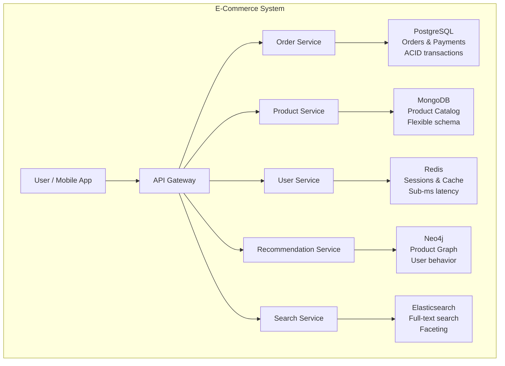

# Choosing the Right Database

## The Decision Framework

There is no universally "best" database. The right choice depends on your specific workload. Ask these questions:

### 1. What does your data look like?
- Structured, well-defined schema with stable relationships → Relational
- Flexible, hierarchical, documents with varying fields → Document Store
- Simple lookups by a single identifier → Key-Value Store
- Time-series or heavily write-oriented tabular data → Column-Family
- Data where relationships ARE the data → Graph

### 2. What queries do you need to run?
- Complex multi-table joins, ad-hoc analytics → Relational
- Queries within a document, aggregation pipelines → Document Store
- Lookup by key only → Key-Value Store
- Queries by partition key + time range → Column-Family
- Multi-hop relationship traversals → Graph

### 3. What are your scale requirements?
- Moderate scale, single region → Any well-operated relational DB
- Horizontal write scaling across many nodes → Column-Family, Document (sharded)
- Horizontal read scaling, caching layer → Key-Value (Redis)
- Massive scale with relationship queries → Graph (limited horizontal scaling)

### 4. What consistency do you need?
- Strong ACID, financial transactions → Relational, MongoDB (with transactions)
- Eventual is acceptable, high availability priority → Column-Family (Cassandra), DynamoDB
- Strong reads with high write throughput → MongoDB replica set with majority write concern

### 5. How does your schema evolve?
- Stable schema, few changes → Relational
- Rapidly evolving, different shapes per record → Document Store

## Comprehensive Comparison Table

| | Relational | Document | Key-Value | Column-Family | Graph |
|--|------------|----------|-----------|---------------|-------|
| **Data model** | Tables/rows | JSON documents | Key→value pairs | Wide rows | Nodes/edges |
| **Schema** | Strict, enforced | Flexible | None | Column families defined | Flexible |
| **Query flexibility** | Excellent | Good | Poor (key only) | Limited (partition key) | Excellent (for graph patterns) |
| **Horizontal scaling** | Hard (sharding complex) | Good (built-in) | Excellent | Excellent (linear) | Hard |
| **Write throughput** | Moderate | High | Very high | Extremely high | Moderate |
| **Read performance** | Excellent with indexes | Very good | Sub-millisecond | Good | Excellent for traversals |
| **Multi-table joins** | Excellent | Not native | None | None | Not needed |
| **Consistency** | ACID (strong) | Tunable | Eventual/tunable | Tunable | Strong |
| **Schema evolution** | Requires migrations | Zero-downtime | N/A | Additive is easy | Easy |
| **Ecosystem maturity** | Excellent | Very good | Excellent (Redis) | Good | Moderate |
| **Primary use case** | Transactions, OLTP | Content, profiles | Cache, sessions | Time-series, logs | Social, fraud, recommendations |
| **Representative product** | PostgreSQL | MongoDB | Redis | Cassandra | Neo4j |

## Anti-Patterns to Avoid

### The "NoSQL Is Trendy" Mistake
Choosing a NoSQL database because it sounds modern or the tech press is excited about it. If your application has well-defined schemas, complex transactions, and moderate scale, PostgreSQL is probably the right choice. Don't add operational complexity without a concrete benefit.

### Using MongoDB Like a Relational Database
The most common MongoDB mistake: storing normalized data with references everywhere and then doing `$lookup` joins on every query. If you end up writing a lot of `$lookup` aggregations, you have a relational data model that would be better served by PostgreSQL.

Document stores reward **embedding** related data. If you're referencing, ask whether the data should be embedded instead.

```javascript
// Anti-pattern: Relational model in MongoDB (lots of lookups needed)
// orders collection
{ _id: "order_1", customer_id: "user_42", product_ids: ["prod_1", "prod_2"] }

// Better: Embed the data that's always accessed together
{
  _id: "order_1",
  customer: { id: "user_42", name: "Alice", email: "alice@example.com" },
  items: [
    { product_id: "prod_1", name: "Laptop", price: 1299, quantity: 1 },
    { product_id: "prod_2", name: "Mouse", price: 29, quantity: 2 }
  ],
  total: 1357,
  status: "shipped"
}
```

### Choosing Cassandra for a Small Dataset
Cassandra's operational complexity (tuning compaction, managing token rings, understanding consistency levels) is only worth it at scale. For a dataset that fits comfortably on a single PostgreSQL server, Cassandra adds cost and complexity with no benefit.

### Ignoring the Operational Cost
Each database type requires different operational expertise:
- Cassandra: compaction, repair, token rebalancing
- MongoDB: shard key selection, balancer tuning, oplog management
- Redis: memory sizing, eviction policies, cluster resharding
- Neo4j: graph modeling, memory for working set

## Polyglot Persistence

Modern data-intensive systems often use multiple database types together, each solving the problem it's best at. This is called **polyglot persistence**.

> **Core Concept:** For the full pattern -- data flow between systems, consistency challenges, CDC, and when polyglot is worth the complexity -- see [Polyglot Persistence](../../core-concepts/06-architecture-patterns/03-polyglot-persistence.md).



**Each database does what it's best at:**
- **PostgreSQL**: Orders and payments require ACID transactions -- two-phase commits, no partial states
- **MongoDB**: Product catalog has wildly different fields per category (laptop vs t-shirt vs furniture) -- document flexibility is essential
- **Redis**: Session tokens need sub-millisecond lookup and automatic TTL expiry
- **Neo4j**: Recommendations require "users who bought X also bought Y" -- graph traversal across purchase history
- **Elasticsearch**: Full-text search with faceting (filter by price range, brand, rating) requires an inverted index

The trade-off is worth it at scale. Start with a single relational database and introduce NoSQL only when a specific, concrete need demands it -- see the core concept above for the full analysis of consistency challenges, data flow, and operational cost.

## The Cloud-Native Alternative

Cloud providers offer managed versions of all these databases that reduce operational burden:

| Self-Managed | AWS | GCP | Azure |
|-------------|-----|-----|-------|
| PostgreSQL | RDS / Aurora | Cloud SQL / AlloyDB | Azure Database for PostgreSQL |
| MongoDB | DocumentDB (compatible) | - | CosmosDB (MongoDB API) |
| Redis | ElastiCache | Memorystore | Azure Cache for Redis |
| Cassandra | Keyspaces | Bigtable | CosmosDB (Cassandra API) |
| Neo4j | Neptune | - | - |

Managed services handle backups, patching, failover, and scaling -- significantly reducing operational cost.

## Decision Flowchart

```
Start: What problem are you solving?

Need ACID transactions across multiple entities?
├─ Yes → Relational (PostgreSQL, MySQL)
└─ No  →
    Data is relationship-heavy (social, fraud, recommendations)?
    ├─ Yes → Graph (Neo4j, Neptune)
    └─ No  →
        Need sub-millisecond lookup by a single key?
        ├─ Yes → Key-Value (Redis, DynamoDB)
        └─ No  →
            Write throughput > 100K writes/sec, or time-series?
            ├─ Yes → Column-Family (Cassandra, HBase)
            └─ No  →
                Flexible schema, hierarchical data, application docs?
                ├─ Yes → Document Store (MongoDB)
                └─ No  → Relational is probably fine
```

## Practical Exercise

For each of the following systems, which database type(s) would you choose? Justify your choice with specific requirements from the problem:

1. **Real-time multiplayer game**: Track player positions, scores, and matches. 10,000 concurrent games, each with ~20 players. Leaderboard updated every second.

2. **Hospital patient records system**: Patient history, diagnoses, medications, lab results. Multiple doctors update records simultaneously. Regulatory requirement: no data loss, all changes audited.

3. **E-commerce analytics**: Track every product view, add-to-cart, and purchase for 50 million daily visitors. Run nightly reports: "top 100 products by conversion rate."

4. **Content recommendation engine**: A video streaming platform with 200 million users, 50 million videos. Recommend videos based on watch history and social connections.

---

**Next:** [03 - MongoDB Basics →](../03-mongodb-basics/01-mongodb-overview.md)

---

[← Back: Graph Databases](04-graph-databases.md) | [Course Home](../README.md)
