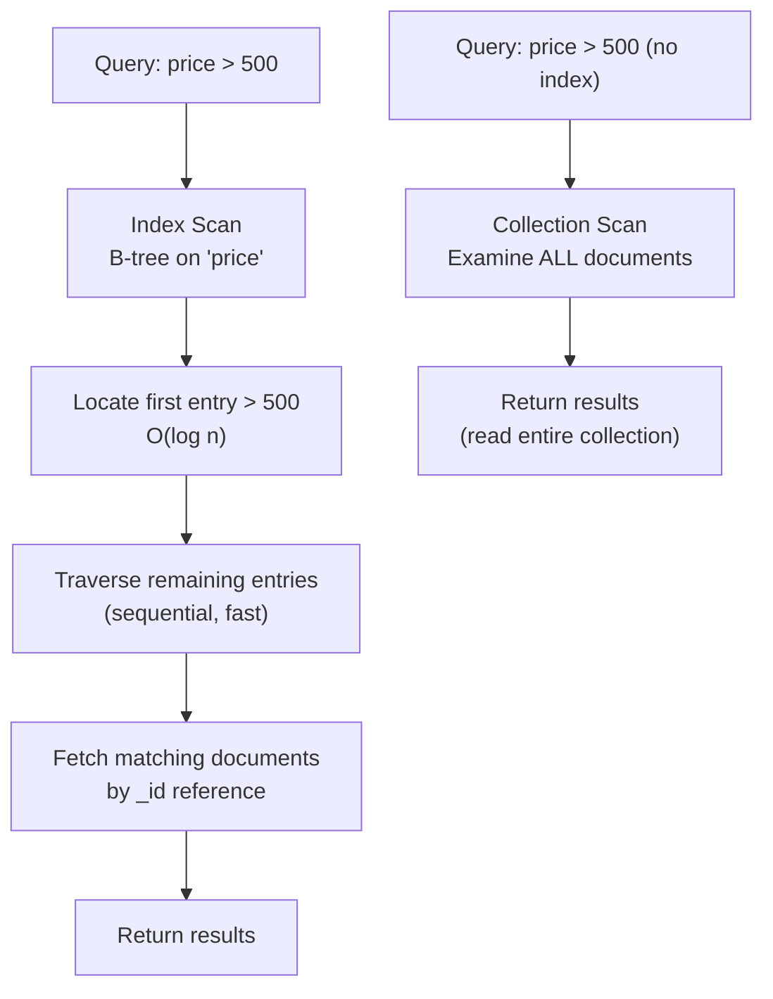

# Indexes and Performance

## Why Indexes Matter

Without an index, MongoDB must examine every document in a collection to find matching results. This is called a **collection scan (COLLSCAN)**. On a collection of 10 million documents, a COLLSCAN reads all 10 million documents for every query -- even if only 5 match.

An index is a separate data structure that maps field values to the documents that contain them. MongoDB can find matching documents by consulting the index first, then fetching only the relevant documents. This is called an **index scan (IXSCAN)**.

If you know SQL indexes, MongoDB indexes follow the same B-tree concept. The key difference: MongoDB indexes work on document fields, including nested fields and array elements.

## How MongoDB Indexes Work

> **Core Concept:** See [Trees for Storage](../../core-concepts/02-data-structures/02-trees-for-storage.md) for how B-trees and B+ trees work -- node structure, depth, why they're optimized for disk, and the difference between clustered and non-clustered indexes.

MongoDB's default index type is a **B-tree** (same as PostgreSQL and SQL Server). MongoDB uses B-trees for the same reason you saw them in SQL indexes -- they provide O(log n) for both point lookups and range scans. Same data structure, applied to documents instead of rows.

The B-tree stores index key values in sorted order, enabling:

- **Equality queries**: Find documents where `price = 1299` → O(log n) lookup
- **Range queries**: Find documents where `price > 500` → O(log n) to find start + sequential scan
- **Sorting**: If the query result must be sorted by an indexed field, the B-tree is already sorted → no sort step needed



## Index Types

### Single Field Index

Index on one field. Supports equality, range, and sort on that field.

```javascript
// Create an index on the price field
db.products.createIndex({ price: 1 })   // 1 = ascending, -1 = descending

// These queries will use the index:
db.products.find({ price: 1299 })
db.products.find({ price: { $gt: 500, $lt: 1000 } })
db.products.find({}).sort({ price: 1 })
```

### Compound Index

Index on multiple fields. The order of fields matters significantly.

```javascript
// Index on category + price
db.products.createIndex({ category: 1, price: -1 })

// Queries that use this index:
db.products.find({ category: "electronics" })                          // prefix match
db.products.find({ category: "electronics", price: { $gt: 500 } })    // both fields
db.products.find({ category: "electronics" }).sort({ price: -1 })     // prefix + sort

// This query CANNOT use the compound index efficiently:
db.products.find({ price: { $gt: 500 } })   // doesn't start with 'category'
```

**The ESR Rule** (Equality, Sort, Range): Structure compound indexes so that:
1. **Equality** fields come first (fields queried with `=`)
2. **Sort** fields come next
3. **Range** fields come last (fields with `$gt`, `$lt`, `$in`)

```javascript
// Query: find electronics, sorted by name, with price > 500
// Optimal compound index follows ESR:
db.products.createIndex({
  category: 1,   // E: equality (category = "electronics")
  name: 1,       // S: sort (sort by name)
  price: 1       // R: range (price > 500)
})
```

### Multikey Index (Arrays)

When you index a field that contains an array, MongoDB creates index entries for each element in the array. This allows efficient queries like "find documents where array contains value X."

```javascript
// Products have a tags array: ["laptop", "gaming", "portable"]
db.products.createIndex({ tags: 1 })   // automatically a multikey index

// Now this query is fast:
db.products.find({ tags: "gaming" })   // finds any document with "gaming" in tags array
```

One compound index can only have one multikey field.

### Hashed Index

Instead of the natural value, stores the hash of the field value. Supports only equality queries (no range, no sort). Used primarily as shard keys (covered in the sharding module).

```javascript
db.users.createIndex({ user_id: "hashed" })

// Supports: db.users.find({ user_id: "user_42" })
// Does NOT support: db.users.find({ user_id: { $gt: "user_40" } })
```

### TTL Index (Time-To-Live)

Automatically deletes documents after a specified time period. A background process runs every 60 seconds and removes expired documents.

```javascript
// Delete session documents 30 minutes after their created_at time
db.sessions.createIndex({ created_at: 1 }, { expireAfterSeconds: 1800 })

// Or expire at a specific datetime stored in the document
db.events.createIndex({ expires_at: 1 }, { expireAfterSeconds: 0 })
```

### Text Index

Enables full-text search across string fields.

```javascript
db.articles.createIndex({ title: "text", content: "text" })
db.articles.find({ $text: { $search: "mongodb replication" } })
```

## The `explain()` Method

`explain()` is the most important tool for understanding index usage and query performance. Always use it before and after adding indexes in production.

```javascript
db.products.find({ category: "electronics", price: { $gt: 500 } }).explain("executionStats")
```

### Reading the Output

The critical fields to look at:

```javascript
{
  "queryPlanner": {
    "winningPlan": {
      "stage": "FETCH",                    // outer stage: fetch documents by _id
      "inputStage": {
        "stage": "IXSCAN",                 // ← GOOD: using an index
        "keyPattern": { "category": 1, "price": -1 },
        "indexName": "category_1_price_-1",
        "direction": "forward"
      }
    }
  },
  "executionStats": {
    "executionSuccess": true,
    "nReturned": 23,                        // documents returned to client
    "totalKeysExamined": 23,               // index entries examined
    "totalDocsExamined": 23,               // documents fetched from disk
    "executionTimeMillis": 2               // total query time
  }
}
```

**What to look for:**

| Field | Good | Bad |
|-------|------|-----|
| `stage` | `IXSCAN` | `COLLSCAN` |
| `nReturned` vs `totalDocsExamined` | Close to each other | `totalDocsExamined` >> `nReturned` |
| `executionTimeMillis` | Low | High (relative to data size) |
| `totalKeysExamined` vs `nReturned` | Close | Much higher (index not selective) |

**COLLSCAN**: Examined every document in the collection. Add an index.

**`totalDocsExamined` >> `nReturned`**: The index found candidates but the database had to read many documents and discard them. The index may not be selective enough, or you need a better compound index.

## Hands-On Exercise: Index Impact

This exercise demonstrates the difference between a collection scan and an index scan on 100,000 documents.

### Setup: Generate Test Data

```javascript
// Run in mongosh
use indexdemo

// Insert 100,000 product documents
const categories = ["electronics", "clothing", "furniture", "books", "sports"]
const brands = ["BrandA", "BrandB", "BrandC", "BrandD", "BrandE"]

let docs = []
for (let i = 0; i < 100000; i++) {
  docs.push({
    sku: `PROD-${String(i).padStart(6, '0')}`,
    name: `Product ${i}`,
    category: categories[i % 5],
    brand: brands[i % 5],
    price: Math.round((Math.random() * 2000 + 10) * 100) / 100,
    stock: Math.floor(Math.random() * 500),
    created_at: new Date(Date.now() - Math.random() * 365 * 24 * 60 * 60 * 1000)
  })
  
  if (docs.length === 1000) {
    db.products.insertMany(docs)
    docs = []
  }
}
db.products.countDocuments()  // Should be 100000
```

### Step 1: Query Without an Index (COLLSCAN)

```javascript
// Check existing indexes (should only be _id)
db.products.getIndexes()

// Run a query and check the execution plan
db.products.find({ category: "electronics", price: { $gt: 800 } }).explain("executionStats")
```

Look at the output:
- `stage`: should be `COLLSCAN`
- `totalDocsExamined`: 100,000 (scanned entire collection)
- `nReturned`: ~20,000 (electronics is 1/5 of data, price > 800 is roughly half)
- `executionTimeMillis`: probably 80-300ms

### Step 2: Add an Index and Compare

```javascript
// Create a compound index following ESR rule
// Query: category (equality) + price (range)
db.products.createIndex({ category: 1, price: 1 })

// Run the SAME query again
db.products.find({ category: "electronics", price: { $gt: 800 } }).explain("executionStats")
```

Now observe:
- `stage`: `IXSCAN` (using the index)
- `totalDocsExamined`: ~20,000 (only documents that match)
- `nReturned`: same as before
- `executionTimeMillis`: probably 10-50ms -- significantly faster

### Step 3: Covered Query (Even Faster)

A **covered query** is one where the index contains all the fields the query needs -- MongoDB never needs to fetch the actual documents.

```javascript
// This index covers: category (filter), price (filter), name (projection)
db.products.createIndex({ category: 1, price: 1, name: 1 })

// Query that only asks for fields in the index
db.products.find(
  { category: "electronics", price: { $gt: 800 } },
  { category: 1, price: 1, name: 1, _id: 0 }    // project only indexed fields
).explain("executionStats")
```

Look for: `totalDocsExamined: 0` -- MongoDB served the result entirely from the index without reading a single document. This is the fastest possible query.

### Step 4: Observe the Write Cost

```javascript
// Check index sizes
db.products.stats().indexSizes

// Measure insert time WITHOUT extra indexes (drop them first)
db.products.dropIndexes()   // drops all except _id

let start = Date.now()
db.products.insertMany(Array.from({length: 1000}, (_, i) => ({
  sku: `BATCH-${i}`, category: "electronics", price: 999, stock: 10
})))
print(`Insert without indexes: ${Date.now() - start}ms`)

// Recreate the compound index
db.products.createIndex({ category: 1, price: 1 })

start = Date.now()
db.products.insertMany(Array.from({length: 1000}, (_, i) => ({
  sku: `BATCH2-${i}`, category: "electronics", price: 999, stock: 10
})))
print(`Insert with index: ${Date.now() - start}ms`)
```

You'll see inserts are slower with indexes -- the B-tree must be updated for every write.

## Index Overhead and Best Practices

**Indexes cost:**
- **Write overhead**: Every insert/update/delete must update all indexes on the collection
- **Storage**: Each index is a separate B-tree on disk (can be 10-50% of collection size)
- **Memory**: Frequently used indexes should fit in RAM (WiredTiger cache)

**Index best practices:**
- Index fields used in frequent `find()` filters and `sort()` operations
- Prefer compound indexes over many single-field indexes
- Avoid indexing fields with low cardinality (e.g., a boolean `is_active` field)
- Use `explain()` to verify that your queries use the index you created
- Audit unused indexes with `db.collection.aggregate([{$indexStats: {}}])`

```javascript
// Find indexes that haven't been used
db.products.aggregate([{ $indexStats: {} }])
// Look for indexes with low or zero 'accesses.ops' count
```

## Connecting to Sharding

**Hashed indexes** are the foundation of MongoDB's hashed sharding. When you create a hashed index on a field and use it as a shard key, MongoDB distributes documents evenly across shards regardless of the field's natural ordering.

This becomes important in the sharding module -- if your shard key is a monotonically increasing value (like a timestamp or auto-increment ID), all new writes land on the same shard. A hashed shard key distributes the writes evenly.

```javascript
// Preview: hashed index as shard key ensures even distribution
db.events.createIndex({ user_id: "hashed" })
sh.shardCollection("mydb.events", { user_id: "hashed" })
```

(Covered in depth in [05 - Sharding Architecture](../05-mongodb-sharding/01-sharding-architecture.md))

## Summary

- Without indexes: COLLSCAN examines every document -- O(n)
- With an index: IXSCAN examines only matching entries -- O(log n) + result set
- **Compound indexes** follow the ESR rule: Equality → Sort → Range
- **Multikey indexes** automatically handle array fields
- **TTL indexes** expire documents automatically
- `explain("executionStats")` is your primary tool for verifying index usage
- **Covered queries** (result entirely from index, `totalDocsExamined: 0`) are the fastest possible
- Indexes speed up reads but slow down writes -- index strategically

---

**Next:** [Replica Set Architecture →](../04-mongodb-replication/01-replica-set-architecture.md)

---

[← Back: Data Modeling](02-documents-and-data-modeling.md) | [Course Home](../README.md)
