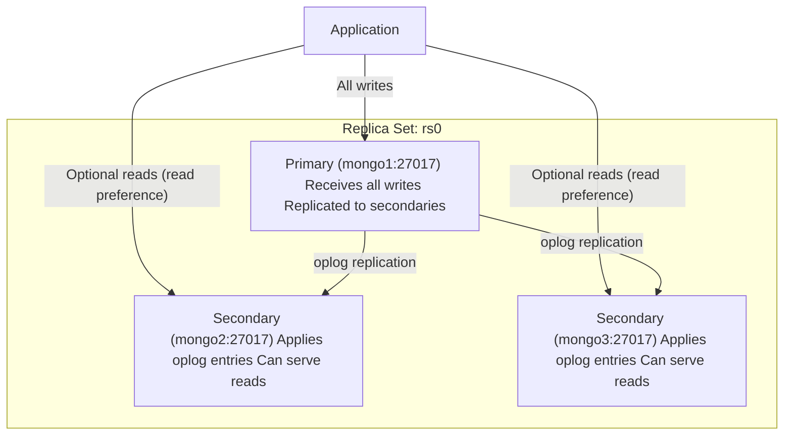
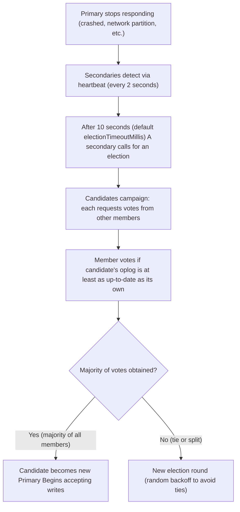
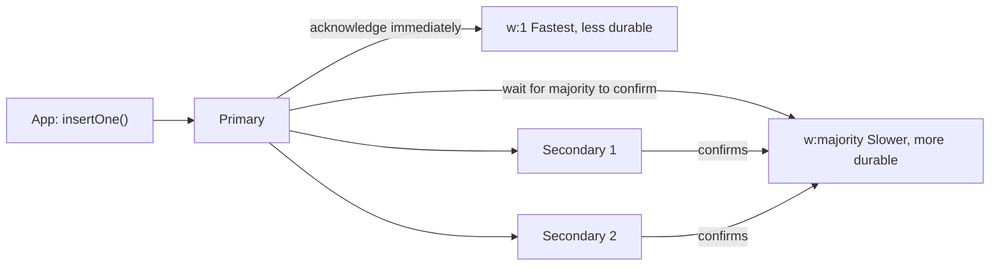
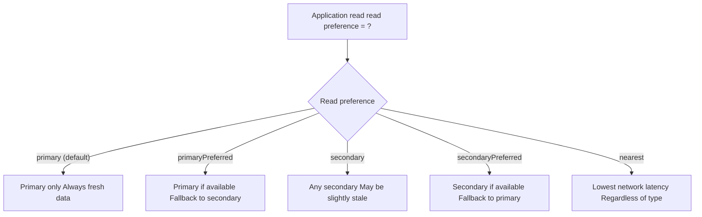
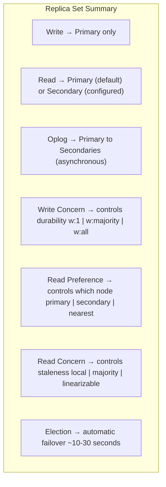

# Replica Set Architecture

## Why Replication?

A single MongoDB node is a single point of failure. The disk fails, the server reboots, or the network goes down -- your application loses access to its database. Replication solves this:

- **High availability**: Automatic failover when a node goes down -- the cluster keeps serving requests
- **Data durability**: Data is stored on multiple machines; a disk failure on one node doesn't lose data
- **Read scaling**: Application reads can be distributed across replica members
- **Zero-downtime maintenance**: Rolling upgrades -- take down one node at a time while others serve traffic

## Replica Set Components

> **Core Concept:** See [Replication Patterns](../../core-concepts/05-replication-and-availability/01-replication-patterns.md) for how primary-secondary replication works in general, synchronous vs asynchronous replication, and how it compares to peer-to-peer approaches.

**Why MongoDB chose primary-secondary:** MongoDB uses primary-secondary -- the same pattern PostgreSQL uses for streaming replication. But while PostgreSQL requires external tools like Patroni for automatic failover (because replication was added to PostgreSQL later, with leader election delegated to an external coordinator), MongoDB has election built into the engine from day one. Same pattern, different implementation maturity.

A MongoDB **replica set** is a group of MongoDB nodes that maintain the same dataset. One node is designated the **primary**, the others are **secondaries**.




**Primary**: The single node that accepts all write operations. Every replica set has exactly one primary at any time.

**Secondary**: Copies the primary's data by applying operations from the primary's **oplog**. Can serve read operations (when configured).

**Arbiter** (optional): A lightweight node that participates in elections but holds no data. Used in 2-node replica sets to provide a tiebreaker for elections without the storage cost of a full replica.

> **Typical configurations:**
>
> - **3 data nodes**: Most common. Tolerates loss of 1 node.
> - **5 data nodes**: Tolerates loss of 2 nodes. Used for higher durability.
> - **2 data nodes + 1 arbiter**: Resource-efficient but the arbiter doesn't help with durability.

## The Oplog: How Replication Works

The **oplog** (operations log) is MongoDB's replication mechanism. It is a **capped collection** (fixed size, overwrites oldest entries when full) stored in the `local` database on every member.

Every write operation on the primary is recorded in the oplog as an idempotent operation. Secondaries tail the primary's oplog (like `tail -f` on a log file) and apply each entry in order.

```
Primary's oplog (local.oplog.rs):

Timestamp    ns                  Op   Document
──────────────────────────────────────────────────────────
T1           mydb.products       i    { _id: "p1", name: "Laptop" }
T2           mydb.products       u    { $set: { price: 1199 } } where _id: "p1"
T3           mydb.orders         i    { _id: "o1", customer: "alice" }
T4           mydb.products       d    { _id: "p2" }

Secondaries read these entries and apply them to their own data.
If secondary is behind: it reads from T1. If it just restarted: it reads from where it left off.
```

**Oplog idempotency**: Operations in the oplog are designed to be replayable multiple times with the same result. An `$inc` in your application code becomes an explicit `$set` in the oplog (e.g., `{$set: {count: 5}}` not `{$inc: {count: 1}}`). This means if a secondary crashes and replays entries, the result is always correct.

**Oplog size**: Configurable, default ~5% of free disk space (minimum 990MB). If a secondary falls so far behind that the primary's oplog has rolled over, the secondary cannot catch up and enters a `RECOVERING` state -- it needs to be re-synced from scratch.

```javascript
// Inspect the oplog in mongosh
use local
db.oplog.rs.find().sort({ $natural: -1 }).limit(5).pretty()

// Check oplog window (how far back it goes)
rs.printReplicationInfo()
// Output: configured oplog size:   1024 MB
//         log length start to end: 4 hrs 23 min
//         oplog first event time:  Thu Feb 20 2024 ...
//         oplog last event time:   Thu Feb 20 2024 ...
```

## Elections: Choosing a New Primary

> **Core Concept:** See [Consensus and Failover](../../core-concepts/05-replication-and-availability/02-consensus-and-failover.md) for the majority voting requirement, split-brain prevention, epoch/term numbers, and how Raft-family protocols work.

**MongoDB's built-in election protocol (similar to Raft) means failover is automatic -- no Patroni, no etcd.** The trade-off: less flexibility to customize the consensus behavior. External coordinators like Patroni let you tune timeouts and hook custom logic into the failover process; MongoDB's built-in election is simpler to operate but less configurable.

When the primary becomes unavailable, the replica set automatically elects a new primary. This is one of the most important behaviors to understand.

### Election Trigger




**Key requirements for election:**

- A candidate needs **votes from a majority of all members** (not just online members). In a 3-node set, majority = 2. In a 5-node set, majority = 3.
- This is why an even number of nodes without an arbiter is problematic: a 2-node set can never elect a new primary if one node goes down (1 vote out of 2 needed = not a majority).
- A candidate's oplog must be at least as recent as the voter's oplog (prevents electing a lagging secondary that would lose data).

**Typical failover time**: 12 seconds (election timeout + vote collection + new primary announcement).

**What the application sees during failover**: Write operations fail with a `NotPrimaryError`. The driver (pymongo) automatically retries once the new primary is elected. Applications should handle brief connection errors gracefully.

## Write Concern

**Write concern** controls how many nodes must acknowledge a write before MongoDB returns success to the application. This is the fundamental durability trade-off.




| Write Concern | Meaning                          | Durability | Latency |
| ------------- | -------------------------------- | ---------- | ------- |
| `w: 0`        | Fire and forget (unacknowledged) | Very low   | ~0ms    |
| `w: 1`        | Primary acknowledged             | Moderate   | ~1ms    |
| `w: majority` | Majority of nodes acknowledged   | High       | ~5-20ms |
| `w: 3`        | All 3 nodes acknowledged         | Very high  | Slowest |


```javascript
// mongosh examples
db.orders.insertOne(
  { customer: "alice", total: 1299 },
  { writeConcern: { w: "majority", wtimeout: 5000 } }
)

// w: "majority" + journal: true = most durable without sacrificing too much speed
db.payments.insertOne(
  { amount: 9999, type: "transfer" },
  { writeConcern: { w: "majority", j: true } }
)
```

**Choosing write concern:**

- Financial transactions, user accounts: `w: majority` (losing a confirmed write is unacceptable)
- High-volume event logs, metrics: `w: 1` (losing a few events is acceptable, throughput matters)
- Cache warming, temp data: `w: 0` (don't care if it's lost)

## Read Preference

**Read preference** determines which replica set member the driver sends read operations to.




| Read Preference      | Use Case                                                                |
| -------------------- | ----------------------------------------------------------------------- |
| `primary` (default)  | Any read that requires up-to-date data                                  |
| `primaryPreferred`   | Prefer fresh data, fall back to secondary if primary is unavailable     |
| `secondary`          | Analytics, reporting -- stale data acceptable, offload primary          |
| `secondaryPreferred` | Primarily secondary reads, fall back to primary                         |
| `nearest`            | Multi-region deployments -- users read from geographically closest node |


**Important**: Reads from secondaries may be **stale** (lag behind the primary). If your application writes a record and immediately reads it back, reading from a secondary might not see the new write. Use `primary` or `primaryPreferred` for read-your-writes consistency.

```javascript
// mongosh: force a secondary read (for demonstration)
// Connect to a secondary directly
db.getMongo().setReadPref("secondary")
db.products.find({ category: "electronics" })
```

## Read Concern

**Read concern** controls the consistency level of data returned by read operations.


| Read Concern      | Returns                                                                             | Use Case                          |
| ----------------- | ----------------------------------------------------------------------------------- | --------------------------------- |
| `local` (default) | Data from the local node, may not be majority-committed                             | Fast, most common                 |
| `majority`        | Data confirmed by majority of nodes                                                 | Prevents reading rolled-back data |
| `linearizable`    | Data guaranteed to reflect all successful majority-committed writes before the read | Strongest, slowest                |


```javascript
// Read only data confirmed by majority (won't read rolled-back writes)
db.accounts.findOne(
  { _id: "account_42" },
  { readConcern: { level: "majority" } }
)
```

**Most applications use `local` read concern** -- it's fast and consistent enough for most use cases. Use `majority` when you must guarantee you're reading data that has survived a potential primary failover.

## Logical Partitions

One critical concept before the hands-on: MongoDB replica sets enforce **logical partitioning** between reads and writes even though physically the same data is replicated. The primary handles writes; secondaries can optionally handle reads. This separation allows:

- **Independent read/write scaling**: Add secondaries to scale reads without affecting write capacity
- **Geographic distribution**: Place secondaries close to read-heavy users (nearest read preference)
- **Reporting isolation**: Dedicate a secondary to analytics queries without impacting the primary's performance

The hands-on exercise will make these concepts concrete by letting you observe replication in action, trigger an election, and see how the application behaves during failover.

## Summary




- **Primary** receives all writes; **secondaries** replicate via the oplog
- **Elections** happen automatically when the primary is unavailable; require majority votes
- **Write concern** (`w: majority`) determines durability -- configure based on your tolerance for data loss
- **Read preference** (`secondary`) distributes read load -- but reads may be stale
- **Read concern** (`majority`) ensures reads reflect only committed data

---

**Next:** [Hands-On: Replica Set →](02-hands-on-replica-set.md)

---

[← Back: Indexes and Performance](../03-mongodb-basics/03-indexes-and-performance.md) | [Course Home](../README.md)