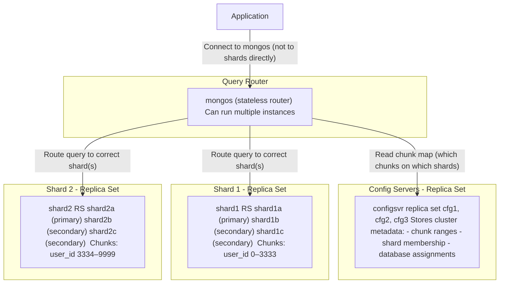
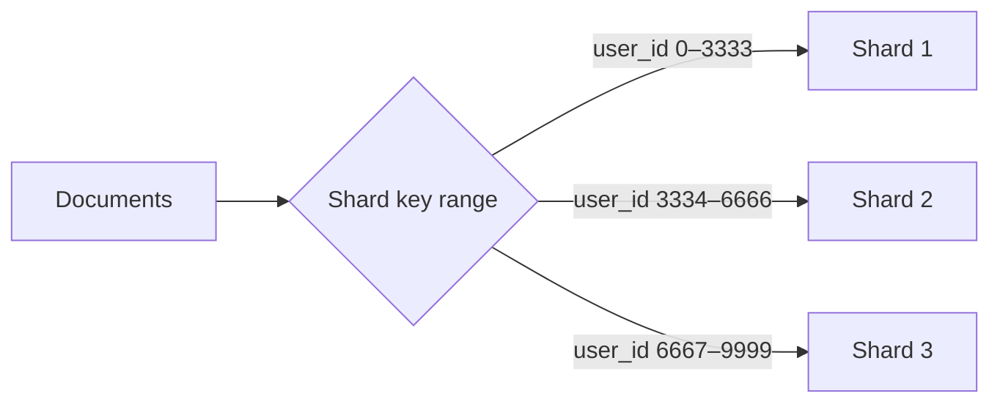
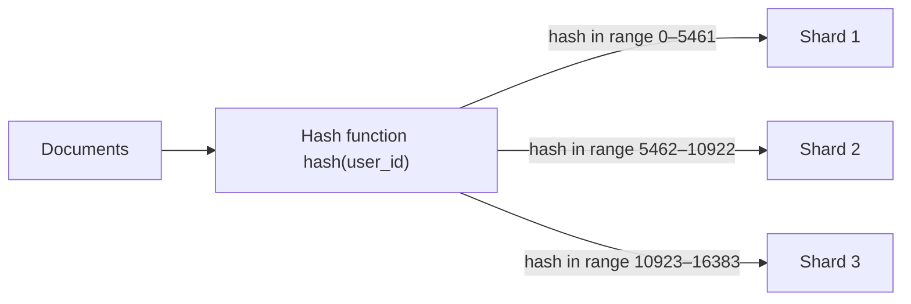
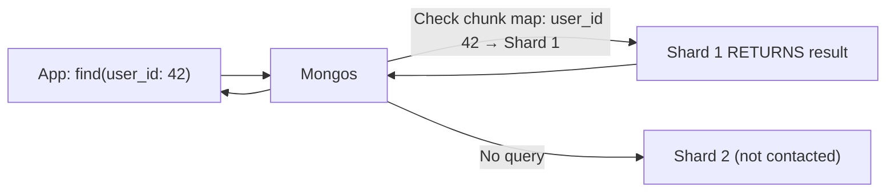
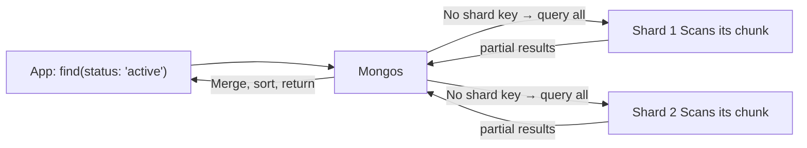
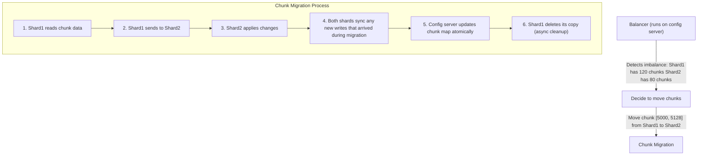

# Sharding Architecture

## Why Sharding?

Replication gives you high availability and read scaling, but every node still holds all the data. When your dataset grows beyond what a single machine can store or serve efficiently, you need **sharding** -- splitting data across multiple machines.

Sharding solves two different problems:

1. **Storage**: Data exceeds a single server's disk capacity (e.g., 10TB dataset, 2TB per server → need 5+ shards)
2. **Write throughput**: Write rate exceeds a single primary's capacity (e.g., 100K writes/sec workload, single node maxes out at 30K)

Note: if your problem is just read scaling, replica sets (more secondaries) are the simpler solution. Sharding adds significant operational complexity -- only adopt it when you genuinely need it.

## Sharded Cluster Architecture

A MongoDB sharded cluster has three distinct components:



### mongos (Query Router)

`mongos` is a **stateless routing process** -- it doesn't store any data. Its job is to:
1. Accept connections from applications (same MongoDB wire protocol)
2. Read the chunk map from config servers to know which shard owns which data range
3. Route queries to the correct shard(s)
4. Merge and sort results from multiple shards before returning to the application

Key points:
- Applications connect to `mongos`, never to individual shard members directly
- You can run multiple `mongos` instances for load balancing and high availability
- `mongos` caches the chunk map in memory and updates it when the cluster changes

### Config Servers

Config servers store all cluster metadata:
- Which shards exist and their connection info
- Which databases and collections are sharded
- The **chunk map**: which shard owns which range of the shard key
- Cluster-wide settings

Config servers **must** run as a replica set (3 nodes in production). If all config servers go down, the cluster becomes read-only (mongos can serve cached routes but can't learn about changes).

### Shard Servers

Each shard is a **MongoDB replica set** storing a subset of the data. A shard behaves exactly like a regular replica set:
- One primary, one or more secondaries
- Handles reads and writes for the data it owns
- Runs elections on failure

## The Shard Key: The Most Critical Decision

> **Core Concept:** See [Partitioning Strategies](../../core-concepts/03-scaling/02-partitioning-strategies.md) for range vs hash partitioning, hot spots, skew, and rebalancing strategies.

**Remember table partitioning from the SQL big data context?** MongoDB applies the same idea at the cluster level -- range sharding for scan-heavy analytics workloads, hash sharding for write-heavy OLTP workloads where you want even distribution. The trade-offs are identical: range sharding enables efficient scans but risks hot spots on monotonic keys; hash sharding distributes evenly but makes range queries scatter-gather across all shards.

The **shard key** is a document field (or compound of fields) that determines which shard a document belongs to. This decision is permanent -- once a collection is sharded with a key, you cannot change it without re-sharding the entire collection.

### Chunks

MongoDB divides the shard key space into **chunks**. Each chunk covers a contiguous range of shard key values and is owned by exactly one shard.

- Default chunk size: **128MB**
- When a chunk grows beyond the limit, MongoDB splits it into two smaller chunks
- The **balancer** (background process) moves chunks between shards to keep the distribution even

```
Shard Key: user_id (integer, ranged sharding)

Chunk 1: user_id [MinKey, 2500)  →  Shard 1
Chunk 2: user_id [2500, 5000)   →  Shard 1
Chunk 3: user_id [5000, 7500)   →  Shard 2
Chunk 4: user_id [7500, MaxKey) →  Shard 2

As data grows:
Chunk 2 splits into [2500, 3750) and [3750, 5000)
Balancer moves chunks to equalize storage across shards
```

### Ranged Sharding

Documents with similar shard key values are stored on the same shard.



**Pros**: Range queries (`user_id > 5000`) can target a single shard or a contiguous set of shards.

**Cons**: If user IDs are assigned incrementally, all new writes land on the last shard -- a **monotonic hot spot**. The newest shard receives 100% of writes while others are idle.

### Hashed Sharding

MongoDB applies a hash function to the shard key value before assigning to a chunk.



**Pros**: Even distribution of writes regardless of the shard key's natural ordering. Solves the monotonic hot spot problem.

**Cons**: Range queries on the shard key must scatter to all shards (the hash randomizes the order, so consecutive values land on different shards).

### Choosing a Good Shard Key

| Property | Why it matters |
|----------|---------------|
| **High cardinality** | Many distinct values = many possible chunks = fine-grained distribution |
| **Even distribution** | Values should be spread evenly across chunks, not clustered |
| **Query isolation** | Queries should include the shard key to avoid scatter-gather |
| **Not monotonically increasing** | Auto-increment IDs, timestamps → hot spot on the last shard (use hashed if unavoidable) |

**Anti-patterns:**
- `_id` (ObjectId) as ranged shard key → monotonic hot spot (use hashed instead)
- Low-cardinality field like `status` → only a few possible values, can't split into enough chunks
- Compound key where first field is low cardinality → same problem

**Common good choices:**
- `{ user_id: "hashed" }` -- even distribution, most queries filter by user
- `{ tenant_id: 1, created_at: 1 }` -- compound: isolate queries by tenant, range queries within tenant work
- `{ category: 1, product_id: "hashed" }` -- zone sharding: one zone per category, even distribution within zone

## Query Routing: Targeted vs Scatter-Gather

> **Core Concept:** See [Query Routing Patterns](../../core-concepts/06-architecture-patterns/02-query-routing-patterns.md) for targeted vs scatter-gather routing, the coordinator role, and how to design for targeted queries.

**When queries don't include the shard key, MongoDB must scatter-gather** -- the same cost as a distributed SQL query without partition pruning. If you've seen Spark or BigQuery explain plans that show full partition scans, that's the same concept: the query planner couldn't eliminate any partitions because the filter doesn't include the partition key. The fix is always the same: design your shard key around your most frequent queries.

Understanding how `mongos` routes queries is critical for performance.

### Targeted Query (Fast)

The query includes the shard key. `mongos` knows exactly which shard(s) to contact.



```python
plan = db.events.find({"user_id": "user_42"}).explain()
print(plan["queryPlanner"]["winningPlan"]["stage"])  # "SINGLE_SHARD"
```

### Scatter-Gather Query (Slow)

The query does NOT include the shard key. `mongos` must send the query to ALL shards and merge results.



```python
plan = db.events.find({"status": "active"}).explain()
print(plan["queryPlanner"]["winningPlan"]["stage"])  # "SHARD_MERGE"
# Touches every shard, merges results in mongos
```

Scatter-gather is not always avoidable -- but it should not be your frequent query pattern. Design your shard key around your most frequent queries.

## The Balancer

The **balancer** is a background process running on the config server primary. Its job is to keep the number of chunks roughly equal across shards.



**Balancer behavior:**
- Runs in the background, paused during chunk splits to avoid conflicts
- Can be manually paused for maintenance windows
- Each migration is transparent to the application -- during migration, writes go to the source shard and are forwarded to the destination

```python
# Check if balancer is enabled
balancer_cfg = client["config"].settings.find_one({"_id": "balancer"}) or {}
print("Balancer enabled:", not balancer_cfg.get("stopped", False))

# Check if balancer is currently running
status = client.admin.command("balancerStatus")
print("Balancer running:", status.get("inBalancerRound", False))

# Pause balancer (for maintenance)
client.admin.command("balancerStop")
client.admin.command("balancerStart")
```

## Zone Sharding

Zones allow you to pin specific ranges of the shard key to specific shards. Used for:
- **Geographic distribution**: EU user data stays on EU shards
- **Tiered storage**: Hot data on SSD shards, cold data on HDD shards
- **Tenant isolation**: Each enterprise customer has a dedicated shard

```python
from bson import MinKey, MaxKey

# Tag shards with zone names
client.admin.command("addShardToZone", shard="shard1", zone="EU")
client.admin.command("addShardToZone", shard="shard2", zone="US")

# Pin key ranges to zones
client.admin.command("updateZoneKeyRange",
    ns="mydb.users",
    min={"region": "EU", "user_id": MinKey()},
    max={"region": "EU", "user_id": MaxKey()},
    zone="EU",
)
client.admin.command("updateZoneKeyRange",
    ns="mydb.users",
    min={"region": "US", "user_id": MinKey()},
    max={"region": "US", "user_id": MaxKey()},
    zone="US",
)
```

## Sharding and Indexes

Every shard has its own indexes -- indexes are not cluster-wide. When you add an index to a sharded collection via `mongos`, it creates the index on all shards.

The shard key field is automatically indexed on every shard (it must be -- it's the routing key). The **shard key index** is the first index created on every shard.

For queries that don't include the shard key, you still benefit from indexes on each shard -- the scatter-gather executes in parallel, each shard uses its local index.

## Summary: Architecture at a Glance

```
Client Application
       │
       ▼
   mongos (router)        ← Connect here, not to shards
       │
       ├── reads chunk map from ──► Config Servers (replica set)
       │                              stores: chunk ranges, shard membership
       │
       ├── routes to ──► Shard 1 (replica set)
       │                  owns: chunks in key range A
       │
       └── routes to ──► Shard 2 (replica set)
                          owns: chunks in key range B

Key concepts:
- Shard key: determines data placement (ranged or hashed)
- Chunks: 128MB ranges of shard key space, moved by balancer
- Targeted query (includes shard key): fast, hits one shard
- Scatter-gather (no shard key): slow, hits all shards
- Balancer: keeps chunk count even across shards automatically
```

---

**Next:** [Hands-On: Sharded Cluster →](02-hands-on-sharded-cluster.md)

---

[← Back: Hands-On Replica Set](../04-mongodb-replication/02-hands-on-replica-set.md) | [Course Home](../README.md)
