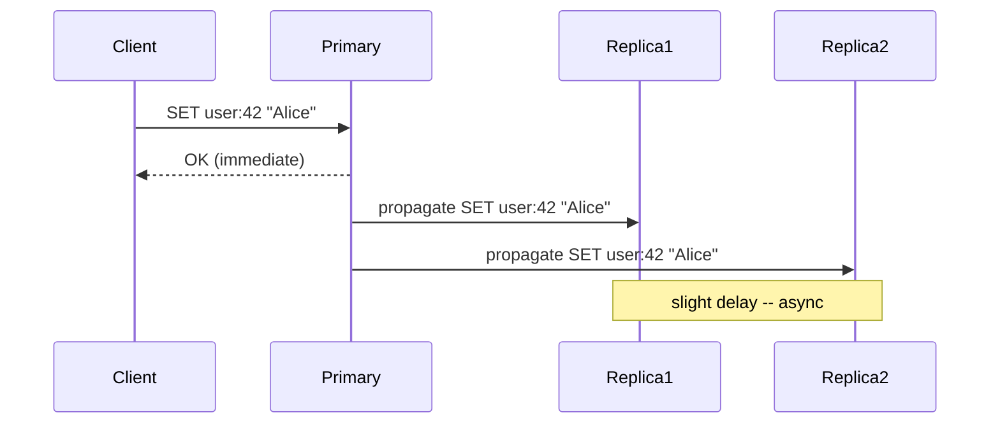
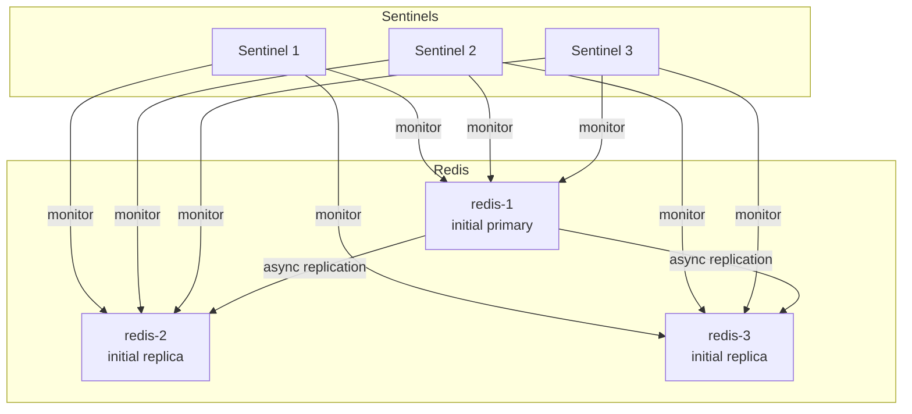

---
kernelspec:
  name: python3
  display_name: Python 3
  language: python
---

# Replication

```{note}
This lesson requires the Redis Sentinel lab. Run `make lab-redis-sentinel` before starting.
```

A single Redis node is fast and simple, but it's a single point of failure. If it crashes, your cache is gone, your sessions are lost, and your rate limiters reset. Replication solves this: one primary node accepts writes, one or more replica nodes receive a continuous copy of all changes.

This lesson focuses on what replication gives you, what it costs, and how Redis Sentinel solves the hardest part -- deciding what to do when the primary goes down.

> **Core Concept:** See [Replication Patterns](../../core-concepts/05-replication-and-availability/01-replication-patterns.md) for the general primary-secondary model, replication lag, and the fundamental tradeoffs between synchronous and asynchronous replication.

---

## Why Replicate a Key-Value Store?

Three reasons, in order of importance:

**1. High availability:** If the primary dies, a replica can be promoted to primary. Downtime is measured in seconds instead of however long it takes to restart a crashed server.

**2. Read scaling:** Replicas can serve reads. For read-heavy workloads (which most caches are), you can add replicas to handle more traffic without scaling the primary.

**3. Durability:** Even if the primary crashes and loses data (e.g., RDB snapshot was 5 minutes ago), a replica that was up-to-date has the recent data.

---

## How Redis Replication Works

Redis replication is **asynchronous** by default. The primary writes to memory, acknowledges the client immediately, and *then* ships the change to replicas in the background.



This means: when a client gets `OK`, the data is on the primary but **may not yet be on replicas**. If the primary crashes at that moment, the write is lost. This is the fundamental tradeoff of async replication.

> **Core Concept:** This is the consistency vs availability tradeoff described in [Consistency Models](../../core-concepts/04-distributed-systems/03-consistency-models.md). Async replication gives eventual consistency -- replicas will eventually catch up, but they may serve stale reads.

### The Replication Stream

After initial sync, the primary maintains an in-memory **replication backlog** and sends a continuous stream of commands to each replica. The replica applies them in order.

If a replica disconnects briefly and reconnects, it requests only the commands it missed (partial resync) using its last known offset in the backlog. If it was disconnected too long and the backlog has been overwritten, a full resync is needed: the primary sends a complete snapshot.

```{code-cell} python
import redis

# Connect to the initial primary (redis-1 at lab startup)
primary = redis.Redis(host="redis-1", port=6379, decode_responses=True)

# Check replication status from the primary's perspective
info = primary.info("replication")
print(f"Role:              {info['role']}")
print(f"Connected replicas: {info['connected_slaves']}")

for i in range(info['connected_slaves']):
    replica = info[f'slave{i}']
    print(f"  Replica {i}: {replica}")
```

---

## Reading from Replicas

By default, the redis-py client reads from the primary. With a `Sentinel` client, you can explicitly route reads to replicas.

> **Core Concept:** See [Replication Patterns -- Read Scaling](../../core-concepts/05-replication-and-availability/01-replication-patterns.md). Routing reads to replicas trades consistency for throughput: reads may return slightly stale data.

```{code-cell} python
from redis.sentinel import Sentinel

sentinel = Sentinel(
    [("redis-sentinel-1", 26379),
     ("redis-sentinel-2", 26379),
     ("redis-sentinel-3", 26379)],
    socket_timeout=1.0
)

# Client that always reads from replicas
replica_client = sentinel.slave_for("mymaster", socket_timeout=1.0, decode_responses=True)
primary_client = sentinel.master_for("mymaster", socket_timeout=1.0, decode_responses=True)

# Write goes to primary
primary_client.set("test:replication", "hello from primary")

# Read from replica -- may be slightly behind
import time
time.sleep(0.05)  # give replica time to catch up
val = replica_client.get("test:replication")
print(f"Read from replica: {val!r}")

# Check replication lag
replica_info = replica_client.info("replication")
print(f"Replica role: {replica_info['role']}")
print(f"Replication offset: {replica_info.get('slave_repl_offset', 'n/a')}")
```

---

## The Consistency Tradeoff in Practice

Async replication means replicas can serve stale reads. How stale? Usually a few milliseconds in a healthy cluster. But during high write load or network issues, lag can grow to seconds.

For workloads that cannot tolerate stale reads -- like reading a write you just made -- you must read from the primary. Replicas are for workloads where "probably current" is good enough: most caches, leaderboards, feature flags.

---

## Sentinel: Automatic Failover

Redis Sentinel is an independent process (or cluster of processes) that monitors your Redis topology and automatically promotes a replica when the primary fails.

> **Core Concept:** See [Consensus and Failover](../../core-concepts/05-replication-and-availability/02-consensus-and-failover.md) for how majority-based election prevents split brain. Sentinel uses the same mechanism: a quorum of sentinels must agree before promoting a replica.



### Failover Sequence

When a sentinel cannot reach the primary, it doesn't act immediately. It marks the primary as **subjectively down** (only this sentinel can't reach it). It then asks other sentinels: "can you reach the primary?" If a quorum (typically ≥ 2 of 3 sentinels) also cannot reach it, the primary is marked **objectively down**.

One sentinel is elected leader and initiates the failover:
1. Choose the most up-to-date replica (lowest replication lag)
2. Send `REPLICAOF NO ONE` to promote it to primary
3. Reconfigure other replicas to follow the new primary
4. Update clients via the Sentinel API

```{code-cell} python
import time
import socket

def resolve(addr):
    """Resolve an (ip, port) tuple to (hostname, port) via Docker's embedded DNS."""
    ip, port = addr
    try:
        hostname = socket.gethostbyaddr(ip)[0].split(".")[0]
    except socket.herror:
        hostname = ip
    return (hostname, port)

sentinel_conn = Sentinel(
    [("redis-sentinel-1", 26379),
     ("redis-sentinel-2", 26379),
     ("redis-sentinel-3", 26379)],
    socket_timeout=1.0
)

# --- Before failover ---
primary_before = sentinel_conn.discover_master("mymaster")
replicas_before = [resolve(r) for r in sentinel_conn.discover_slaves("mymaster")]
print("=== Before failover ===")
print(f"Primary:  {primary_before}")
print(f"Replicas: {replicas_before}")

# Write a key so we can check it survived the failover
primary_client = sentinel_conn.master_for("mymaster", decode_responses=True)
primary_client.set("failover:canary", "written-before-failover")
print(f"\nCanary key written to {primary_before}")
```

```{code-cell} python
%%bash
# Kill the current primary — Sentinel must detect and promote a replica
docker stop redis-1
echo "redis-1 stopped"
```

```{code-cell} python
# Poll Sentinel until it elects a new primary (typically 10–30 s)
print("Waiting for Sentinel to elect a new primary...")
deadline = time.time() + 60
new_primary = None
while time.time() < deadline:
    try:
        candidate = sentinel_conn.discover_master("mymaster")
        # Accept once Sentinel reports an address different from the old primary
        if candidate != primary_before:
            new_primary = candidate
            break
    except Exception:
        pass
    time.sleep(1)

if new_primary is None:
    print("Timed out — Sentinel did not elect a new primary within 60 s")
else:
    print(f"\n=== After failover ===")
    print(f"Old primary: {primary_before}")
    print(f"New primary: {resolve(new_primary)}")
    print(f"Remaining replicas: {[resolve(r) for r in sentinel_conn.discover_slaves('mymaster')]}")

    # The sentinel_conn.master_for() client transparently reconnects to the new primary
    new_primary_client = sentinel_conn.master_for("mymaster", decode_responses=True)
    canary = new_primary_client.get("failover:canary")
    print(f"\nCanary key on new primary: {canary!r}")
    new_primary_client.set("failover:post", "written-after-failover")
    print(f"New write succeeded: {new_primary_client.get('failover:post')!r}")
```

```{code-cell} python
%%bash
# Bring redis-1 back — it rejoins as a replica of whoever is now primary
docker start redis-1
echo "redis-1 restarted"
```

```{code-cell} python
time.sleep(3)  # give it a moment to connect
print("=== After restart ===")
print(f"Primary:  {resolve(sentinel_conn.discover_master('mymaster'))}")
print(f"Replicas: {[resolve(r) for r in sentinel_conn.discover_slaves('mymaster')]}")
```

### What Sentinel Does Not Solve

Sentinel provides **high availability for a single dataset** -- one primary with replicas. It does not:
- Increase write throughput (all writes still go to one primary)
- Partition data across nodes (that's what clustering does)
- Guarantee zero data loss (the async replication window means recent writes can be lost during failover)

---

## Durability During Failover

During a failover, writes acknowledged by the old primary but not yet replicated are lost. This is the async replication gap.

To minimize this, you can configure the primary to **stop accepting writes** if it has fewer than N replicas within M seconds behind:

```bash
# In redis.conf -- primary requires at least 1 replica within 10s
min-replicas-to-write 1
min-replicas-max-lag 10
```

This turns the primary into a CA (consistent+available) mode: writes succeed only when you have at least one up-to-date replica. If all replicas fall behind or disconnect, the primary rejects writes rather than risking data loss.

```{code-cell} python
# Check replica configuration on the primary
config = primary_client.config_get("min-replicas-to-write")
lag_config = primary_client.config_get("min-replicas-max-lag")
print(f"min-replicas-to-write: {config.get('min-replicas-to-write', '0')}")
print(f"min-replicas-max-lag:  {lag_config.get('min-replicas-max-lag', '0')}s")
```

---

**Next:** [Sharding →](07-sharding.md)

---

[← Back: Cache Write Patterns](05-cache-write-patterns.md) | [Course Home](../README.md)
