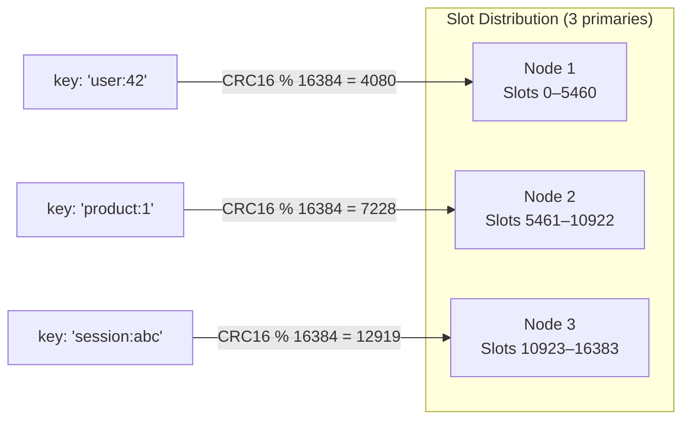
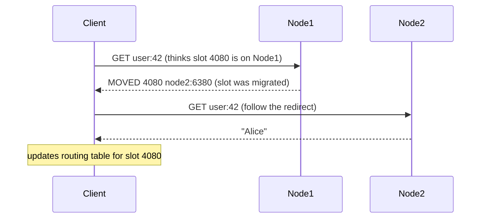

---
kernelspec:
  name: python3
  display_name: Python 3
  language: python
---

# Sharding

```{note}
This lesson requires the Redis Cluster lab. Run `make lab-redis-cluster` before starting.
```

Replication with Sentinel gives you high availability: the dataset still fits on one machine, and you have failover if that machine dies. But what happens when the dataset is too large for one machine's RAM, or when write throughput exceeds what one CPU can handle?

That's when you need **sharding**: splitting the dataset across multiple nodes so each node only holds a portion of the data.

> **Core Concept:** See [Partitioning Strategies](../../core-concepts/03-scaling/02-partitioning-strategies.md) for the general problem of distributing data across nodes: range partitioning, hash partitioning, and the challenge of rebalancing when nodes join or leave.

> **Core Concept:** See [Consistent Hashing](../../core-concepts/03-scaling/03-consistent-hashing.md) for the mechanism that minimizes data movement during cluster changes. Redis Cluster uses a variant of this called hash slots.

---

## Why Key-Value Stores Are Easy to Shard

Key-value data is naturally partition-friendly. Each key is independent -- there are no joins, no foreign keys, no transactions spanning multiple keys. If key A lives on node 1 and key B lives on node 3, that's fine. No query will ever need both at once (unless you explicitly design it that way, which we'll cover).

Compare this to a relational database: sharding PostgreSQL is hard because a single query might need rows from multiple tables on multiple shards. Redis Cluster is easy to shard because a `GET` needs exactly one node.

---

## Hash Slots: Redis's Partitioning Scheme

Redis Cluster divides the keyspace into **16,384 fixed slots**. Every key maps to exactly one slot, and every slot is owned by exactly one primary node.

```
slot = CRC16(key) % 16384
```

Why 16,384 slots instead of a continuous ring? Fixed slots make the cluster configuration easy to communicate: a node can tell any client "I own slots 0-5460" and that fits in a compact bitmap. The number 16,384 was chosen because it fits in 2KB per node in gossip messages.

> **Core Concept:** This is a specific implementation of the hash partitioning described in [Partitioning Strategies](../../core-concepts/03-scaling/02-partitioning-strategies.md). The hash ring from Consistent Hashing is replaced with a fixed slot table, which achieves similar rebalancing properties but is simpler to implement and reason about.



```{code-cell} python
import redis
from redis.cluster import RedisCluster

rc = RedisCluster(host="redis-node-1", port=6380, decode_responses=True)

# See how slots are distributed across the cluster
slots = rc.cluster_slots()
print("Slot ranges per node:")
for slot_range in slots:
    start, end, *nodes = slot_range
    primary = nodes[0]
    print(f"  slots {start:5d}-{end:5d} → {primary['host']}:{primary['port']}")
```

---

## Client-Side Routing and MOVED

When a client sends a command, it computes the slot for the key and sends the command to the node that owns that slot. If the client's routing table is stale (e.g., slots were recently moved), the node responds with a `MOVED` redirect.



The `MOVED` response is not an error -- it's a routing correction. Smart Redis clients (like redis-py in cluster mode) handle this transparently: they update their internal routing table and retry. The application code sees nothing.

> **Core Concept:** This is client-side routing as described in [Query Routing Patterns](../../core-concepts/06-architecture-patterns/02-query-routing-patterns.md). Compare to MongoDB's `mongos` router, which does server-side routing. Redis Cluster pushes the routing logic to the client, eliminating the router as a single point of failure.

```{code-cell} python
# redis-py cluster client handles MOVED transparently
# Keys are automatically routed to the correct node
rc.set("user:42:name", "Alice")
rc.set("product:1001:name", "Laptop")
rc.set("session:abc123", "user_data")

# These all succeed even though they're on different nodes
print(f"user:42:name   = {rc.get('user:42:name')}")
print(f"product:1001   = {rc.get('product:1001:name')}")
print(f"session:abc123 = {rc.get('session:abc123')}")

# Inspect which node holds a key
def get_key_slot(key: str) -> int:
    from redis.crc import key_slot
    return key_slot(key)

for key in ["user:42:name", "product:1001:name", "session:abc123"]:
    slot = get_key_slot(key)
    print(f"  {key!r} → slot {slot}")
```

---

## Multi-Key Constraints

The slot-per-key design breaks down for operations that touch multiple keys. Redis Cluster requires all keys in a multi-key command to be in the same slot. If they're not, the command fails with a `CROSSSLOT` error.

```{code-cell} python
# Single-key operations: always work
rc.set("counter:a", 0)
rc.set("counter:b", 0)

# MGET across different slots: CROSSSLOT error
try:
    result = rc.mget("user:42:name", "product:1001:name")
    print(f"MGET result: {result}")
except Exception as e:
    print(f"MGET error: {type(e).__name__}: {e}")
```

This affects: `MGET`, `MSET`, `DEL` (multi-key), `SUNION`, `SINTER`, Lua scripts that touch multiple keys, and transactions (`MULTI`/`EXEC`) across nodes.

### Hash Tags: Forcing Keys to the Same Slot

If you need multi-key operations, you can force keys onto the same slot by embedding a **hash tag** -- a substring in curly braces. Redis uses only the hash tag portion for slot calculation.

```{code-cell} python
# Without hash tags: likely on different slots
user_key = "user:42"
orders_key = "user:42:orders"
slot_user = get_key_slot(user_key)
slot_orders = get_key_slot(orders_key)
print(f"'user:42' slot:        {slot_user}")
print(f"'user:42:orders' slot: {slot_orders}")
print(f"Same slot: {slot_user == slot_orders}")

# With hash tags: both use {user:42} for slot calculation → same slot
user_tag = "{user:42}:profile"
orders_tag = "{user:42}:orders"
slot_tagged_user = get_key_slot(user_tag)
slot_tagged_orders = get_key_slot(orders_tag)
print(f"\n'{{user:42}}:profile' slot: {slot_tagged_user}")
print(f"'{{user:42}}:orders' slot:  {slot_tagged_orders}")
print(f"Same slot: {slot_tagged_user == slot_tagged_orders}")

# Now MGET works
rc.set(user_tag, "Alice")
rc.set(orders_tag, '["ord_1", "ord_2"]')
result = rc.mget(user_tag, orders_tag)
print(f"\nMGET with hash tags: {result}")
```

**Caution:** Overusing hash tags concentrates keys on fewer slots, reducing the effectiveness of sharding. Only use hash tags when you genuinely need multi-key atomicity.

---

## Resharding: Adding Nodes

When a cluster grows, new nodes are added and slots are migrated to them. This happens slot by slot: each slot's keys are transferred from the old node to the new node without downtime.

During migration, a slot can be in a transient state: some keys have moved, others haven't. Redis handles this with `ASK` redirects (temporary, unlike `MOVED` which is permanent).

> **Core Concept:** This is the key insight from [Consistent Hashing](../../core-concepts/03-scaling/03-consistent-hashing.md) applied to fixed slots: when a node joins, only the keys in the migrating slots move. Keys in other slots stay put. Compare to naive modular hashing where adding one node would require moving nearly all keys.

```{code-cell} python
# Inspect cluster state after a potential rebalance
cluster_info = rc.cluster_info()
print(f"Cluster state:    {cluster_info['cluster_state']}")
print(f"Cluster size:     {cluster_info['cluster_size']} primaries")
print(f"Slots assigned:   {cluster_info['cluster_slots_assigned']}")
print(f"Slots OK:         {cluster_info['cluster_slots_ok']}")
print(f"Slots migrating:  {cluster_info['cluster_slots_pfail']}")
```

---

## Cluster vs Sentinel: Which to Choose

| Concern | Sentinel | Cluster |
|---------|----------|---------|
| **Dataset size** | Fits in one node's RAM | Exceeds one node's RAM |
| **Write throughput** | Limited by single primary | Linear with node count |
| **Read scaling** | Via replicas | Via replicas per shard |
| **Multi-key ops** | Always supported | Requires hash tags |
| **Operational complexity** | Lower | Higher |
| **Typical use** | Cache + session store | Large dataset + high write load |

For most web application caches and session stores -- where datasets are tens of GB and write loads are moderate -- Sentinel is the right choice. Redis Cluster makes sense when you're storing hundreds of GB or need write throughput that a single primary can't deliver.

---

**Next:** [Course Home →](../README.md)

---

[← Back: Replication](06-replication.md) | [Course Home](../README.md)
