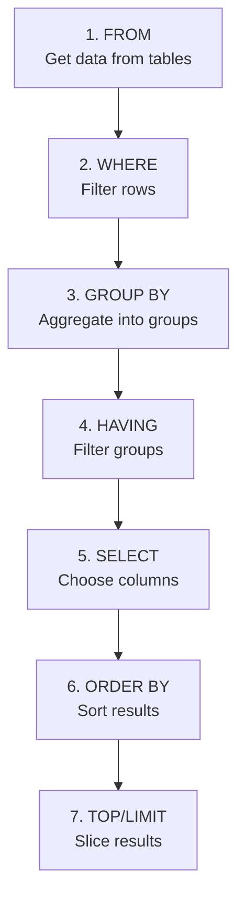

# SQL Execution Order

## Overview

One of the most confusing aspects of SQL for beginners is that queries are **written** in one order but **executed** in a completely different order. Understanding this is crucial for debugging, optimization, and writing correct queries.

## The Written Order (Syntax)

This is how you write a SELECT statement:

```sql
SELECT column_list
FROM table_name
WHERE conditions
GROUP BY grouping_columns
HAVING group_conditions
ORDER BY sorting_columns;
```

## The Logical Execution Order

But the database engine processes it in this order:

1. **FROM** - Determine the source tables and perform joins
2. **WHERE** - Filter individual rows before grouping
3. **GROUP BY** - Aggregate rows into groups
4. **HAVING** - Filter groups after aggregation
5. **SELECT** - Choose columns and compute expressions
6. **ORDER BY** - Sort the final result set
7. **LIMIT/OFFSET** - Slice the result set (if applicable)



## Why This Matters: Practical Examples

### Example 1: You Can't Use Aliases in WHERE

```sql
-- ❌ WRONG: This will fail
SELECT 
    ProductName,
    UnitPrice * 1.1 AS PriceWithTax
FROM Products
WHERE PriceWithTax > 50;  -- Error! PriceWithTax doesn't exist yet
```

**Why?** `WHERE` is processed BEFORE `SELECT`, so the alias doesn't exist yet.

```sql
-- ✅ CORRECT: Repeat the expression
SELECT 
    ProductName,
    UnitPrice * 1.1 AS PriceWithTax
FROM Products
WHERE UnitPrice * 1.1 > 50;
```

### Example 2: You CAN Use Aliases in ORDER BY

```sql
-- ✅ CORRECT: ORDER BY sees aliases
SELECT 
    ProductName,
    UnitPrice * 1.1 AS PriceWithTax
FROM Products
ORDER BY PriceWithTax DESC;  -- Works! ORDER BY is after SELECT
```

**Why?** `ORDER BY` is processed AFTER `SELECT`, so aliases are available.

### Example 3: WHERE vs HAVING

```sql
-- Count orders per customer, only for customers with > 10 orders
SELECT 
    CustomerID,
    COUNT(*) AS OrderCount
FROM Orders
WHERE COUNT(*) > 10  -- ❌ WRONG! Aggregate not allowed in WHERE
GROUP BY CustomerID;
```

**Why?** `WHERE` filters BEFORE grouping, so aggregates like `COUNT(*)` don't exist yet.

```sql
-- ✅ CORRECT: Use HAVING for aggregate filters
SELECT 
    CustomerID,
    COUNT(*) AS OrderCount
FROM Orders
GROUP BY CustomerID
HAVING COUNT(*) > 10;  -- HAVING filters AFTER grouping
```

### Example 4: Execution Order Affects Performance

```sql
-- Find expensive beverage products
SELECT 
    p.ProductName,
    p.UnitPrice,
    c.CategoryName
FROM Products p
    INNER JOIN Categories c ON p.CategoryID = c.CategoryID
WHERE c.CategoryName = 'Beverages' 
    AND p.UnitPrice > 20;
```

**What happens:**
1. **FROM** - Join Products and Categories (77 × 8 = 616 rows in Cartesian product)
2. **WHERE** - Filter to Beverages AND expensive (maybe 5 rows)
3. **SELECT** - Project the 3 columns

The optimizer is smart enough to apply `WHERE` predicates early (called **predicate pushdown**), filtering before the full join executes.

## Advanced Insight: The Query Optimizer

The **logical order** is a conceptual model. The actual **physical execution plan** may differ significantly due to optimizer transformations:

### Transformation Examples

**1. Predicate Pushdown**

```sql
-- Written order suggests: join first, filter after
SELECT p.ProductName
FROM Products p
    INNER JOIN Categories c ON p.CategoryID = c.CategoryID
WHERE c.CategoryName = 'Beverages';

-- Optimizer may execute: filter Categories first, then join
-- This reduces the join cardinality
```

**2. Join Reordering**

```sql
-- You write joins in this order:
SELECT *
FROM A 
    INNER JOIN B ON A.id = B.id
    INNER JOIN C ON B.id = C.id;

-- Optimizer may reorder:
-- If C has only 10 rows and A has 10 million, start with C
```

**3. Constant Folding**

```sql
-- You write:
SELECT * FROM Orders WHERE YEAR(OrderDate) = 2024 - 27;

-- Optimizer evaluates constants:
WHERE YEAR(OrderDate) = 1997
```

### Viewing Execution Plans

Understanding actual execution is crucial for performance tuning:

**SQL Server:**

```sql
-- Text plan
SET SHOWPLAN_TEXT ON;
GO
SELECT * FROM Products WHERE UnitPrice > 50;
GO
SET SHOWPLAN_TEXT OFF;

-- Or graphical in SSMS/Azure Data Studio: Ctrl+L
```

**Reading Plans:**
- **Operators** - Scan, Seek, Hash Join, Nested Loop, Sort
- **Cost** - Estimated % of total query cost
- **Cardinality** - Estimated number of rows

## Big Data Context: Execution in Distributed Systems

In distributed SQL engines (Spark SQL, Presto, BigQuery), execution order becomes even more complex:

### Stages and Shuffles

```sql
SELECT 
    c.CategoryName,
    SUM(od.Quantity) AS TotalQuantity
FROM [Order Details] od
    INNER JOIN Products p ON od.ProductID = p.ProductID
    INNER JOIN Categories c ON p.CategoryID = c.CategoryID
GROUP BY c.CategoryName;
```

**Distributed Execution:**

1. **Stage 1** - Scan `Order Details` (partitioned across nodes)
2. **Stage 2** - **Shuffle** - Redistribute by ProductID for join
3. **Stage 3** - Join with Products (maybe broadcast if small)
4. **Stage 4** - Join with Categories (likely broadcast join)
5. **Stage 5** - **Shuffle** - Redistribute by CategoryName for GROUP BY
6. **Stage 6** - Aggregate locally on each node

**Shuffles are expensive** - they move data across the network. The optimizer tries to minimize them:

- **Broadcast joins** - Replicate small tables to all nodes (no shuffle)
- **Co-partitioning** - If data is already partitioned by join key, no shuffle needed
- **Predicate pushdown** - Filter data before shuffling (less data to move)

### Vectorized Execution

Modern columnar engines (Spark, ClickHouse, DuckDB) process data in batches (vectors) of 1000s of rows at once, rather than row-by-row. This exploits:

- **CPU cache locality** - Keep data in L1/L2 cache
- **SIMD instructions** - Single Instruction, Multiple Data parallelism
- **Reduced function call overhead** - One function call processes 1000s of rows

```sql
-- Traditional row-by-row: 1 million function calls
-- Vectorized (batch size 1024): 1000 function calls
SELECT UPPER(ProductName) FROM Products;
```

## Practical Exercise

Analyze this query and predict the execution order:

```sql
SELECT 
    c.CategoryName,
    AVG(p.UnitPrice) AS AvgPrice,
    COUNT(*) AS ProductCount
FROM Products p
    INNER JOIN Categories c ON p.CategoryID = c.CategoryID
WHERE p.Discontinued = 0
GROUP BY c.CategoryName
HAVING COUNT(*) >= 10
ORDER BY AvgPrice DESC;
```

**Execution Order:**
1. FROM - Join Products and Categories
2. WHERE - Filter discontinued = 0
3. GROUP BY - Group by CategoryName
4. HAVING - Filter groups with >= 10 products
5. SELECT - Compute AVG and COUNT
6. ORDER BY - Sort by AvgPrice descending

**Run it and verify the results!**

## Key Takeaways

- SQL execution order ≠ written order
- **FROM → WHERE → GROUP BY → HAVING → SELECT → ORDER BY**
- Aliases are available in ORDER BY but not WHERE
- WHERE filters rows, HAVING filters groups
- The optimizer may reorder operations for performance
- In distributed systems, execution involves stages and shuffles
- Understanding execution helps debug errors and optimize queries

## What's Next?

Now that you understand how queries are processed, let's dive into querying data:

[Next: Module 02 - Querying Data →](../02-querying-data/01-select-basics.md)

---

[← Back: Database Setup](02-database-setup.md) | [Course Home](../README.md) | [Next: SELECT Basics →](../02-querying-data/01-select-basics.md)
