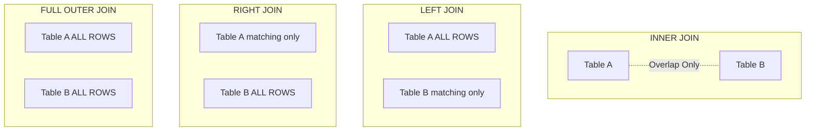

# Join Theory: The Mathematical Foundation

## Overview

JOINs are the heart of relational databases, allowing you to combine data from multiple tables. Understanding the theoretical foundation - set theory and Cartesian products - is crucial for writing correct and efficient queries.

## Core Concepts

### What is a JOIN?

A JOIN combines rows from two or more tables based on a related column. It's fundamentally a **Cartesian product** followed by **filtering**.

### The Cartesian Product (CROSS JOIN)

The Cartesian product creates **every possible combination** of rows from two tables.

If table A has 3 rows and table B has 4 rows, the Cartesian product has **3 × 4 = 12 rows**.

**Result: 12 combinations** (every row from Table A connects to every row from Table B)

### Example: Basic Cartesian Product

```sql
-- Table: Colors (3 rows)
-- Red, Green, Blue

-- Table: Sizes (2 rows)
-- Small, Large

-- Cartesian Product: 3 × 2 = 6 rows
SELECT c.Color, s.Size
FROM Colors c
    CROSS JOIN Sizes s;

-- Result:
-- Red,   Small
-- Red,   Large
-- Green, Small
-- Green, Large
-- Blue,  Small
-- Blue,  Large
```

### Real Example: Products and Categories

```sql
-- Categories: 8 rows
-- Products: 77 rows
-- Cartesian product: 8 × 77 = 616 rows

SELECT c.CategoryName, p.ProductName
FROM Categories c
    CROSS JOIN Products p;
```

**⚠️ Warning:** This creates 616 rows even though only 77 meaningful combinations exist (each product belongs to exactly one category).

## FROM Clause Processing

When you write a JOIN, this is what happens:

**Step 1: Cartesian Product** - Create all combinations

```sql
FROM Products p, Categories c;  -- Old syntax
-- or
FROM Products p CROSS JOIN Categories c;  -- Explicit syntax
```

**Step 2: Apply Join Condition** - Filter to meaningful rows

```sql
FROM Products p
    INNER JOIN Categories c ON p.CategoryID = c.CategoryID;
```

This is equivalent to:

```sql
FROM Products p
    CROSS JOIN Categories c
WHERE p.CategoryID = c.CategoryID;
```

## Set Theory Visualization

Think of JOINs as set operations:

```
Table A:           Table B:
1, 2, 3            2, 3, 4, 5

INNER JOIN (intersection):  2, 3
LEFT JOIN:   1, 2, 3 (all of A)
RIGHT JOIN:  2, 3, 4, 5 (all of B)
FULL JOIN:   1, 2, 3, 4, 5 (union)
```

### Venn Diagram Representation



## Join Cardinality

Understanding relationship types is critical:

### One-to-Many (1:M)

**Example:** One category has many products

```sql
-- Categories: 8 rows
-- Products: 77 rows (each has one CategoryID)
-- Result: 77 rows

SELECT c.CategoryName, p.ProductName
FROM Categories c
    INNER JOIN Products p ON c.CategoryID = p.CategoryID;
```

**Cardinality:** Result has same row count as "many" side (Products).

### Many-to-Many (M:N)

**Example:** Orders and Products (via junction table)

```sql
-- Orders: 830 rows
-- Products: 77 rows
-- Order Details (junction): 2,155 rows
-- Result: 2,155 rows

SELECT o.OrderID, p.ProductName
FROM Orders o
    INNER JOIN [Order Details] od ON o.OrderID = od.OrderID
    INNER JOIN Products p ON od.ProductID = p.ProductID;
```

**Cardinality:** Result has row count of junction table.

### One-to-One (1:1)

Rare in practice. Usually means tables should be merged.

```sql
-- Employees: 9 rows
-- EmployeePhotos: 9 rows (one photo per employee)
-- Result: 9 rows

SELECT e.EmployeeID, e.FirstName, ep.Photo
FROM Employees e
    INNER JOIN EmployeePhotos ep ON e.EmployeeID = ep.EmployeeID;
```

## Advanced Insight: Join Cardinality Explosions

**Danger:** Incorrect joins can cause exponential row growth.

### Example: Accidental Cartesian Product

```sql
-- ❌ WRONG: No join condition!
SELECT o.OrderID, p.ProductName
FROM Orders o, Products p;

-- Result: 830 × 77 = 63,910 rows (should be 2,155)
```

### Example: Duplicate Keys

```sql
-- If CategoryID is NOT unique in Categories (data quality issue):
-- Categories: 10 rows (2 rows with CategoryID = 1)
-- Products: 77 rows (12 rows with CategoryID = 1)
-- Expected: 77 rows
-- Actual: 77 - 12 + (12 × 2) = 89 rows (extra 12 rows!)

SELECT c.CategoryName, p.ProductName
FROM Categories c  -- Bug: duplicate CategoryID = 1
    INNER JOIN Products p ON c.CategoryID = p.CategoryID;
```

**Always verify join key uniqueness on the "one" side of 1:M relationships.**

## Join Conditions: More Than Equality

### Equi-Join (Most Common)

```sql
-- Join where keys are equal
ON p.CategoryID = c.CategoryID
```

### Non-Equi-Join

```sql
-- Find products more expensive than average category price
SELECT p.ProductName, p.UnitPrice, avg_cat.AvgPrice
FROM Products p
    INNER JOIN (
        SELECT CategoryID, AVG(UnitPrice) AS AvgPrice
        FROM Products
        GROUP BY CategoryID
    ) avg_cat ON p.CategoryID = avg_cat.CategoryID
                AND p.UnitPrice > avg_cat.AvgPrice;
```

### Range Joins

```sql
-- Assign products to price tiers
CREATE TABLE PriceTiers (
    TierName VARCHAR(20),
    MinPrice MONEY,
    MaxPrice MONEY
);

INSERT INTO PriceTiers VALUES 
    ('Budget', 0, 20),
    ('Standard', 20, 50),
    ('Premium', 50, 999999);

SELECT p.ProductName, p.UnitPrice, pt.TierName
FROM Products p
    INNER JOIN PriceTiers pt 
        ON p.UnitPrice >= pt.MinPrice 
        AND p.UnitPrice < pt.MaxPrice;
```

## Big Data Context: Join Explosion Risk

In data lakes with **denormalized** data, accidental Cartesian products can be catastrophic:

```sql
-- Events table: 10 billion rows
-- Dimensions table: 1,000 rows

-- ❌ Missing join condition = 10 trillion rows!
SELECT e.*, d.*
FROM events e, dimensions d;
-- Would take days to execute and fill your entire cluster storage
```

**Safeguards:**
1. **Set row limits** in exploratory queries
2. **Use EXPLAIN** to check estimated cardinality before running
3. **Monitor execution** - kill runaway queries
4. **Enforce foreign keys** in OLTP (prevents bad data)

## Practical Examples

### Example 1: Verify Cardinality

```sql
-- Before joining, check counts
SELECT COUNT(*) FROM Orders;           -- 830
SELECT COUNT(*) FROM [Order Details];  -- 2,155
SELECT COUNT(DISTINCT OrderID) FROM [Order Details];  -- 830

-- JOIN should produce 2,155 rows
SELECT COUNT(*)
FROM Orders o
    INNER JOIN [Order Details] od ON o.OrderID = od.OrderID;
-- Result: 2,155 ✓
```

### Example 2: Detecting Duplicate Keys

```sql
-- Check for duplicate CategoryIDs (should be 0)
SELECT CategoryID, COUNT(*) AS DuplicateCount
FROM Categories
GROUP BY CategoryID
HAVING COUNT(*) > 1;
```

### Example 3: Cartesian Product Use Case

Sometimes you **want** all combinations:

```sql
-- Generate a date × employee grid for a timesheet template
DECLARE @StartDate DATE = '2024-01-01';
DECLARE @EndDate DATE = '2024-01-31';

WITH Dates AS (
    SELECT @StartDate AS Date
    UNION ALL
    SELECT DATEADD(DAY, 1, Date)
    FROM Dates
    WHERE Date < @EndDate
)
SELECT e.EmployeeID, e.FirstName, d.Date
FROM Employees e
    CROSS JOIN Dates d
ORDER BY e.EmployeeID, d.Date
OPTION (MAXRECURSION 31);
```

## Practice Exercises

1. **Calculate expected cardinality:** Customers (91), Orders (830). How many rows will their INNER JOIN produce?
2. **Cartesian product:** How many rows would a CROSS JOIN of Customers and Products produce?
3. **Detect duplicates:** Write a query to find duplicate ProductIDs in Products (should be none)
4. **Range join:** Create a query that categorizes orders by freight cost ranges

### Solutions

```sql
-- Exercise 1
-- Expected: 830 (one-to-many, result = "many" side)
SELECT COUNT(*)
FROM Customers c
    INNER JOIN Orders o ON c.CustomerID = o.CustomerID;
-- Result: 830 ✓

-- Exercise 2
-- 91 × 77 = 7,007 rows
SELECT COUNT(*)
FROM Customers c
    CROSS JOIN Products p;

-- Exercise 3
SELECT ProductID, COUNT(*) AS DuplicateCount
FROM Products
GROUP BY ProductID
HAVING COUNT(*) > 1;
-- Result: 0 rows (no duplicates) ✓

-- Exercise 4
WITH FreightTiers AS (
    SELECT 'Low' AS Tier, 0 AS MinFreight, 50 AS MaxFreight
    UNION ALL SELECT 'Medium', 50, 100
    UNION ALL SELECT 'High', 100, 999999
)
SELECT 
    o.OrderID, 
    o.Freight, 
    ft.Tier
FROM Orders o
    INNER JOIN FreightTiers ft 
        ON o.Freight >= ft.MinFreight 
        AND o.Freight < ft.MaxFreight;
```

## Key Takeaways

- JOINs are **Cartesian products + filtering** on join conditions
- **Cardinality** depends on relationship type (1:1, 1:M, M:N)
- Result row count equals junction table size in M:N relationships
- **Always verify join key uniqueness** to prevent cardinality explosions
- Non-equi-joins use `<`, `>`, `BETWEEN` (useful for ranges)
- CROSS JOINs (Cartesian products) have legitimate use cases
- In big data, accidental Cartesian products can be catastrophic
- Check **estimated cardinality** before running joins on huge tables

## What's Next?

Now that you understand the theory, let's explore the different types of JOINs:

[Next: Join Types →](02-join-types.md)

---

[← Back: ORDER BY](../02-querying-data/03-sorting-order-by.md) | [Course Home](../README.md) | [Next: Join Types →](02-join-types.md)
