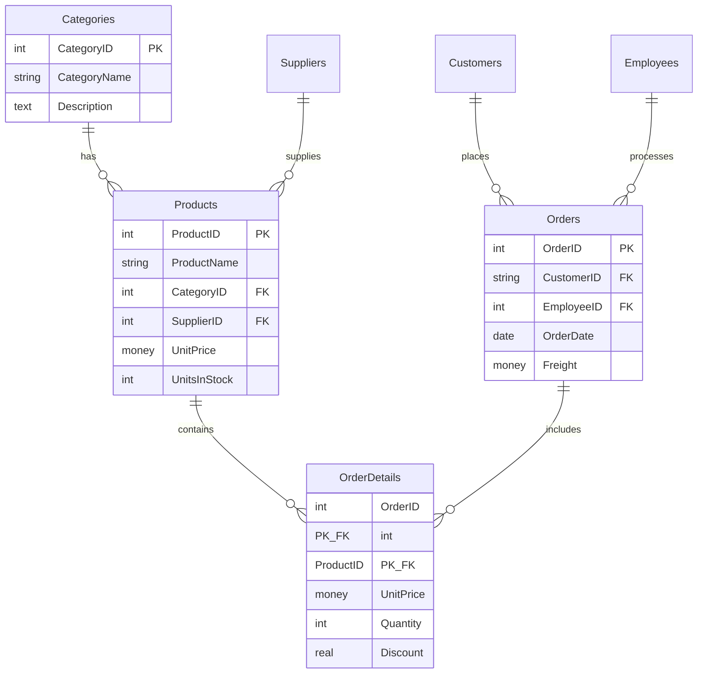
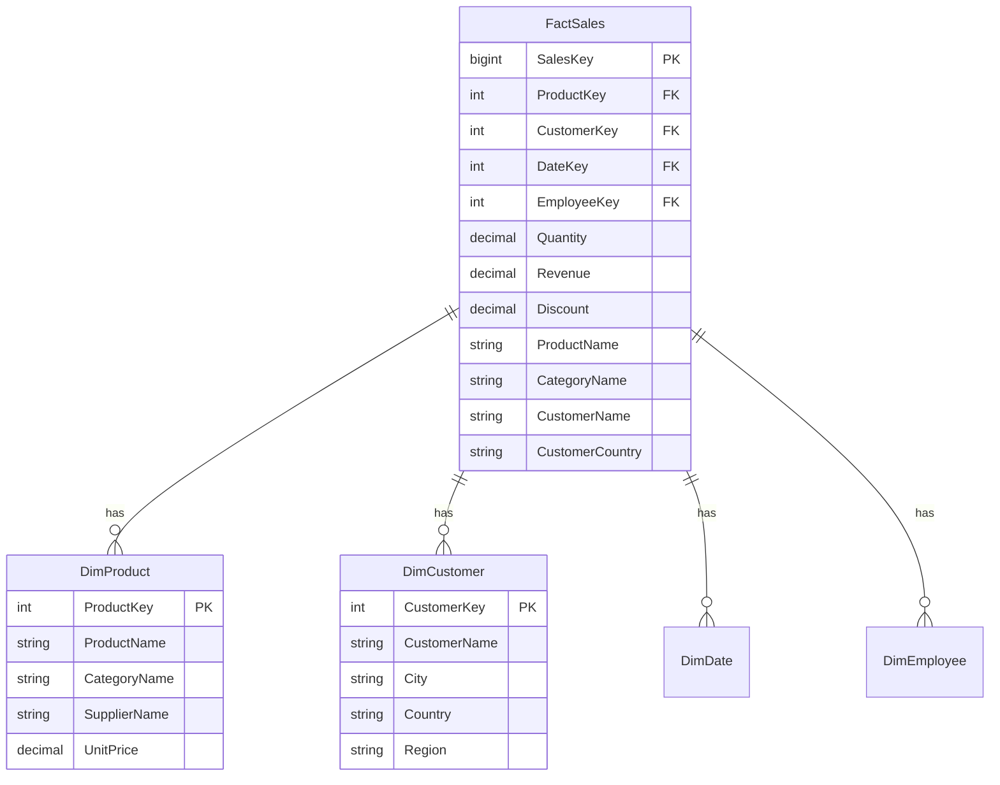

# Normalization vs Denormalization: OLTP vs OLAP

## Overview

One of the most important concepts in data engineering is understanding **when to normalize** (OLTP) and **when to denormalize** (OLAP). This fundamentally affects schema design, query patterns, and performance characteristics.

## What is Normalization?

**Normalization** is the process of organizing data to:
1. **Minimize redundancy** - Store each fact once
2. **Ensure data integrity** - Prevent update anomalies
3. **Enforce constraints** - Use foreign keys

**Normal forms:**
- **1NF** - Atomic values, no repeating groups
- **2NF** - No partial dependencies on composite keys
- **3NF** - No transitive dependencies
- **BCNF** - Stronger version of 3NF
- **4NF, 5NF** - Deal with multi-valued dependencies (rare in practice)

Most OLTP systems target **3NF** or **BCNF**.

## Northwind: A Normalized (3NF) Example

### Schema Structure



### Benefits of Normalization (Why Northwind is Normalized)

#### 1. No Redundancy

**Product information stored once:**

```sql
-- Product "Chai" appears in multiple orders
-- But its name, price, category are stored ONCE in Products table
SELECT * FROM Products WHERE ProductName = 'Chai';
-- Result: 1 row

SELECT COUNT(*) FROM [Order Details] WHERE ProductID = 1;  -- Chai
-- Result: 38 orders (but name stored only once)
```

**If denormalized:**
- ProductName would appear 38 times in Order Details
- 38× storage overhead
- 38 places to update if name changes

#### 2. Update Anomalies Prevention

**Scenario:** Product price changes from $18 to $20.

**Normalized (CORRECT):**

```sql
-- Update once
UPDATE Products SET UnitPrice = 20 WHERE ProductID = 1;
-- Affected: 1 row
```

**Denormalized (PROBLEMATIC):**

```sql
-- Must update all order detail rows!
UPDATE OrderDetails SET ProductPrice = 20 WHERE ProductID = 1;
-- Affected: 38 rows

-- Risk: Miss some rows → inconsistent data
-- Historical issue: Should old orders show old price or new price?
```

#### 3. Referential Integrity

Foreign keys enforce valid references:

```sql
-- Cannot insert order for non-existent customer
INSERT INTO Orders (CustomerID, EmployeeID, OrderDate)
VALUES ('FAKE', 1, GETDATE());
-- Error: FK constraint violation

-- Cannot delete a category that has products
DELETE FROM Categories WHERE CategoryID = 1;
-- Error: FK constraint violation (Beverages has products)
```

#### 4. Smaller Indexes

```sql
-- Normalized: Index on small key
CREATE INDEX IX_Products_CategoryID ON Products(CategoryID);
-- Index size: 77 rows × 4 bytes = ~308 bytes

-- Denormalized: Index includes category name
CREATE INDEX IX_Products_CategoryName ON Products(CategoryName);
-- Index size: 77 rows × ~15 chars = ~1,155 bytes (3-4× larger)
```

## What is Denormalization?

**Denormalization** intentionally introduces redundancy by:
1. **Pre-joining** tables into fewer tables
2. **Duplicating** dimension attributes in fact tables
3. **Pre-aggregating** commonly queried metrics

Used in **OLAP** systems for query performance.

## Star Schema: The Denormalized Data Warehouse Pattern

### Structure



### Key Differences from Normalized

| Aspect | Normalized (OLTP) | Denormalized (OLAP/Star) |
|--------|------------------|--------------------------|
| **Tables** | Many (Categories, Products, Orders...) | Few (1 fact, several dimensions) |
| **Joins** | Required for most queries | Minimized or eliminated |
| **Storage** | Minimal redundancy | Intentional redundancy |
| **Updates** | Frequent, small transactions | Rare, batch ETL loads |
| **Queries** | Simple, specific (1 order, 1 product) | Complex, analytical (all sales by region) |
| **Indexes** | B-tree on keys | Columnar, partitioned, clustered |

### Example: Same Query, Different Design

**Normalized (Northwind):**

```sql
-- Requires 4 JOINs
SELECT 
    c.CategoryName,
    c.Description,
    p.ProductName,
    od.Quantity,
    od.UnitPrice,
    od.Quantity * od.UnitPrice * (1 - od.Discount) AS Revenue,
    o.OrderDate,
    cust.CompanyName,
    cust.Country
FROM [Order Details] od
    INNER JOIN Products p ON od.ProductID = p.ProductID
    INNER JOIN Categories c ON p.CategoryID = c.CategoryID
    INNER JOIN Orders o ON od.OrderID = o.OrderID
    INNER JOIN Customers cust ON o.CustomerID = cust.CustomerID
WHERE YEAR(o.OrderDate) = 1997
    AND c.CategoryName = 'Beverages';
```

**Denormalized (Star Schema):**

```sql
-- No JOINs needed! Everything pre-joined.
SELECT 
    CategoryName,
    ProductName,
    Quantity,
    Revenue,  -- Pre-calculated
    OrderDate,
    CustomerName,
    Country
FROM FactSales
WHERE OrderYear = 1997
    AND CategoryName = 'Beverages';
```

**Performance difference:**
- Normalized: 5 table scans + 4 join operations
- Denormalized: 1 table scan, columnar read of 9 columns
- **Star schema can be 10-100× faster** on large datasets

## When to Use Each

### Use Normalization (3NF) When:

1. **Transactional workload** - Many small INSERTs/UPDATEs
2. **Data integrity critical** - E-commerce orders, financial transactions
3. **Write-heavy** - More writes than reads
4. **Real-time updates** - Data changes frequently
5. **OLTP system** - Application database

**Examples:**
- Order management systems
- CRM databases
- Inventory systems
- User authentication databases

### Use Denormalization (Star Schema) When:

1. **Analytical workload** - Complex aggregations, reporting
2. **Query performance critical** - Sub-second dashboard queries
3. **Read-heavy** - Mostly SELECT, rare updates
4. **Historical data** - Immutable facts, batch loaded
5. **OLAP system** - Data warehouse, data mart

**Examples:**
- Business intelligence dashboards
- Sales reporting
- Customer analytics
- Financial reporting

## Denormalization Patterns in Data Engineering

### 1. Dimension Denormalization (Snowflake → Star)

**Snowflake (Normalized dimensions):**

```sql
-- Separate dimension tables
DimProduct (ProductID, ProductName, CategoryID)
DimCategory (CategoryID, CategoryName, CategoryGroup)
DimCategoryGroup (CategoryGroup, GroupDescription)
```

**Star (Denormalized dimensions):**

```sql
-- Flattened into one dimension
DimProduct (
    ProductID, 
    ProductName, 
    CategoryName,      -- Denormalized from DimCategory
    CategoryGroup,     -- Denormalized from DimCategoryGroup
    GroupDescription   -- Denormalized from DimCategoryGroup
)
```

**Trade-off:**
- ✅ No joins needed in queries
- ✅ Faster query performance
- ❌ More storage (CategoryName repeated for each product) - in columnar storage, this is typically not a problem because the columns are stored in a compressed format.
- ❌ Updates harder (change CategoryName requires updating all products) - typically we don't update analytical data directly, only through ETL processes.

### 2. Pre-Aggregated Summary Tables

```sql
-- Instead of aggregating every query:
SELECT ProductID, SUM(Quantity), SUM(Revenue)
FROM FactSales
GROUP BY ProductID;

-- Create pre-aggregated table:
CREATE TABLE AggProductSales (
    ProductID INT,
    TotalQuantity DECIMAL,
    TotalRevenue DECIMAL,
    LastUpdated DATETIME
);

-- Refresh daily via ETL
INSERT INTO AggProductSales
SELECT 
    ProductID, 
    SUM(Quantity), 
    SUM(Revenue),
    GETDATE()
FROM FactSales
GROUP BY ProductID;
```

**Trade-off:**
- ✅ Instant query results (no aggregation at query time)
- ❌ Storage overhead
- ❌ Data freshness lag

### 3. Materialized Views

Some databases support **materialized views** - pre-computed query results:

```sql
-- SQL Server: Indexed views (limited)
CREATE VIEW vwProductSales WITH SCHEMABINDING
AS
SELECT 
    p.ProductID,
    SUM(od.Quantity * od.UnitPrice) AS TotalRevenue,
    COUNT_BIG(*) AS OrderCount
FROM dbo.Products p
    INNER JOIN dbo.[Order Details] od ON p.ProductID = od.ProductID
GROUP BY p.ProductID;

CREATE UNIQUE CLUSTERED INDEX IX_vwProductSales ON vwProductSales(ProductID);
```

The view is **physically stored** and auto-maintained, essentially this is a pre aggregated fully managed table which makes it easier to maintain but have some limitations.
Useful when you have a not too complicated query that is ran frequently and should have good performance.

## Big Data Context

### Data Lake Denormalization

In data lakes (S3, ADLS), denormalization is even more critical:

**Reasons:**
1. **No indexes** - Filtering requires full scans
2. **Network latency** - Joins over network (S3) are very slow
3. **Columnar format** - Parquet/ORC benefit from fewer tables
4. **Partitioning** - Easier to partition one denormalized table

**Example:**

```sql
-- Normalized: 3 tables in S3
s3://lake/products/
s3://lake/categories/
s3://lake/order_details/

-- Query requires 2 joins over S3 (slow!)

-- Denormalized: 1 table with redundancy
s3://lake/order_details_enriched/
-- Contains: OrderID, ProductID, ProductName, CategoryName, ...

-- Query: Single table scan (fast!)
```

### Immutability in Data Lakes

Data lakes are typically **append-only** (immutable):

```sql
-- Traditional database: UPDATE
UPDATE Customers SET City = 'Seattle' WHERE CustomerID = 'ALFKI';

-- Data lake: Append new row with updated value
INSERT INTO customers_delta VALUES ('ALFKI', 'Seattle', '2024-01-15');
-- Old row remains, query engine handles versioning
```

**Denormalization benefit:** Since updates are rare, redundancy doesn't cause update anomalies.

### SCD (Slowly Changing Dimensions)

How to handle dimension changes in warehouses:

**Type 1: Overwrite**

```sql
-- Product price changes from $10 to $12
UPDATE DimProduct SET UnitPrice = 12 WHERE ProductID = 1;
-- Historical sales now show new price (incorrect!)
```

**Type 2: Add Row with Version**

```sql
-- Keep history
INSERT INTO DimProduct 
VALUES (1, 'Chai', 12, '2024-01-15', '9999-12-31', 1);  -- Current
-- Old row: (1, 'Chai', 10, '2020-01-01', '2024-01-14', 0);  -- Historical
```

**Type 3: Add Column**

```sql
-- Store current and previous
ALTER TABLE DimProduct ADD PreviousPrice DECIMAL;
UPDATE DimProduct SET PreviousPrice = UnitPrice, UnitPrice = 12 WHERE ProductID = 1;
```

**Type 2 is most common in data warehouses.**

## Performance Implications

### Normalized (OLTP)

```sql
-- Fast for single-row operations
SELECT * FROM Products WHERE ProductID = 1;  -- Index seek: <1ms

-- Slower for aggregations
SELECT CategoryName, SUM(UnitPrice * UnitsInStock)
FROM Products p JOIN Categories c ON p.CategoryID = c.CategoryID
GROUP BY CategoryName;  -- Join + aggregate: 10-50ms
```

### Denormalized (OLAP)

```sql
-- Slower for single-row updates (must update multiple places)
UPDATE FactSales SET ProductName = 'Chai Tea' WHERE ProductID = 1;
-- Affects millions of rows!

-- Very fast for aggregations
SELECT CategoryName, SUM(InventoryValue)
FROM FactProducts  -- Pre-joined, pre-calculated
GROUP BY CategoryName;  -- Columnar scan: 1-5ms
```

## Key Takeaways

- **Normalization** minimizes redundancy, ensures integrity (OLTP)
- **Denormalization** optimizes read performance, introduces redundancy (OLAP)
- **3NF** is standard for transactional databases
- **Star schema** is standard for data warehouses
- Trade-off: Storage & update complexity vs query performance
- In **big data**, denormalization is critical (no indexes, network latency)
- **SCD Type 2** tracks dimension history in warehouses
- **Immutability** in data lakes makes denormalization safe
- Choose based on workload: transactional (normalize) vs analytical (denormalize)

## Practice Exercises

1. Identify which tables in Northwind could be denormalized for reporting
2. Design a star schema for Northwind (1 fact table, 4-5 dimension tables)
3. Calculate storage overhead of denormalizing CategoryName into Products
4. Write the same query (category sales) in both normalized and denormalized form
5. Identify update anomalies that would occur if Northwind were denormalized

### Solutions

```sql
-- Exercise 1: Tables to denormalize
-- Categories → Products: CategoryName in Products (avoid join)
-- Suppliers → Products: SupplierName in Products
-- Customers → Orders: CustomerName, Country in Orders
-- Employees → Orders: EmployeeName in Orders

-- Exercise 2: Star schema design
-- Fact: FactOrderDetails (OrderDetailKey, OrderKey, ProductKey, CustomerKey, DateKey, Quantity, Revenue)
-- Dims: DimProduct, DimCustomer, DimEmployee, DimDate, DimShipper

-- Exercise 3: Storage overhead
-- Original: CategoryName stored 8 times (8 categories)
-- Denormalized: CategoryName stored 77 times (77 products)
-- Overhead: 69 extra copies × ~15 bytes = ~1KB (negligible)

-- Exercise 4: Normalized
SELECT c.CategoryName, SUM(od.Quantity * od.UnitPrice) AS Revenue
FROM [Order Details] od
JOIN Products p ON od.ProductID = p.ProductID
JOIN Categories c ON p.CategoryID = c.CategoryID
GROUP BY c.CategoryName;

-- Denormalized (if CategoryName in Order Details)
SELECT CategoryName, SUM(Quantity * UnitPrice) AS Revenue
FROM OrderDetailsDenormalized
GROUP BY CategoryName;

-- Exercise 5: Update anomalies
-- If CategoryName in Products:
--   - Renaming "Beverages" requires updating 12 rows
--   - Risk of inconsistency if some rows missed
--   - No foreign key constraint possible
```

## What's Next?

Learn how to aggregate data with GROUP BY:

[Next: Module 04 - Aggregations →](../04-aggregations/01-aggregate-functions.md)

---

[← Back: Advanced Joins](03-advanced-joins.md) | [Course Home](../README.md) | [Next: Aggregate Functions →](../04-aggregations/01-aggregate-functions.md)
