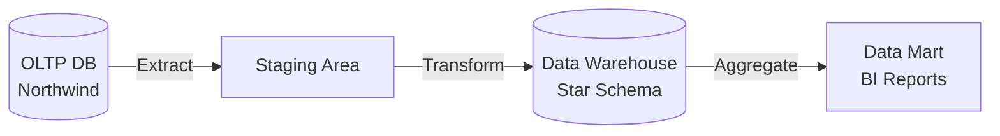
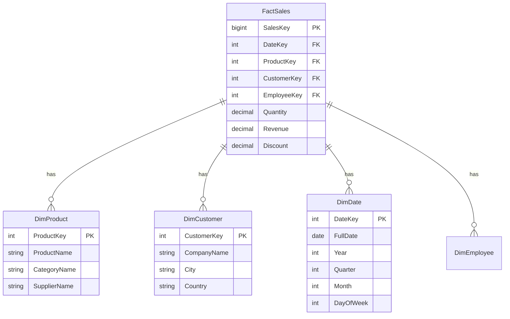

# OLTP vs OLAP: Deep Dive

## Overview

Understanding the fundamental differences between OLTP and OLAP systems is critical for data engineers. This guide expands on the introduction, focusing on practical implications.

## OLTP: Online Transaction Processing

**Purpose:** Run the business (orders, payments, inventory)

**Characteristics:**
- **Many small transactions** - Thousands/millions per second
- **ACID guarantees** - Data integrity critical
- **Normalized schema** (3NF) - Avoid redundancy
- **Row-oriented storage** - Fast single-row access
- **Write-heavy** - Frequent INSERTs/UPDATEs
- **Low latency** - Milliseconds

**Examples:**
- E-commerce order system
- Banking transactions
- CRM databases
- Inventory management

### OLTP Schema Design

```sql
-- Normalized (avoids redundancy)
CREATE TABLE Orders (
    OrderID INT PRIMARY KEY,
    CustomerID INT FOREIGN KEY REFERENCES Customers(CustomerID),
    EmployeeID INT FOREIGN KEY REFERENCES Employees(EmployeeID),
    OrderDate DATETIME
);

-- Must JOIN to get customer name
SELECT o.OrderID, c.CompanyName
FROM Orders o
    INNER JOIN Customers c ON o.CustomerID = c.CustomerID;
```

## OLAP: Online Analytical Processing

**Purpose:** Analyze the business (trends, reports, dashboards)

**Characteristics:**
- **Few large queries** - Complex aggregations
- **Eventual consistency** - Batch updates OK
- **Denormalized schema** (star/snowflake) - Pre-joined
- **Column-oriented storage** - Fast column scans
- **Read-heavy** - Mostly SELECTs
- **Higher latency** - Seconds to minutes OK

**Examples:**
- Sales reporting dashboards
- Customer analytics
- Financial reporting
- Business intelligence

### OLAP Schema Design

```sql
-- Denormalized fact table (redundancy OK)
CREATE TABLE FactOrders (
    OrderKey BIGINT PRIMARY KEY,
    OrderID INT,
    CustomerKey INT,
    CustomerName NVARCHAR(100),  -- Denormalized!
    CustomerCountry NVARCHAR(50),  -- Denormalized!
    EmployeeKey INT,
    EmployeeName NVARCHAR(100),  -- Denormalized!
    OrderDate DATE,
    Revenue DECIMAL(18,2)
);

-- No JOINs needed!
SELECT CustomerCountry, SUM(Revenue)
FROM FactOrders
GROUP BY CustomerCountry;
```

## Key Differences Table

| Aspect | OLTP | OLAP |
|--------|------|------|
| **Workload** | Transactional | Analytical |
| **Query type** | Simple, specific | Complex, aggregates |
| **Schema** | Normalized (3NF) | Denormalized (star) |
| **Storage** | Row-oriented | Column-oriented |
| **Updates** | Frequent | Rare (batch) |
| **Data size** | GB to TB | TB to PB |
| **Query latency** | < 10ms | Seconds to minutes |
| **Users** | Thousands concurrent | Dozens concurrent |
| **Example DB** | SQL Server, PostgreSQL | Snowflake, BigQuery, Redshift |

## Storage: Row vs Column

### Row-Oriented (OLTP)

```
Row 1: [ID=1, Name='Chai', Price=18, Stock=39]
Row 2: [ID=2, Name='Chang', Price=19, Stock=17]
Row 3: [ID=3, Name='Syrup', Price=10, Stock=13]
```

**Access:** Read entire row quickly
**Good for:** `SELECT * WHERE ID = 1`
**Bad for:** `SELECT AVG(Price) FROM Products` (reads all columns)

### Column-Oriented (OLAP)

```
ID column: [1, 2, 3]
Name column: ['Chai', 'Chang', 'Syrup']
Price column: [18, 19, 10]
Stock column: [39, 17, 13]
```

**Access:** Read only needed columns
**Good for:** `SELECT AVG(Price)` (reads only Price column)
**Bad for:** `SELECT * WHERE ID = 1` (reads 4 columns separately)

## ETL: OLTP → OLAP Pipeline



**Extract:** Pull data from OLTP (nightly batch)
**Transform:** Clean, denormalize, calculate
**Load:** Insert into data warehouse

### Example ETL

```sql
-- Extract from OLTP
SELECT 
    o.OrderID,
    o.CustomerID,
    o.OrderDate,
    od.ProductID,
    od.Quantity,
    od.UnitPrice
FROM Orders o
    INNER JOIN [Order Details] od ON o.OrderID = od.OrderID
WHERE o.OrderDate >= '2024-01-01';

-- Transform and Load into OLAP
INSERT INTO FactOrders (
    OrderID,
    CustomerKey,
    CustomerName,
    CustomerCountry,
    ProductKey,
    ProductName,
    CategoryName,
    OrderDate,
    Quantity,
    Revenue
)
SELECT 
    o.OrderID,
    c.CustomerKey,
    c.CompanyName,  -- Denormalized
    c.Country,  -- Denormalized
    p.ProductKey,
    p.ProductName,  -- Denormalized
    cat.CategoryName,  -- Denormalized
    o.OrderDate,
    od.Quantity,
    od.Quantity * od.UnitPrice * (1 - od.Discount)  -- Pre-calculated
FROM OltpOrders o
    JOIN Customers c ON o.CustomerID = c.CustomerID
    JOIN OrderDetails od ON o.OrderID = od.OrderID
    JOIN Products p ON od.ProductID = p.ProductID
    JOIN Categories cat ON p.CategoryID = cat.CategoryID;
```

## Star Schema Example



**Fact table:** Measures (quantities, revenue)
**Dimension tables:** Context (who, what, when, where)

## When to Use Each

**Use OLTP when:**
- Building applications
- Need real-time updates
- ACID compliance critical
- User-facing features

**Use OLAP when:**
- Building analytics
- Need historical analysis
- Reports and dashboards
- Batch processing OK

**In Practice:** Most organizations have **both**:
- OLTP for operations
- Nightly ETL to OLAP
- BI tools query OLAP

## Lambda Architecture

Modern approach: combine batch (OLAP) and streaming (OLTP).

```
         ┌─> Batch Layer (OLAP) ─────────┐
Data ────┤                                 ├─> Serving Layer
         └─> Speed Layer (Real-time) ─────┘
```

**Batch:** Historical accuracy (reprocess all data)
**Speed:** Real-time (approximate, recent data only)
**Serving:** Merge both for queries

## Practice Exercises

```sql
-- 1. Convert Northwind OLTP to OLAP fact table
CREATE TABLE FactOrders (
    OrderKey BIGINT IDENTITY PRIMARY KEY,
    DateKey INT,
    CustomerKey INT,
    EmployeeKey INT,
    ProductKey INT,
    OrderID INT,
    CustomerName NVARCHAR(40),
    EmployeeName NVARCHAR(50),
    ProductName NVARCHAR(40),
    CategoryName NVARCHAR(15),
    Quantity SMALLINT,
    Revenue MONEY
);

-- 2. ETL to populate fact table
INSERT INTO FactOrders (...)
SELECT ...
FROM Orders o
JOIN ...

-- 3. Fast OLAP query (no JOINs!)
SELECT 
    CategoryName,
    SUM(Revenue) AS TotalRevenue
FROM FactOrders
WHERE DateKey BETWEEN 19970101 AND 19971231
GROUP BY CategoryName;
```

## Key Takeaways

- **OLTP** = transactional, normalized, row-store, write-heavy
- **OLAP** = analytical, denormalized, column-store, read-heavy
- **ETL** moves data from OLTP → OLAP nightly
- **Star schema** = fact table + dimension tables
- Denormalization trades storage for query speed
- Most organizations need both systems
- Column-store 10-100× faster for analytics

## What's Next?

[Next: Data Lake Patterns →](02-data-lake-patterns.md)

---

[← Back: Indexes](../09-schema-design/03-indexes.md) | [Course Home](../README.md) | [Next: Data Lake Patterns →](02-data-lake-patterns.md)
