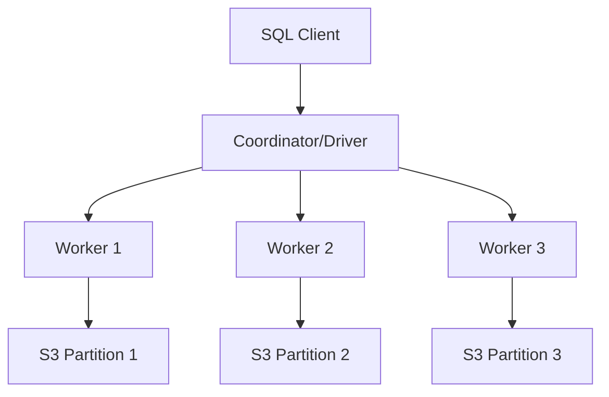

# Distributed SQL

## Overview

Distributed SQL engines (Spark SQL, Presto, BigQuery) execute queries across clusters of machines. Understanding how they work helps write efficient queries at scale.

## Architecture



**Coordinator:** Parses SQL, creates execution plan, coordinates workers
**Workers:** Execute tasks in parallel, read data, perform computations

## Shuffles: The Expensive Operation

**Shuffle** = redistribute data across workers (network transfer).

**Triggered by:**
- `GROUP BY`
- `JOIN` (large-to-large)
- `DISTINCT`
- `ORDER BY`
- `UNION`
- Window functions with `PARTITION BY`

### Example: GROUP BY Shuffle

```sql
SELECT customer_id, SUM(amount)
FROM sales  -- 1 billion rows across 100 workers
GROUP BY customer_id;
```

**What happens:**
1. Each worker reads its partition (10M rows each)
2. **Shuffle:** Hash partition by customer_id
   - Customer 123's records scattered across workers
   - Must move to same worker for aggregation
3. Each worker aggregates its customer subset
4. Coordinator collects results

**Cost:** Shuffling 1 billion rows = massive network I/O!

## Broadcast Joins

For small tables, **broadcast** to all workers (no shuffle).

```sql
-- Categories: 10 rows (small)
-- Products: 1 billion rows (large)
SELECT p.*, c.CategoryName
FROM products p
    INNER JOIN categories c ON p.category_id = c.category_id;
```

**Execution:**
1. Broadcast `categories` (10 rows) to all 100 workers
2. Each worker joins its `products` partition locally
3. **No shuffle** - very fast!

**Broadcast threshold:** Usually 10-100MB. Configure in Spark:

```python
spark.conf.set("spark.sql.autoBroadcastJoinThreshold", 104857600)  # 100MB
```

## Partition Pruning

Skip entire partitions based on WHERE clause.

```sql
-- Data partitioned by year and month
SELECT * FROM sales
WHERE year = 2024 AND month = 1;
```

**Execution:**
- Skips all partitions except `year=2024/month=01/`
- Reads 1/120th of data (one month out of 10 years)
- **95%+ time savings!**

## Predicate Pushdown

Push filters to storage layer (read less data).

```sql
SELECT name, price
FROM products
WHERE price > 100;
```

**Without pushdown:** Read all columns, filter in engine
**With pushdown:** Parquet/ORC reads only rows where price > 100

**How it works:**
- Parquet stores min/max per row group
- Skip row groups where max(price) < 100

## Query Optimization Techniques

### 1. Filter Early

```sql
-- Bad: Filter after aggregation
SELECT customer_id, total
FROM (
    SELECT customer_id, SUM(amount) AS total
    FROM sales
    GROUP BY customer_id
)
WHERE customer_id IN (1, 2, 3);

-- Good: Filter before aggregation
SELECT customer_id, SUM(amount) AS total
FROM sales
WHERE customer_id IN (1, 2, 3)
GROUP BY customer_id;
```

### 2. Project Only Needed Columns

```sql
-- Bad: SELECT * (reads all columns)
SELECT *
FROM sales
WHERE year = 2024;

-- Good: Only needed columns
SELECT customer_id, amount
FROM sales
WHERE year = 2024;
```

**Columnar benefit:** 10-100× faster with fewer columns.

### 3. Partition-Aware Queries

```sql
-- Good: Uses partition column
WHERE year = 2024 AND month = 1

-- Bad: Function on partition column (can't prune)
WHERE YEAR(sale_date) = 2024  -- Reads all partitions!
```

### 4. Avoid Data Skew

**Problem:** One key has millions of rows, others have hundreds.

```sql
-- Customer 'BIGCUST' has 10M orders
-- Others have ~100 orders each
SELECT customer_id, COUNT(*)
FROM orders
GROUP BY customer_id;
```

**One worker gets 10M rows, others get 100 - bottleneck!**

**Solution: Salt the key:**

```sql
SELECT customer_id, SUM(cnt)
FROM (
    SELECT 
        CONCAT(customer_id, '_', FLOOR(RAND() * 10)) AS salted_key,
        customer_id,
        COUNT(*) AS cnt
    FROM orders
    GROUP BY salted_key, customer_id
)
GROUP BY customer_id;
```

Splits hot key across 10 buckets - better parallelism.

## Bucketing

Pre-partition data by common join/group columns.

```sql
-- Spark: Bucket by customer_id
CREATE TABLE orders (
    order_id BIGINT,
    customer_id BIGINT,
    amount DECIMAL
)
USING parquet
CLUSTERED BY (customer_id) INTO 100 BUCKETS;
```

**Benefit:** Joins/GROUP BY on customer_id don't need shuffle!

## Execution Plans

View how query executes:

### Spark SQL

```python
df.explain()  # Logical and physical plan
df.explain("extended")  # All stages
```

**Look for:**
- `Exchange` (shuffle) - expensive
- `BroadcastHashJoin` - good (no shuffle)
- `PartitionFilters` - partition pruning

### Presto

```sql
EXPLAIN SELECT ...;

EXPLAIN ANALYZE SELECT ...;  -- Actual runtime stats
```

## Cost-Based Optimization

Modern engines use statistics to choose plans:

```sql
-- Collect stats
ANALYZE TABLE sales COMPUTE STATISTICS;

-- Engine uses:
-- - Row counts
-- - Column cardinality
-- - Min/max values
-- - Histograms
```

**Example:** Choose broadcast vs shuffle join based on table size.

## Caching

Cache frequently accessed data in memory.

```python
# Spark
df = spark.read.parquet("s3://sales/")
df.cache()  # Keep in memory
df.count()  # First run: reads from S3
df.count()  # Second run: reads from cache (faster)
```

**Use for:** Iterative queries, dashboards, ML feature engineering

## Adaptive Query Execution (AQE)

Spark 3.0+ adapts plan during execution.

**Features:**
- Convert shuffle to broadcast if small
- Optimize skewed joins
- Coalesce partitions (reduce overhead)

```python
spark.conf.set("spark.sql.adaptive.enabled", true)
```

## Practical Examples

### Optimized JOIN

```sql
-- Broadcast small dimension, partition-prune fact
SELECT 
    p.product_name,
    SUM(s.amount) AS revenue
FROM sales s  -- Billions of rows, partitioned by year
    INNER JOIN products p  -- 10K rows (small)
        ON s.product_id = p.product_id
WHERE s.year = 2024
GROUP BY p.product_name;
```

**Execution:**
1. Partition prune: only 2024 partition
2. Broadcast `products` (small)
3. Each worker joins locally
4. Shuffle by product_name for GROUP BY

### Avoid Shuffle

```sql
-- Bad: Shuffle then filter
SELECT * FROM (
    SELECT customer_id, COUNT(*) AS order_count
    FROM orders
    GROUP BY customer_id  -- Shuffle!
)
WHERE customer_id = 123;

-- Good: Filter then aggregate (if you only need one customer)
SELECT customer_id, COUNT(*) AS order_count
FROM orders
WHERE customer_id = 123
GROUP BY customer_id;  -- Only one customer, minimal shuffle
```

## Big Data SQL Engines Comparison

| Engine | Best For | Strengths |
|--------|----------|-----------|
| **Spark SQL** | Batch ETL, ML pipelines | Unified (batch + streaming), language APIs |
| **Presto/Trino** | Interactive analytics | Fast, low latency, multi-source |
| **BigQuery** | Fully managed DW | Serverless, auto-scaling, fast |
| **Snowflake** | Cloud DW | Separation of compute/storage, multi-cloud |
| **Athena** | Ad-hoc S3 queries | Serverless, pay-per-query |

## Practice Exercises

```sql
-- 1. Optimize with partition pruning
-- Bad
SELECT * FROM sales WHERE YEAR(sale_date) = 2024;

-- Good
SELECT * FROM sales WHERE year = 2024;

-- 2. Broadcast join hint (Spark)
SELECT /*+ BROADCAST(products) */
    s.sale_id,
    p.product_name
FROM sales s
    JOIN products p ON s.product_id = p.product_id;

-- 3. Reduce data before aggregation
-- Good pattern
SELECT category, SUM(revenue)
FROM (
    SELECT category, SUM(amount) AS revenue
    FROM sales
    WHERE year >= 2020  -- Filter early
    GROUP BY category, year  -- Pre-aggregate by year
)
GROUP BY category;
```

## Key Takeaways

- **Shuffle** = expensive network transfer (GROUP BY, JOIN, etc.)
- **Broadcast joins** avoid shuffle for small tables (<100MB)
- **Partition pruning** skips irrelevant data
- **Predicate pushdown** filters at storage layer
- Filter early, project only needed columns
- **Bucketing** pre-partitions data by common keys
- Watch for **data skew** (salt hot keys)
- Use `EXPLAIN` to view execution plans
- Adaptive query execution improves plans dynamically

## Course Complete!

Congratulations! You've completed the SQL Fundamentals for Data Engineering course. You now understand:

- SQL basics to advanced (SELECT, JOINs, window functions)
- OLTP vs OLAP design patterns
- Data manipulation (INSERT, UPDATE, MERGE)
- Schema design and indexing
- Big data concepts (data lakes, distributed SQL)

**Next steps:**
- Practice on real datasets
- Build ETL pipelines
- Explore Spark/Presto/BigQuery
- Learn about orchestration (Airflow, dbt)

---

[← Back: Data Lake Patterns](02-data-lake-patterns.md) | [Course Home](../README.md)
